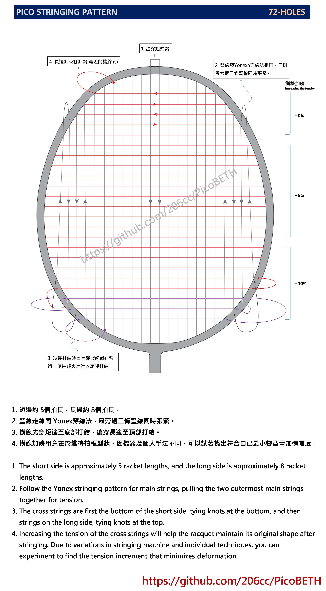
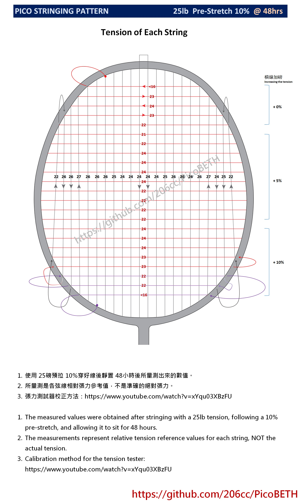

# Pico 線譜

我也有自己設計的線譜，暫時命名為 **Pico Stringing Pattern**。如果這個名稱已經被其他線譜使用，請告訴我該線譜的名稱。

## 穿線展示影片

## 線譜圖

1. 短邊約 5 個拍長，長邊約 8 個拍長。
2. 豎線的穿線方式同 Yonex 穿線法，最旁邊的兩條豎線需要同時張緊。
3. 橫線先從短邊開始，穿至底部後打結，再穿長邊至頂部打結。
4. 橫線的加磅用意在於保持拍框形狀。由於不同的機器與手法會影響結果，建議根據個人經驗調整加磅幅度，以達到最小的框型變形。

## 各弦線張力參考

1. 使用 25 磅預拉 10% 穿好線後，靜置 48 小時量測的結果。
2. 所量測的數值為各弦線的相對張力參考值，而非準確的絕對張力。
3. 張力測試器校正方法：  
   [https://youtu.be/xYqu03XBzFU](https://youtu.be/xYqu03XBzFU)
