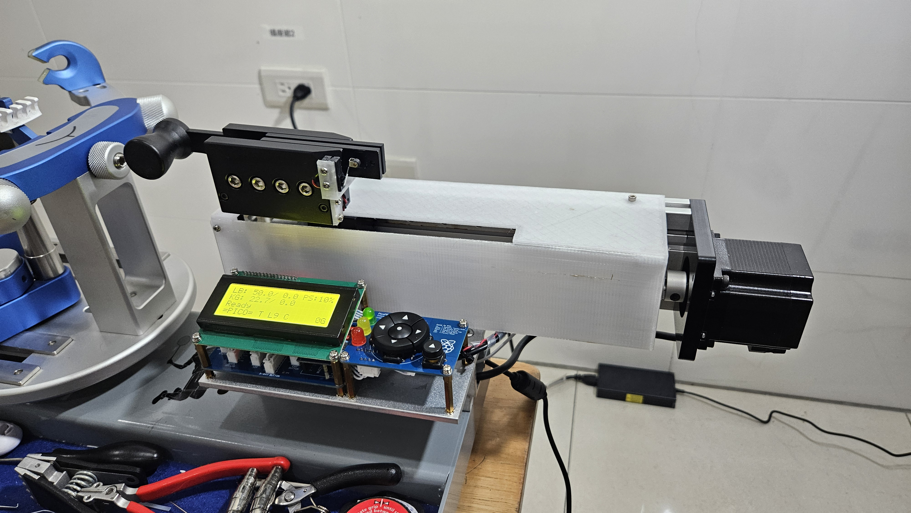
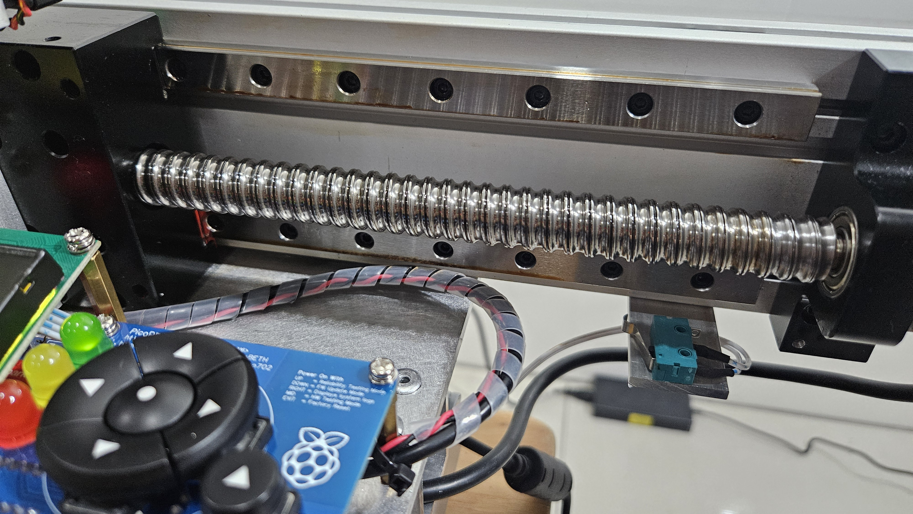
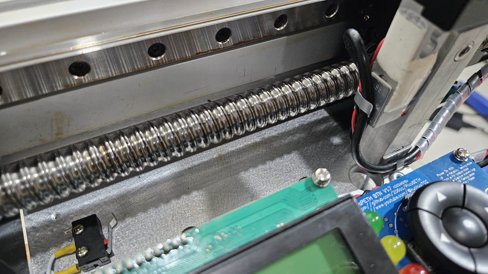
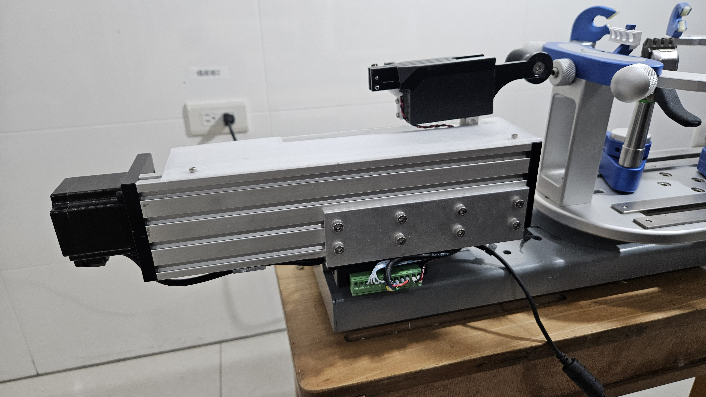
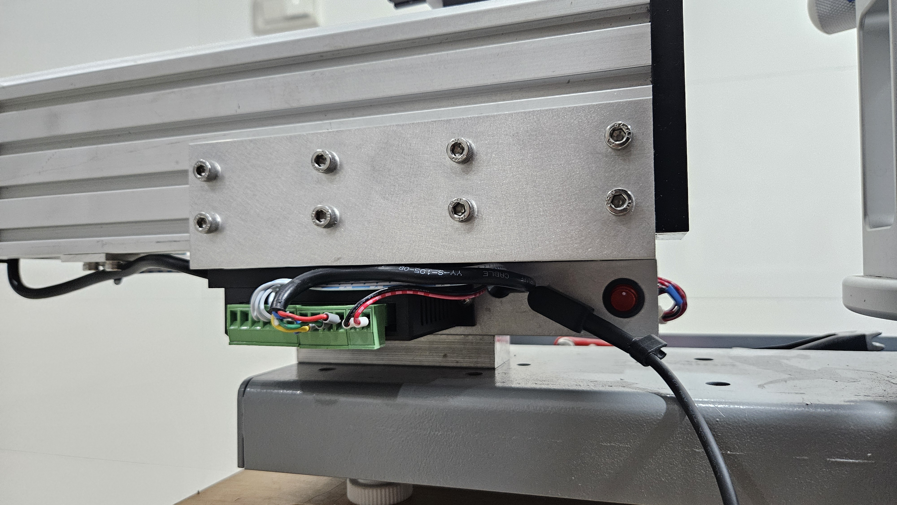
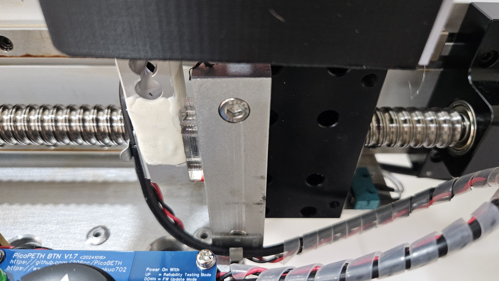

 

# PicoBETH 網球版本

此分支是在原羽毛球版的基礎上進行最少的硬體修改，即可支援網球拍更高張力的需求。在開始進行此分支的製作前，請務必詳閱 [主版本](https://github.com/206cc/PicoBETH) 的說明文件，了解相關知識和注意事項。

## 硬體變更

1. **滑台螺杆**：改用 1605 規格
2. **Load Cell**：改用 50kg 規格

> [!WARNING]
> 網球版本的軟體版本需更新至 **V2.80A** 或以上。

> [!CAUTION]
> 本專案的說明文件仍在持續修訂中，如有任何問題，歡迎在討論區提問交流。

### 硬體配置

提供兩種網球版硬體配置：**輕型版** 與 **一般版**。下表說明了羽毛球版與兩種網球版之間的主要差異：

|               | **羽毛球版**         | **網球版 – 輕型**      | **網球版 – 一般**      |
|---------------|----------------------|-----------------------|------------------------|
| **滑台**      | SGX 1610             | SGX 1610              | GX80 1605              |
| **Load Cell** | NJ5 YZC-133 20kg     | NJ5 YZC-133 50kg      | NJ5 YZC-133 50kg       |
| **最大張力**  | 40 lb                | 70 lb                  | 90 lb                  |
| **速度**      | 快                   | 快                    | 慢                     |

> [!WARNING]
> 請勿使用 GPP 系列滑台，可靠度測試顯示該系列在約 7 萬次張力操作後，其光軸會出現明顯間隙。

> [!NOTE]
> 螺杆速度參考影片
> 
> 

---

### 精度  
參考影片：[PicoBETH HW3D Lightweight Tennis – Tension Calibration & Accuracy](https://youtu.be/3H8zwHVQJGE)

---

## 輕型網球版本

本版本延續 SGX 系列滑台，更換為 1605 螺杆以提供更大的拉力。由於 SGX 僅搭配一組 MGN12H 線性滑軌，因此建議最大張力不超過 70 lb，以確保滑台壽命。

### 製作方法

- 參考 [PicoBETH HW 3D-Printed Version](https://youtu.be/gtyGDhp-Uqk) 製作說明。
- 只需將 Load Cell 更換為 **50 kg** 版本。

---

## 一般網球版本

本版本採用 GX80 系列滑台搭配 1605 螺杆，GX80 配置兩組 MGN12H 線性滑軌，可安全支撐高達 90 lb 的張力。雖然測試機經過 87 萬次可靠度測試後，Load Cell 發生金屬疲勞斷裂，但此使用壽命仍相當長。

### 製作方法

- 參考 [HW2 for GX80](docs/HW2.2_GX80.pdf) 佈局圖。
- 主要組件規格如下：

  | 組件 | 材質       | 尺寸            | 長度/厚度     |
  |------|------------|-----------------|---------------|
  | A    | L 型角鋁   | 150 x 50 x 5 mm | 長度：175 mm  |
  | B    | 鋁方管    | 32 x 32 x 3 mm  | 長度：175 mm  |
  | C    | 鋁條      | 20 x 15 mm      | 長度：80 mm   |
  | E    | 鋁片      | 55 x 25 mm      | 厚度：2 mm    |

### 相關照片

---

## 軟體說明

請務必使用 **V2.80A** 或更高版本的軟體，新版本已加入 50 kg Load Cell 進行校正，並優化 40 lb 以上的恆拉系統。

### 參數設定

請在「工程模式」選單中進行以下設定（適用於軟體版本 v2.80E 及之後）：

1. 將 Load Cell 設定為 **50kg**  
2. 設定最大張力為：  
   - **70LB**（適用於 SGX 1610 滑動平台）  
   - **90LB**（適用於 GX 80 1605 滑動平台）

---

## 張力校正

由於網球版本採用 50 kg Load Cell，其校正方式與羽毛球版使用的 20 kg Load Cell 略有不同。請參考此 **PicoBETH HW3D 輕型網球版 – 張力校正與精度**，按照影片步驟進行張力校正，以確保準確性。

---

## 後續更新

如有任何問題或建議，歡迎在討論區提出。
