

# PicoBETH
PicoBETH (Raspberry Pico Badminton Electronic Tension Head) 是一個開源項目，讓喜歡穿線，但只有機械式穿線機（重錘式、手搖式）的業餘穿線師可以自行製作電子拉線機頭，如果你有一些基本的程式能力，這個項目會很容易完成。

重錘式穿線機與改裝零件
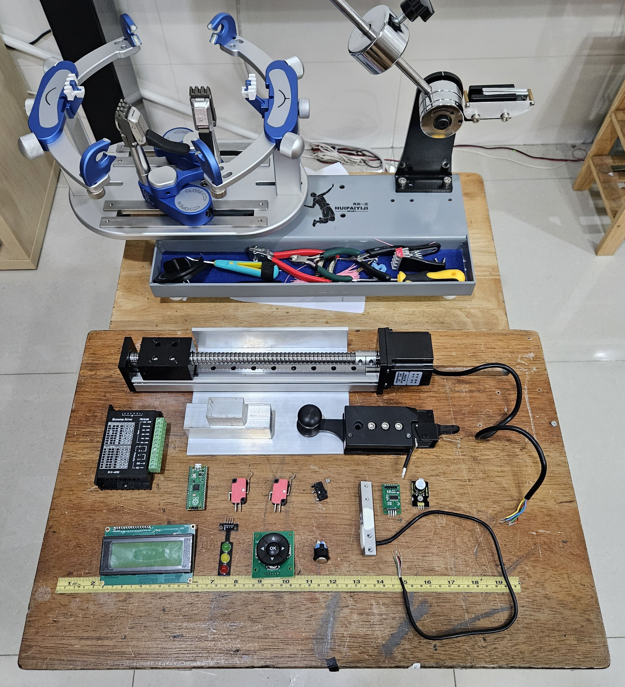

改裝完成（原型機）
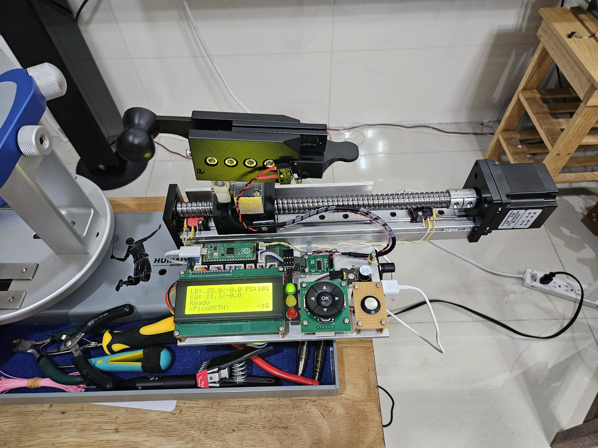

正式機 [更多的詳細照片](https://github.com/206cc/PicoBETH/tree/main/Images)
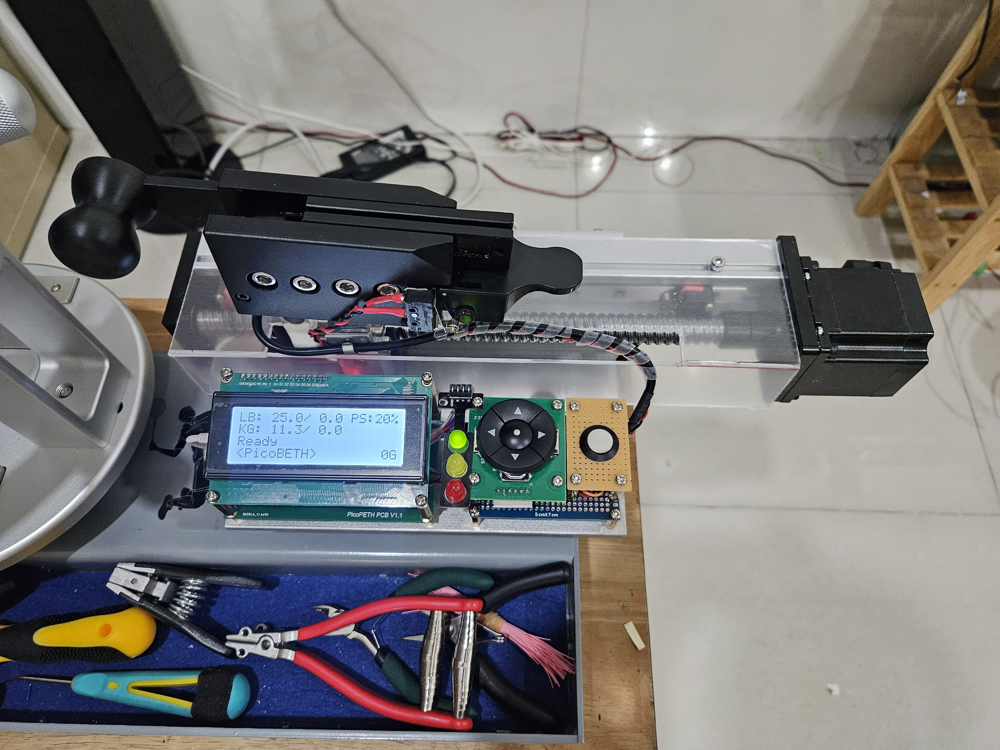

正式機的改進
1. 增加螺杆防塵罩
2. 螺杆改使用1610規格，增加張力速度
3. 更合理的硬體佈局，各零件可單獨拆裝不需全拆
4. 使用堆疊方式減少體積，不會擋到置物槽
5. 改使用自行設計PCB電路板
6. HX711模塊改用 SparkFun
7. 新增UPS電池盒，可在無外部電源的狀況下繼續完成穿線

穿線展示影片

製作過程影集(持續更新中)

## 警告
如果你的羽毛球穿線機結構不是強壯的，我非常不建議進行這個專案，不強壯的固定平台會在張緊時型變，造成球拍框架變圓、張緊度降低，結果是機器補強張力，循環之下，最終羽毛球拍斷裂。

## 原由
一年前因為公司社團關係，開始打羽毛球，球技不怎麼好卻迷上的穿線，買了一台重錘式穿線機，原本想再購買電子拉線機頭，但後來想想我可以用我會的知識，在 Raspberry Pico 上使用張力傳感器、幾個微動開關、按鈕製作了這個專案。

## 現有主要功能如下：

功能展示影片

1. 使用磅或公斤單位設定張力
2. 預拉(Pre-Strech)
3. 自動恆拉(Constant-pull)
4. 張力系數設定
5. 張力校正
6. 穿線計時
7. 張緊和開機次數記錄
8. 張緊LOG的詳細記錄
9. 二段速度設定(在TB6600馬達控制器上切換)
10. 打結加磅
11. UPS不斷電功能

## 待機畫面
1. 使用左右鍵可設定磅、公斤及預拉的十位數、個位數、小數。
2. 使用上下鍵調整選擇的設定。
3. 穿線計時功能，在按下離開鍵開始計時，再按一下停止計時，按第三下計時器歸零。
4. 預拉功能(PS)及打結功能(KT)使用上下鍵切換，打結功能用完後會自動切回預拉功能。
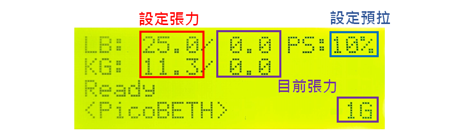

## 張緊畫面
1. 達到設定張力時自動進入恆拉微調模式，張力不足增加張力、過高減少張力，直到按下珠夾頭上的按鍵或離開按鍵結束張緊模式。
2. 按五向鍵的中鍵進入手動微調模式，此時自動恆拉模式會被取消，可按上下鍵手動微調張力；再次按下五向鍵的中鍵後可重新進入自動恆拉模式。
3. 達到指定張力後會開始出現計算秒數。
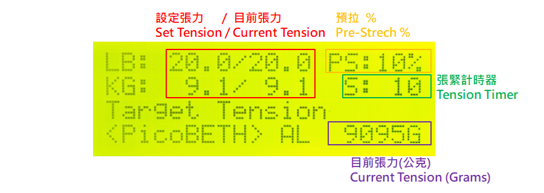

> [!WARNING]
> 每次的張力微調幅度如太高或太低，可自行調整 FT 參數

## 設定畫面
1. UN: 選擇設定時使用磅或公斤單位。
2. CC: 微調參數(詳見第一次開機章節)，1.70版之後可自動學習最佳的參數值。
3. HX: HX711 的張力傳感器校正(詳見第一次開機章節)
4. FT: 達到指定張力時微調的幅度
5. AT: 預設恆拉開關
6. SMART: 自動偵測最佳的FT微調參數及CC張力系數參數 
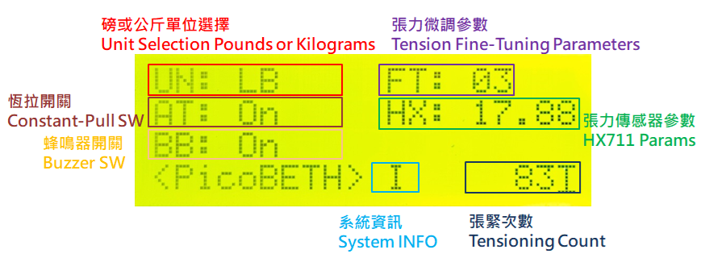
  
> [!NOTE]
> 一般來說這些參數設定好後就不需要再設定了

## 張緊LOG的詳細記錄
在設定畫面下，使用左右鍵選到張緊次數，再點下五向建的中鍵進入張緊 LOG 記錄頁面  
在頁面下使用左右鍵可瀏覽 LOG 記錄
TIMER: 如果有開啟計時功能，顯示此張緊時的時間  
LB: 設定張力/停止張力  
PS: 設定預拉值  
FT: 增加張力微調次數/減少張力微調次數/微調參數  
ST: CC參數/HX參數  

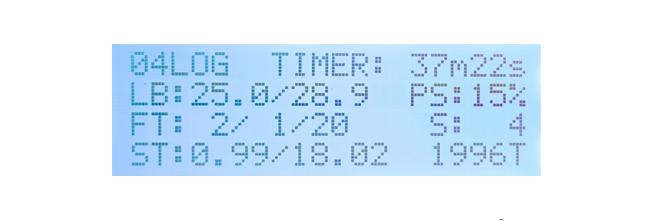
  
> [!NOTE]
> 預設顯示 1-20 筆 LOG 記錄，如要需調整請修改 LOG_MAX 參數

> [!WARNING]
> LOG_MAX 參數請勿設定過大，開機時如載入過多 LOG 會導致記憶體不足會無開機

## 硬體

主要材料
1. Raspberry Pico H
2. CBX/SGX 1610 200MM 滑台 / CBX/SGX 1610 Sliding Table 200MM 
3. 57步進馬達(2相4線 1.8°) / 57 Stepper Motor (1.8° Step Angle 2 Phase 4 Line)
4. TB6600 步進馬達驅動器 / TB6600 Stepper Motor Driver
5. NJ5 20KG 張力傳感器 / NJ5 20KG load cell
6. HX711 模塊(SparkFun) / Load Cell Amplifier(SparkFun)
7. 2004 i2c LCD 
8. WISE 2086 珠夾頭 / WISE 2086 Head
9. 5向按鍵模組 / Five-way key
10. 按鈕 / Button
11. 微控開關 / Micro Switch
12. 有源蜂鳴器 / Active buzzer
13. 三色 LED / Tri-Color LEDs
14. 12V 18650 UPS 電池盒 / 18650 UPS Battery Box

> [!WARNING]
> 除非您有自行修改程式的能力，否則請照指的的型號或規格購買材料

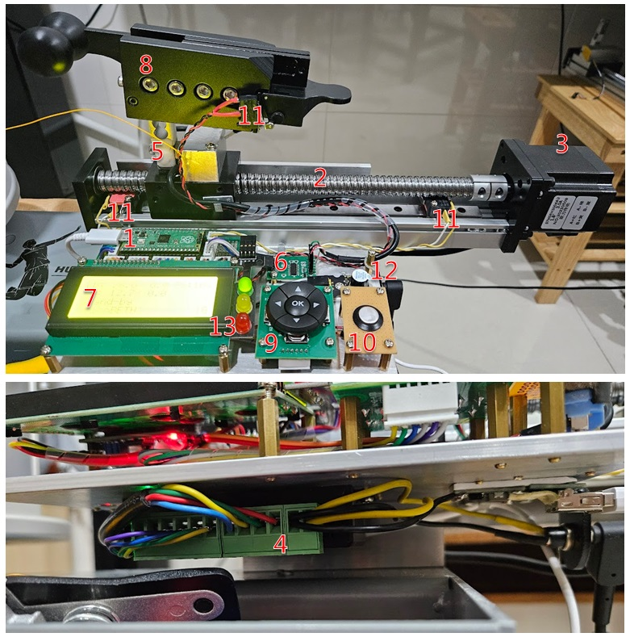

## 接線圖
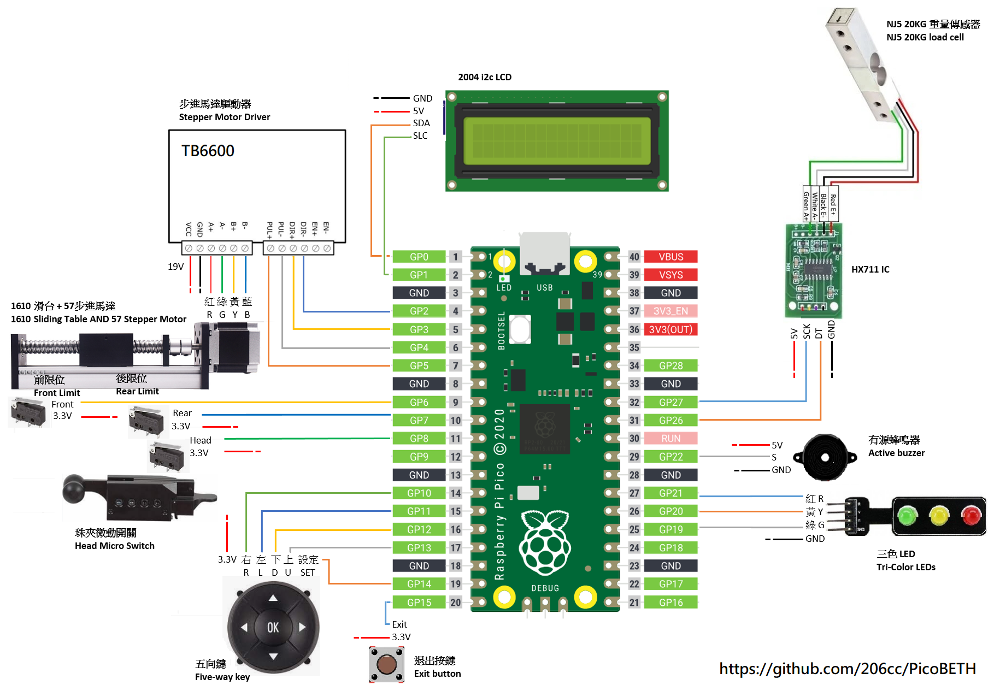
> [!WARNING]
> 請適時增加安全措施，例如增加按鍵的上拉電阻、步進馬達的保險絲、LED 限流電阻之類保護 Raspberry Pi Pico 及馬達電機

## PCB 電路板
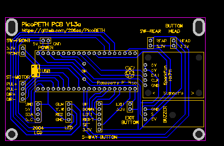

Gerber PCB [製板文件下載](https://github.com/206cc/PicoBETH/tree/main/docs/Gerber_pico_PCB_2024-04-01.zip)

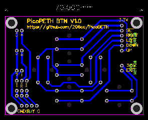

Gerber PCB BTN [製板文件下載](https://github.com/206cc/PicoBETH/tree/main/docs/Gerber_pico_PCB_btn_2024-04-02.zip)

> [!NOTE]
> 您可以自行下載上圖洗電路板，避免手焊電路板的麻煩

## HX711 張力感測器放大器

此專案對於HX711的要求較高，我測試過許多廠商的 HX711機板，建議使用 SparkFun 品質較為穩定。
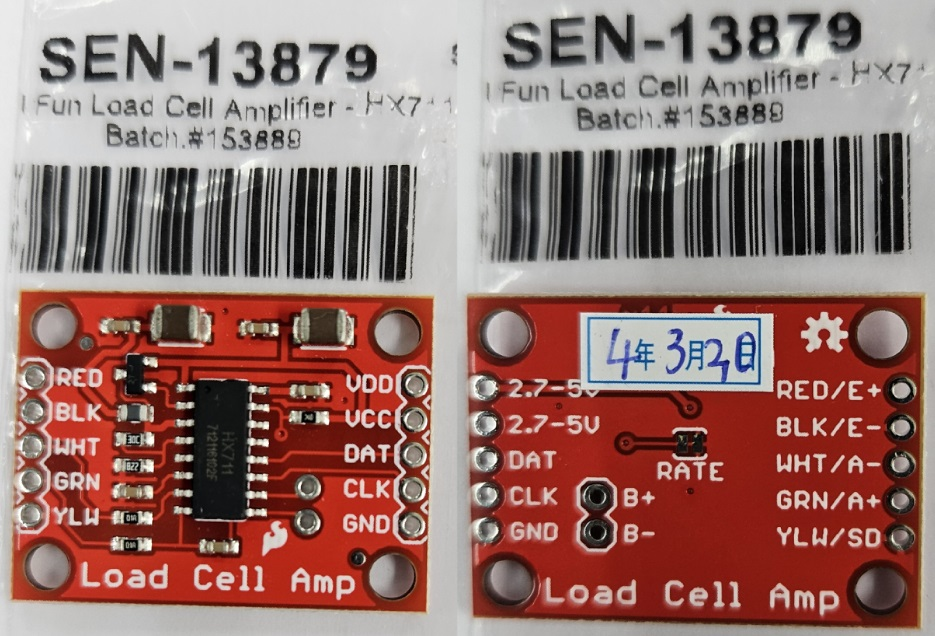

### 開啟 80Hz

SparkFun 的 HX711 RATE 預設是 10Hz，需使用美工刀將以下綠色箭頭處的連接線割斷來開啟 80Hz
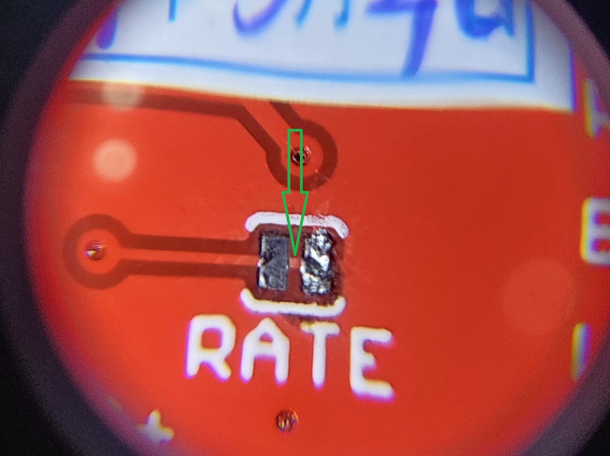

### 穩定度測試

每片 HX711 的品質不一，在裝上機器前可先使用麵包板測試穩定度，正常穩定的機板跑一整天的飄移量不會超過1G
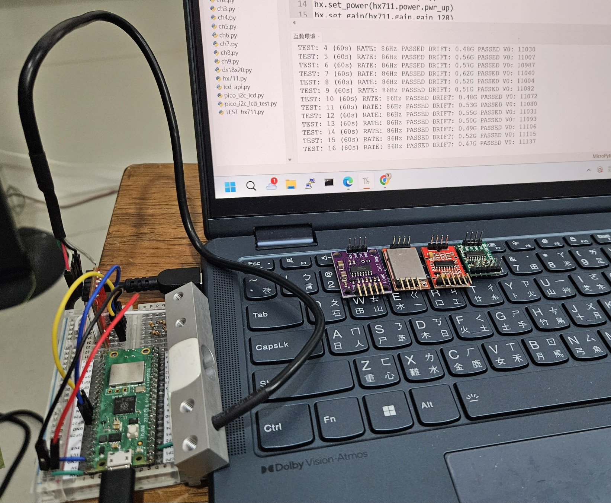

> [!NOTE]
> 測試程式為 TEST_hx711.py

> [!WARNING]
> 在V1.96版本之後開機時會檢查RATE，未達到80Hz或飄移量超過1G會無法開機使用

> [!WARNING]
> 每個HX711的放大器品質不一，如果有問題建議換供應商購買

## TB6600 步進馬達電機參數
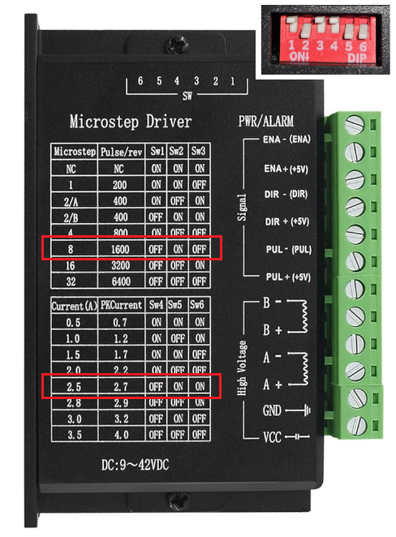

> [!WARNING]
> 如更改此TB6600電機參數，程式碼可能會有許多要修正的地方

# 軟體安裝
使用 Thonny 將以下程式碼檔案儲存到 Raspberry Pico 中，其中 src 資料夾內是 hx711 及 2004 LCD 的相關函式庫

1. main.py
2. src\hx711.py
3. src\lcd_api.py
4. src\pico_i2c_lcd.py

> [!NOTE]
> 感謝 [https://github.com/endail/hx711-pico-mpy](https://github.com/endail/hx711-pico-mpy) 提供 hx711 for pico 的函式庫

> [!NOTE]
> 感謝 [https://github.com/T-622/RPI-PICO-I2C-LCD](https://github.com/T-622/RPI-PICO-I2C-LCD) 提供 2004 LCD for pico 的函式庫

# 第一次開機

## 第一步：全機功能測試

組裝完成一次開機時請依照指示做所有的按鍵、前後限位、HX711感測器的測試。

## 第二步：校正 HX 參數

HX711 張力感應器校正系數，第一次使用或有更換張力傳感器、HX711 電路板時務必重新校正一次

校正方法：
1. 將外接式張力計，一端綁在拉線機上，另一端綁上羽毛球線
2. 先將 LCD 設定頁面中HX參數設為 20.00
3. 跳回主選單設定拉力為 20 磅
4. 按上或下鍵開始拉線，當 LCD 顯示 20 磅時，抄下張力計顯示數值
5. 至設定頁面上填入剛抄下張力計的數值

參考影片

> [!WARNING]
> 如不做此校正，實際張力會與 LCD 上的張力會有誤差

> [!IMPORTANT]
> 此參數以設定存檔為主(config.cfg)

## 第三步：設定 CC 及 FT 參數

CC參數: 是線在拉申時的補償系數，準確的值可減少後續的微調動作，在1.70版本已後新增自動學習功能，可動態調整成最佳的數值。

FT參數: 達到指定張力後微調時的幅度，過大的值會造成反覆加減張力，過小的值微調次數會增加才能到達指定張力。

以上二個參數可以使用1.90版本後新增的 SMART 功能測出建議的值

參考影片

以下是建議的FT參數
| 滑台規格  | TB6600一般模式 | TB6600快速模式 |
| -------- |:-------:|:--------:|
| 1605     |  14~15  |   7~8    |
| 1610     |  7~8    |   3~4    |

> [!WARNING]
> 因硬體廠牌精細度的差異，正確的FT參數依實際測試為主

# 最後
如果有製作上的問題，歡迎留言討論，也可以寫信給我詢問。

# Pico 線譜

我也有自已的線譜，暫時取名為Pico Stringing Pattern，我不知道是否已經有人在使用，如果有一樣的線譜請告訴我線譜的名子。

此線譜穿線展示影片

## 線譜圖
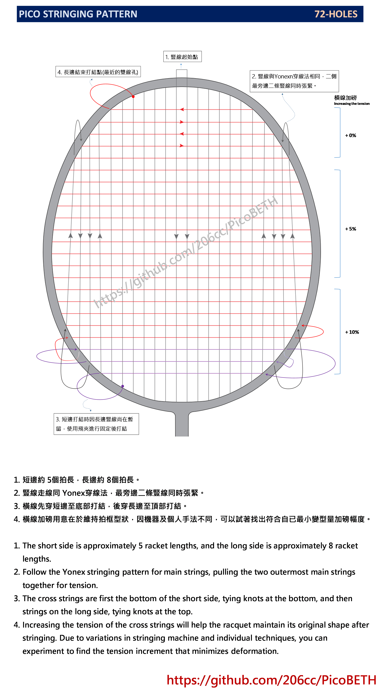

1. 短邊約 5個拍長，長邊約 8個拍長。
2. 豎線走線同 Yonex穿線法，最旁邊二條豎線同時張緊。
3. 橫線先穿短邊至底部打結，後穿長邊至頂部打結。
4. 橫線加磅用意在於維持拍框型狀，因機器及個人手法不同，可以試著找出符合自已最小變型量加磅幅度。

## 各弦線張力參考
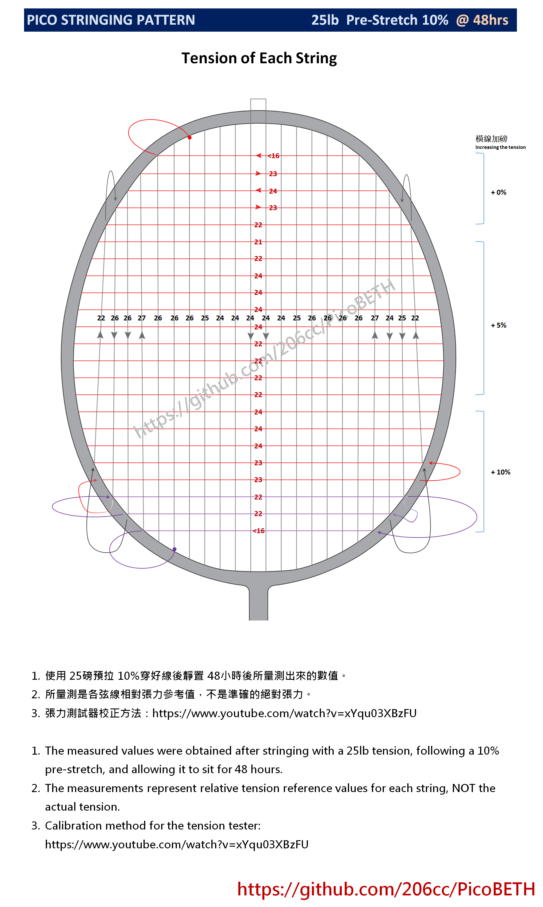

1. 使用 25磅預拉 10%穿好線後靜置 48小時後所量測出來的數值。
2. 所量測是各弦線相對張力參考值，不是準確的絕對張力。
3. 張力測試器校正方法: [https://youtu.be/xYqu03XBzFU](https://youtu.be/xYqu03XBzFU)
