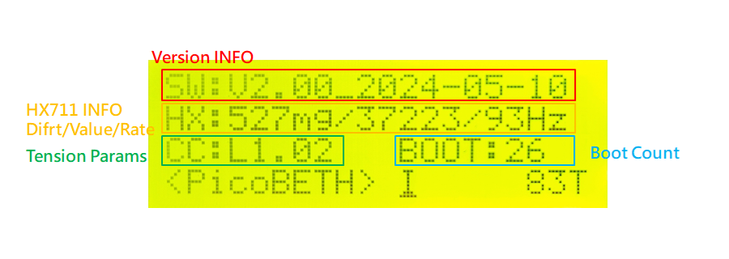

# PicoBETH
PicoBETH (Raspberry Pico Badminton Electronic Tension Head) 是一個開源項目，讓喜歡穿線，但只有機械式穿線機（重錘式、手搖式）的業餘穿線師可以自行製作電子拉線機頭，如果你有一些基本的程式能力，這個項目會很容易完成。

> 設計理念：便宜、簡單、精準

重錘式穿線機與改裝零件

改裝完成（原型機）

正式機 [製作合集](https://youtu.be/uJVE3YFJtJA)

正式機的改進
1. 增加螺杆防塵罩
2. 螺杆改使用1610規格，增加張力速度
3. 更合理的硬體佈局，各零件可單獨拆裝不需全拆
4. 使用堆疊方式減少體積，不會擋到置物槽
5. 改使用自行設計PCB電路板
6. HX711模塊改用 SparkFun
7. 新增UPS電池盒，可在無外部電源的狀況下繼續完成穿線

穿線展示影片

> [!NOTE]
> 如果你沒有穿線機，可以參考此專案做一個穿線機台 [Pico-Badminton-Stringer](https://github.com/HsuKaoPang/Pico-Badminton-Stringer)

## 警告
如果你的羽毛球穿線機結構不是強壯的，我非常不建議進行這個專案，不強壯的固定平台會在張緊時型變，造成球拍框架變圓、張緊度降低，結果是機器補強張力，循環之下，最終羽毛球拍斷裂。

> [!CAUTION]
> 非常重要，如果您的穿線機台是簡易型的，請務必補強結構。

## 原由
一年前因為公司社團關係，開始打羽毛球，球技不怎麼好卻迷上的穿線，買了一台重錘式穿線機，原本想再購買電子拉線機頭，但後來想想我可以用我會的知識，在 Raspberry Pico 上使用張力傳感器、幾個微動開關、按鈕製作了這個專案。

## 現有主要功能

功能展示影片

1. 磅/公斤顯示及設定
2. 預拉(Pre-Strech)
3. 自動恆拉(Constant-pull)
4. 打結加磅(Knot)
5. 張緊時手動調整張力
6. 張力校正
7. 穿線計時器
8. 張力計時器
9. 張力計數器和開機計數器
10. 張緊LOG的詳細記錄
11. 二段速度設定(在TB6600馬達控制器上切換)
12. UPS不斷電功能
13. 0.1LB(50G)高精度

## 待機畫面
1. 使用左右鍵可設定磅、公斤及預拉的十位數、個位數、小數。
2. 使用上下鍵調整選擇的設定。
3. 穿線計時功能，在按下離開鍵開始計時，再按一下停止計時，按第三下計時器歸零。
4. 預拉功能(PS)及打結功能(KT)使用上下鍵切換，打結功能用完後會自動切回預拉功能。

## 張緊畫面
1. 達到設定張力時自動進入恆拉微調模式，張力不足增加張力、過高減少張力，直到按下珠夾頭上的按鍵或離開按鍵結束張緊模式。
2. 按五向鍵的中鍵進入手動微調模式，此時自動恆拉模式會被取消，可按上下鍵手動微調張力；再次按下五向鍵的中鍵後可重新進入自動恆拉模式。
3. 達到指定張力後會開始出現計算秒數。

> [!WARNING]
> 每次的張力微調幅度如太高或太低，可自行調整 FT 參數

## 設定畫面
1. UN: 選擇設定時使用磅或公斤單位。
2. AT: 預設恆拉開關
3. BB: 蜂鳴器開關
4. FT: 達到指定張力時微調的幅度
5. HX: HX711 的張力傳感器校正(詳見最後設定章節)
6. I: 系統資訊
7. T: 張緊次數/Log記錄

## 張緊LOG的詳細記錄
在設定畫面下，使用左右鍵選到張緊次數，再點下五向建的中鍵進入張緊 LOG 記錄頁面  
在頁面下使用左右鍵可瀏覽 LOG 記錄
TIMER: 如果有開啟計時功能，顯示此張緊時的時間  
LB: 設定張力/停止張力  
PS: 設定預拉值  
FT: 增加張力微調次數/減少張力微調次數/微調參數  
C/H: CC參數/HX參數  

> [!NOTE]
> 預設顯示 1-50 筆 LOG 記錄，如要需調整請修改 LOG_MAX 參數

> [!WARNING]
> LOG_MAX 參數請勿設定過大，開機時如載入過多 LOG 會導致記憶體不足會無開機

## 系統資訊

## 硬體

主要材料
1. Raspberry Pico H
2. CBX/SGX 1610 200MM 滑台
3. 57步進馬達(2相4線 1.8°)
4. TB6600 步進馬達驅動器
5. NJ5 20KG 張力傳感器 (YZC-133)
6. HX711 模塊(SparkFun)
7. 2004 i2c LCD 
8. WISE 2086 珠夾頭
9. 5向按鍵模組
10. 按鈕
11. 微控開關
12. 有源蜂鳴器(高平電觸發)
13. 三色 LED
14. 12V 18650 UPS 電池盒

> [!WARNING]
> 除非您有自行修改程式的能力，否則請照指的的型號或規格購買材料

## 硬體採購建議

### 滑台

滑台有非常多樣式，此專案中使用的是螺杆式的 CBX/SGX 1610 200MM 滑台，建議購買 CBX 及馬達端帶有軸承固定座的版本，有些無固定座的滑台在高速模式及高張力下會有問題。

軸承固定座

### TB6600 步進電機驅動器

TB6600 是一款小型、經濟型的步進電機驅動器，用於 42、57型步進電機，在網路商店中，它非常的便宜，建議買標註有 "升級版"、"加強版" 的 TB6600，有一些非常便宜的 TB6600 用起來會有明顯的電流聲，我不知道會有什麼未知的問題，也沒有長時間使用過此廉價版本的 TB6600。

### HX711 張力感應加大器

HX711 是一款簡單易用的稱重傳感器放大器，通常用於高精度電子稱，在這個專案用來量測弦線的張力，我測試過許多廠商生產的 HX711 電路板，發現一個嚴重的問題，許多廠商生產的 HX711 電路板用起來常會有飄移的現象，當然此飄移的現象可以修復，之後會在我的 [Youtube 頻道](https://www.youtube.com/@kuokuo702) 專門拍一集如何修復此現像的影片，建議直接買 SparkFun 生產的 HX711 Load Cell Amplifier 品質較為優良，在製作前先使用 [EP.3 影片](https://youtu.be/pZT4ccE3bZk) 中教學的飄移測試程式測式此板的穩定度，如果你有遇到問題可以在影片中留言。

我測試過的 HX711 電路版 

## 接線圖

> [!WARNING]
> 請適時增加安全措施，例如增加按鍵的上拉電阻、步進馬達的保險絲、LED 限流電阻之類保護 Raspberry Pi Pico 及馬達電機

# 製作教學

製作過程影集(持續更新中)

## 軟體安裝
使用 Thonny 將以下程式碼檔案儲存到 Raspberry Pico 中，其中 src 資料夾內是 hx711 及 2004 LCD 的相關函式庫

1. main.py
2. src\hx711.py
3. src\lcd_api.py
4. src\pico_i2c_lcd.py

> [!NOTE]
> 感謝 [https://github.com/endail/hx711-pico-mpy](https://github.com/endail/hx711-pico-mpy) 提供 hx711 for pico 的函式庫

> [!NOTE]
> 感謝 [https://github.com/T-622/RPI-PICO-I2C-LCD](https://github.com/T-622/RPI-PICO-I2C-LCD) 提供 2004 LCD for pico 的函式庫

> [!NOTE]
> 相關製作影片 

## TB6600 步進馬達電機參數

> [!NOTE]
> 相關製作影片 

## HX711 張力感測器放大器

此專案對於HX711的要求較高，我測試過許多廠商的 HX711機板，建議使用 SparkFun 品質較為穩定。

### 開啟 80Hz

SparkFun 的 HX711 RATE 預設是 10Hz，需使用美工刀將以下綠色箭頭處的連接線割斷來開啟 80Hz

### 穩定度測試

每片 HX711 的品質不一，在裝上機器前可先使用麵包板測試穩定度，正常穩定的機板跑一整天的飄移量不會超過1G

> [!NOTE]
> 測試程式為 TEST_hx711.py

> [!WARNING]
> 在V1.96版本之後開機時會檢查RATE，未達到80Hz或飄移量超過1G會無法開機使用

> [!WARNING]
> 每個HX711的放大器品質不一，如果有問題建議換供應商購買

> [!NOTE]
> 相關製作影片 

## 結構佈局

零件佈局自由發揮，下圖是供參考佈局的定位孔圖，如何使用請參閱製作影片。

> [!NOTE]
> 相關製作影片 

## PCB 電路板

Gerber PCB [製板文件下載](https://github.com/206cc/PicoBETH/tree/main/docs/Gerber_PicoBETH_PCB_2024-05-15.zip)

Gerber PCB BTN [製板文件下載](https://github.com/206cc/PicoBETH/tree/main/docs/Gerber_PicoBETH_BTN_2024-05-15.zip)

> [!NOTE]
> 您可以先在麵包板組裝測試，成功後再將電路轉移到電路板上或手工焊接板上，不建議長期使用麵包板會有一些問題。

> [!NOTE]
> 請將 Gerber 檔案下載後 EMAIL 給線上(露天、蝦皮)PCB製造廠商，備註單層雙面1.6mm、雙面焊盤，廠商報價後下單即可。

> [!NOTE]
> 相關製作影片 

## 全機功能測試

組裝完成一次開機時請依照指示做所有的按鍵、前後限位、HX711感測器的測試。

> [!NOTE]
> 相關製作影片 

## 最後設定

### 第一步：設定 FT 參數

FT參數: 達到指定張力後微調時的幅度，過大的值會造成反覆加減張力，過小的值微調次數會增加才能到達指定張力。

以下是建議的 FT 參數
| 滑台螺杆規格  | TB6600一般模式 | TB6600快速模式 |
| -------- |:-------:|:--------:|
| 1605     |  14~15  |   7~8    |
| 1610     |  7~8    |   3~4    |

> [!WARNING]
> 因硬體廠牌及精細度的不同，正確的 FT 參數依實際測試為主

### 第二步：校正 HX 參數

HX711 張力感應器校正系數，第一次使用或有更換張力傳感器、HX711 電路板時務必重新校正一次。

校正方法：
1. 至設定頁面暫時關閉自動恆拉功能
2. 至設定頁面將 HX 參數設為 20.00
3. 跳回主選單設定拉力為 20.3 磅，預拉 10%
4. 將外接式張力計，一端綁在拉線機上，另一端綁上羽毛球線
5. 開始拉線，當 LCD 顯示低於 20.0 磅時(19.9)，抄下外接式張力計顯示數值
6. 至設定頁面上填入剛抄下張力計的數值，並重新開啟自動恆拉功能

參考影片

> [!IMPORTANT]
> 非常重要，如不做此校正，實際張力會與 LCD 上的張力會有誤差

# 常見問與答

## Q: 我想製作這個專案，但我不知道我能不能完成
A: 建議先看我 YouTube 頻道的 [製作合集](https://www.youtube.com/playlist?list=PLN3s8Sz8h_G_Dp-Vqi42OujVhEX1pyrGo) 的 EP.1 ~ EP.3 前三集，需購買 Raspberry Pico、HX711稱重放大器、NJ5傳感器(YZC-133)、TB6600 步進碼達控製器、57x56 步進碼達，這些材料不難準備，單價也不高，如果範例程式可以順利執行就可以準備剩下的材料，後續的製作偏向機械加工部份，當然你還需要一些工具如台鑽、砂輪機、電烙鐵，以及一些基本的機械加工技術，再根據教學影片一步一步的製作即可完成。

## Q: 我想改用其它的步進馬達驅動器，如更好的 DM542C 可以嗎？
A: 換成 DM542C 理論上可以，但驅動方式可能需要修改，例如程式碼中控制正轉逆轉的 MOTO_FORW_W、MOTO_BACK_W 參數、控制速度的 MOTO_SPEED_V1、MOTO_SPEED_V2 參數，建議先修改 [EP.2](https://youtu.be/7eG5W6a95h0) 中的範例程式中可以使用此驅動器正常驅動馬達，並且確保滑台在移動的過程中沒有異音後再移植至主程式中。我沒有試過，但已經有別的分支開發者移植成功，可以參考 [Pico-Badminton-Stringer](https://github.com/HsuKaoPang/Pico-Badminton-Stringer) 專案

## Q: 我的 HX711 RATE 只有 10Hz 沒有 80Hz 可以使用嗎？
A: 此專案一開始也是用 10Hz 的取樣頻率製作，是能正常使用，但經過後來測試，80Hz 的取樣頻率對於張力的控制會更加的精準、細膩及有較快的反應速度(10Hz 在偵測到指定的張力時到 Raspberry Pico 下指令停止馬達轉動時的時間差是 80Hz 的約 1.3倍)，所以在 1.96 版本中我加入檢查 80Hz 的動作，如果您還是想使用 10Hz，請將此檢查註解掉，並將張力系數 CORR_COEF 的值改為 1.3，可能還有些參數或程式碼需要自行調整與修正。

## Q: 什麼是 HX711 的飄移？
A: 可以參考 [EP.3](https://youtu.be/pZT4ccE3bZk) 中的測試程式，經過測試，正常的 HX711 在 80Hz 下的飄移值約在 0.5 ~ 1公克以內，所以我在 1.96版本後加入開機時取樣1秒中的飄移值，如果超過 1公克就無法使用，如果通過檢查，一般來說待機時的 LCD右下角的即時張力顯示在 -1 ~ 10公克以內的線性飄移是正常的。

## Q: 一定要使用 SparkFun 的 HX711 稱重放大器嗎？
A: 當然可以使用其它廠牌的 HX711 稱重放大器，但前提是能通過 [EP.3](https://youtu.be/pZT4ccE3bZk) 中的測試程式，我的經驗是其它廠牌正常的 HX711 會與 SparkFun 的一樣穩定，不幸的是其它廠牌會有許多會飄移的瑕疵品，只要飄移超過 50公克就是 0.1 LB的誤差值，並會造成 Constant-pull system 的反覆微調。

## Q: 可以自製珠夾頭嗎？
A: 這也一直是我想做的事，2086 珠夾頭是整個專案成本最高的硬體，但也是因為他能很容易的安裝在 NJ5傳感器(YZC-133)上以及很好的夾線功能，讓我暫時還沒想到如何取代，如果你有好的珠夾頭設計可以自行裝上，只要注意好 [EP.9](https://youtu.be/Ax4agdsqyms) 中提到的注意事項即可。

## Q: 此電腦拉線機頭的耐用度如何？
A: 如果都使用高品質的零件，理論上耐用度會蠻高的，截至今日(2024/05/22)，在我製作的正式機的張緊次數已達 7500多次，並沒有一次出現問題。就算是未來需要維修，所有的電子零件都相當的便宜。

## Q: 這個專案可以給網球拍穿線嗎？
A: 理論上是可以的，但有些硬體需要升級，例如 NJ5傳感器需從 20KG 換成 50KG、更大的步進馬達、更大的電源、更強狀的平台與滑台，並修改一些程式碼參數，如果有興趣的可以自行開分支專案開發。

## Q: YouTube 頻道中的製作合集我看不懂中文，有英文的字幕嗎？
A: 我有計劃在未來加入英文字幕，但因為平常工作較為忙碌，每天僅有一些時間可以製作專案，如果可以請幫我在影片上點讚並加入訂閱，這對我是很大的鼓勵。

# 最後
如果有製作上的問題，可以直接在 youtube 製作影片下留言。

# Pico 線譜

我也有自已的線譜，暫時取名為Pico Stringing Pattern，我不知道是否已經有人在使用，如果有一樣的線譜請告訴我線譜的名子。

此線譜穿線展示影片

## 線譜圖

1. 短邊約 5個拍長，長邊約 8個拍長。
2. 豎線走線同 Yonex穿線法，最旁邊二條豎線同時張緊。
3. 橫線先穿短邊至底部打結，後穿長邊至頂部打結。
4. 橫線加磅用意在於維持拍框型狀，因機器及個人手法不同，可以試著找出符合自已最小變型量加磅幅度。

## 各弦線張力參考

1. 使用 25磅預拉 10%穿好線後靜置 48小時後所量測出來的數值。
2. 所量測是各弦線相對張力參考值，不是準確的絕對張力。
3. 張力測試器校正方法: [https://youtu.be/xYqu03XBzFU](https://youtu.be/xYqu03XBzFU)
