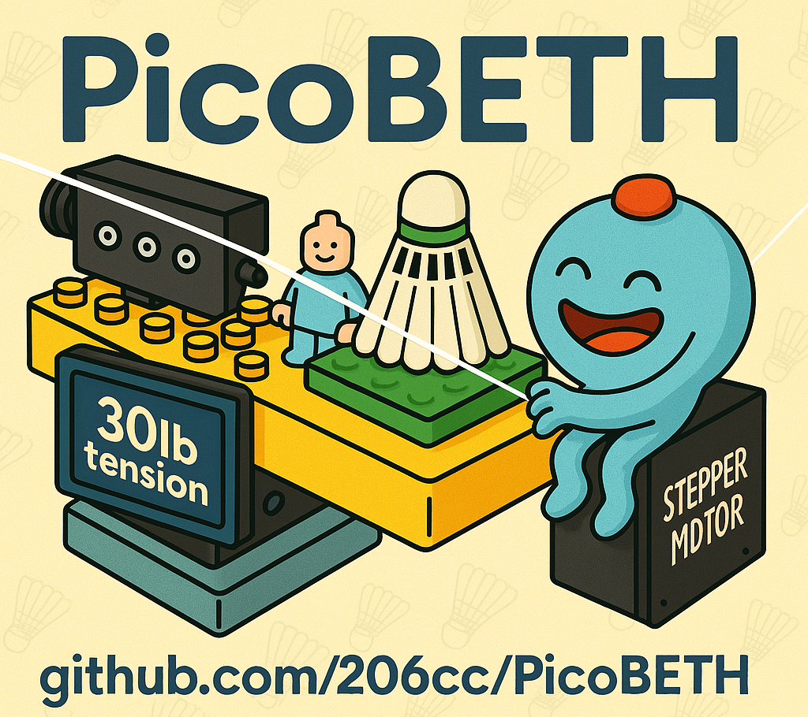

# PicoBETH
**PicoBETH** (Raspberry Pico Badminton Electronic Tension Head) 是一個開源項目，讓有機械式穿線機的愛好者可以自行製作電子拉線機頭。如果你具備基本的程式能力，這個項目會很容易完成。

> 設計理念：便宜、簡單、精準

## 現有主要功能與特點

### 功能
- **磅/公斤顯示及設定**
- **預拉 (Pre-Stretch)**
- **自動恆拉 (Constant-Pull)**
- **打結加磅 (Knot)**
- **張緊中手動調整張力**
- **張力校正**
- **穿線計時器**
- **張力計數器與開機計數器**
- **張緊 LOG 記錄**
- **9 段速度切換**
- **OTA 線上韌體更新功能** (使用 Pico W 與 v2.80E 版本及之後)

### 特點
- **0.05 LB 高精度**
  - 在 Sparkfun HX711 94Hz 及 V2.2 版本後
  - [參考影片](https://youtu.be/Hk7eMABAxT0)
- **低功耗**
  - 僅需 DC19V 4A 電源*
- **UPS 不斷電**
  - 使用 18650 x 5 電池可支持至少完成一次穿線
- **緊湊設計**
  - 尺寸約 38(L) × 15(W) × 15(H) cm，重量約 3.5 kg
- **結構簡單、成本低且易於維修**
  - 所有元件皆易於取得且價格低廉
- **高耐用性**
  - 已完成超過 100 萬次張緊可靠性測試，未發現任何硬體故障。（2024/8 至 2024/12/28） [100萬次影片](https://youtube.com/shorts/kR_JLVGHwB8)

> [!CAUTION]
> 自 v2.90B 版本開始，需額外上傳新版 LCD 函式庫 `pico_i2c_lcd2.py` 至 `src` 資料夾，否則程式將無法正常運行（僅透過 OTA 更新將無法完成升級，請務必搭配手動檔案上傳）。本版本亦整合了 ZeroBETH 的移值經驗，全面優化 PicoBETH 的恆拉演算法與張緊啟動反應速度，使整體性能達到與 ZeroBETH 相同的水準，大幅提升使用體驗。 

## 開發項目計劃

| 計劃項目           | 進度     | 備註                           |
| ------------------ | -------- | ------------------------------ |
| 移植至 Raspberry Pi Zero | 進行中 | 將原本使用的 Raspberry Pi Pico 更換為 Raspberry Pi Zero，並進行程式碼移植。詳情請參閱專案頁面 [https://github.com/206cc/ZeroBETH/](https://github.com/206cc/ZeroBETH/blob/main/README.cht.md)。 |
| 3D 列印輕量網球版本  | 結束   | 在 HW3D 架構，使用 50KG Load Cell 與 SGX 1605 滑台，進行 55 至 65 LB 循環張緊可靠性測試。 張緊次數達 430,000+ 次後測試結束（Load Cell 張力感應異常）。 |
| 相容 Pico 2        | 結束 | 受到 RP2350-E9 BUG 的影響，已確認無法直接使用，請參閱 [`branch/pico2-issue`](https://github.com/206cc/PicoBETH/tree/branch/pico2-issue) |
| 可靠度測試         | 結束   | HW1 測試張緊次數已達 100 萬次，期間無任何硬體故障，測試結束。 |
| 適用網球拍         | 結束   | 在 HW2 架構，使用 50KG Load Cell 與 GX80 1605 滑台進行了 75~85LB 循環張緊可靠度測試，張緊次數達 870,000+ 次後測試結束（Load Cell 金屬疲勞斷裂）。|
| 3D列印珠夾頭       | 結束   | 夾片耐用度不佳，停止開發 |

## 專案起源
一年前，由於參加公司社團，我開始接觸羽毛球，並對穿線產生濃厚興趣。我購買了重錘式穿線機，原計劃買一個電子拉線機頭，但最終決定利用我所掌握的知識自行設計。這個項目就是結合 Raspberry Pico、張力傳感器、微動開關和按鈕的成果。

**PicoBETH 全系列**

**HW 1.5 完成品** (舊版本，停止更新) [製作合集](https://youtu.be/uJVE3YFJtJA)

  
[View 3D Model on Tinkercad](https://www.tinkercad.com/things/5FHNO85KUK4-picobeth-hw-15-for-badminton-stringing?sharecode=hBukCj4giq4Q9J8Fq-s8H5lIKzbYCcOiwuyQ-TE8oRA)

**HW 2.0 完成品** 

  
[View 3D Model on Tinkercad](https://www.tinkercad.com/things/gW2eyW052h4-picobeth-hw-20-for-badminton-stringing?sharecode=Maq9iaeRmlb3yHHCTIYZC1jmwOv0plqlq70pMMMWHQw)

**HW 3D Print 完成品 (全部由 3D 列印)**

  
PicoBETH HW 3D 列印分支 [`branch/3d-printed`](https://github.com/206cc/PicoBETH/tree/branch/3d-printed/README.cht.md)

**穿線展示影片**

> [!NOTE]
> 如果你沒有穿線機，請參考 [Pico-Badminton-Stringer](https://github.com/HsuKaoPang/Pico-Badminton-Stringer) 項目。

> [!NOTE]
> 如果你正在考慮購買手動穿線機，我建議選擇具備六點固定和底座夾具的重錘式穿線機。重錘機具備恆拉效果，其穿線張力與電子機相差不大。且重錘機在電子拉線頭故障時可以作為替代方案，並且能夠快速安裝回去恢復使用。

# 警告
如果你的穿線機結構不夠堅固，請勿進行此專案。結構不堅固的平臺會在張緊時發生變形，有可能導致球拍損壞。

> [!CAUTION]
> 非常重要：如果你的穿線機平台是簡易型的請補強平台結構。

# 其他說明文件

- [操作與設定指南](docs/1.Operation_and_Settings_Guide.cht.md)
- [硬體製作、採購與維護](docs/2.Hardware_Setup.cht.md)
- [維護與日誌管理指南](docs/3.Maintenance_and_Logs_Guide.cht.md)
- [常見問題解答(FAQ)](docs/4.FAQ.cht.md)
- [Pico 線譜](docs/5.Pico_Stringing_Pattern.cht.md)
- [研究室](docs/6.Research_Lab.cht.md)

# 分支

| 分支名稱                        | 說明                             |
|----------------------------------|----------------------------------|
| [`imp/beadclip-btn@jpliew`](https://github.com/206cc/PicoBETH/blob/imp/beadclip-btn%40jpliew) | 改良式珠夾啟動按鍵                |
| [`branch/3d-printed`](https://github.com/206cc/PicoBETH/tree/branch/3d-printed) | HW 3D 列印分支                |
| [`branch/tennis`](https://github.com/206cc/PicoBETH/tree/branch/tennis) | 適用網球拍              |
| [`branch/pico2-issue`](https://github.com/206cc/PicoBETH/tree/branch/pico2-issue) | Pico2 問題              |

# 支援
有任何問題，可以在 YouTube 影片下方留言。若完成專案，歡迎在討論區分享你的成果照片。

# 致謝

- [HX711 驅動模組適用於 Raspberry Pi Pico](https://github.com/endail/hx711-pico-mpy)
- [2004 I2C 液晶顯示模組適用於 Raspberry Pi Pico](https://github.com/T-622/RPI-PICO-I2C-LCD)

# License

- **Source Code**: Licensed under the Apache License 2.0
- **Hardware Design**: Distributed under the CERN Open Hardware Licence v2 - Weakly Reciprocal
