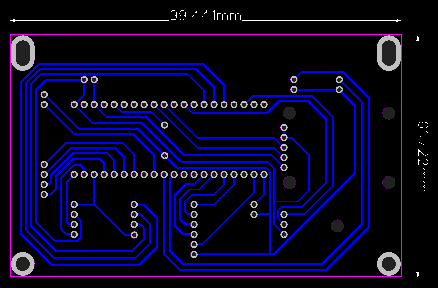

> [!TIP]
> Translated by ChatGPT 3.5  
> 中文說明請點選上方連結

# PicoBETH
PicoBETH (Raspberry Pico Badminton Electronic Tension Head) is an open-source project that allows hobbyist stringers who enjoy stringing but only have mechanical stringing machines (drop-weight, manual crank) to create their own electronic tensioning head. If you have basic programming skills, this project can be easily completed.

Drop-weight stringing machine and modification parts

Modified prototype machine

Final machine [More detailed photos](https://github.com/206cc/PicoBETH/tree/main/Images)

Improvements in the final machine:
1. Added screw dust cover
2. Upgraded to a 1610 specification screw for increased tensioning speed
3. More rational hardware layout, allowing individual disassembly without the need for complete disassembly
4. Reduced volume by using a stacking approach, avoiding interference with the storage slot
5. Switched to a custom-designed PCB circuit board
6. HX711 module change SparkFun
7. Addition of a UPS battery box that allows continued stringing even in the absence of an external power source.

Stringing demonstration video

Video Series of the Production Process (Continuously Updating)

## Warning
If your badminton stringing machine structure is not robust, I strongly advise against undertaking this project. A weak fixing platform can deform when under tension, causing the racket frame to become rounded and the tension to decrease. As a result, the machine compensates by reinforcing the tension, leading to a cycle that ultimately results in the badminton racket breaking.

## Background
A year ago, due to company club activities, I started playing badminton. Although my badminton skills weren't great, I became fascinated with stringing. I purchased a drop-weight stringing machine and initially planned to buy an electronic tensioning head. However, I later thought about using my knowledge to create this project on the Raspberry Pico, incorporating a tension sensor, several microswitches, and buttons.

## Current main features:

Function demonstration video

1. Set tension in pounds or kilograms
2. Pre-Stretch function
3. Constant-pull system
4. Tension coefficient setting
5. Tension calibration
6. Stringing timer
7. Tension counter and boot counter
8. Detailed recording of tensioning logs
9. Pull speed of the string(Switch on the TB6600 stepper motor driver)
10. Knot function
11. Real-time UPS Redundancy Feature

## Standby screen
1. Use left and right keys to set pounds, kilograms, and the tens, units, and decimal places of pre-stretch.
2. Use up and down keys to adjust the selected settings.
3. Stringing timer function: Start timing by pressing the exit key, stop timing by pressing it again, and reset the timer on the third press.
4. The Pre-Stretch function (PS) and Knot function (KT) are switched using the up and down keys. After using the Knot function, it will automatically switch back to the Pre-Stretch function.

## Tensioning screen
1. When the set tension is reached, automatically enter the constant-pull mode. Increase tension if it's insufficient, decrease tension if it's too high, until pressing the button on the clamp or exit button to end the tensioning mode.
2. Press the center button of the five-way key to enter manual fine-tuning mode. The constant-pull mode will be canceled at this time, and tension can be manually adjusted with the up and down keys. Press the center button of the five-way key again to re-enter constant-pull mode.
3. When the specified tension is reached, the countdown timer will appear.

> [!WARNING]
> If the tension fine-tuning amplitude is too high or too low, you can adjust the FT parameter yourself.

## Settings screen
1. UN: Select pounds or kilograms when setting.
2. CC: Fine-tuning parameters (see the first boot chapter for details). After version 1.70, the system can automatically learn the optimal parameter values.
3. HX: Calibration of the tension sensor for HX711 (see the first boot chapter for details).
4. FT: Amplitude of fine-tuning when reaching the specified tension.
5. AT: Default Constant-Pull Switch.
6. SAMRT: Automatically detecting optimal FT fine-tuning parameters and CC tension coefficient parameters.

> [!NOTE]
> Once these parameters are set, there is usually no need to set them again.

## Detailed recording of tensioning logs
On the settings screen, use the left and right keys to select the tensioning count, then press the center key of the five-way key to enter the tensioning log recording page.
On the page, use the left and right keys to browse through the log records.
TIMER: If the timing function is enabled, display the time of tensioning.
LB: Set tension/stop tension.
PS: Set pre-stretch value.
FT: Increase tension fine-tuning count/decrease tension fine-tuning count/fine-tuning parameters.
ST: CC parameter/HX parameter.

> [!NOTE]
> The default display is 1-20 log records. If you need to adjust, please modify the LOG_MAX parameter.

> [!WARNING]
> Do not set the LOG_MAX parameter too large, as loading too many logs during startup will cause insufficient memory and result in failure to boot.

## Hardware

Main materials
1. Raspberry Pico H
2. CBX/SGX 1610 200MM sliding table
3. 57 stepper motor (2-phase 4-wire 1.8°)
4. TB6600 stepper motor driver
5. NJ5 20KG tension sensor
6. HX711 module (SparkFun)
7. 2004 i2c LCD
8. WISE 2086 head
9. Five-way key module
10. Button
11. Micro switch
12. Active buzzer
13. Tri-color LEDs
14. 12V 18650 UPS Battery Box

> [!WARNING]
> Unless you have the ability to modify the code yourself, please purchase materials according to the specified models or specifications.

## Wiring diagram

> [!WARNING]
> Please add safety measures as needed, such as adding pull-up resistors to buttons, fuses to stepper motors, limiting resistors to LEDs, etc., to protect the Raspberry Pi Pico and motors.

## PCB circuit board

> [!NOTE]
> You can download the circuit board for the above image to avoid the trouble of hand-soldering the circuit board.

> [!NOTE]
> The lock points around this circuit board are based on the lock point positions of the 2004 LCD, allowing stacking to reduce volume.

## HX711 Load Cell Amplifier

This project demands a higher standard for the HX711, and it is recommended to use the more stable quality provided by SparkFun.

### Enabling 80Hz

The default setting for SparkFun's HX711 is 10Hz. To enable 80Hz, you'll need to cut the connection wire at the green arrow as indicated below.

### Stability Testing

The quality of each HX711 unit varies. Before installing the equipment, it's advisable to test the stability using a breadboard. A normally stable board should not drift by more than 1G over the course of a whole day.

> [!NOTE]
> The testing script is named TEST_hx711.py.

> [!WARNING]
> Starting from version 1.96, during boot-up, the board will check the RATE. Failure to reach 80Hz or exceeding a drift of 1G will prevent the board from booting up.

> [!WARNING]
> The quality of each HX711 amplifier varies. If there are any issues, it is recommended to switch suppliers.

## TB6600 stepper motor parameters

> [!WARNING]
> Changing these TB6600 motor parameters may require many modifications in the code.

# Software Installation
Use Thonny to save the following code files to the Raspberry Pico. The src folder contains relevant libraries for hx711 and 2004 LCD.

1. main.py
2. src\hx711.py
3. src\lcd_api.py
4. src\pico_i2c_lcd.py

> [!NOTE]
> Thanks to [https://github.com/endail/hx711-pico-mpy](https://github.com/endail/hx711-pico-mpy) for providing the hx711 library for Pico.

> [!NOTE]
> Thanks to [https://github.com/T-622/RPI-PICO-I2C-LCD](https://github.com/T-622/RPI-PICO-I2C-LCD) for providing the 2004 LCD library for Pico.

# First Boot

## Step 1: Full System Function Test

Upon completing assembly and powering on the machine for the first time, please conduct tests on all buttons, front and rear limits, and HX711 sensors as instructed on the screen.

## Step 2: Calibrate the HX Parameter

HX711 tension sensor calibration coefficient. It is necessary to recalibrate it the first time you use it or when replacing the tension sensor or HX711 circuit board.

Calibration method:
1. Attach one end of an external tension gauge to the stringing machine and the other end to the badminton string.
2. Set the HX parameter in the LCD setting page to 20.00.
3. Return to the main menu and set the tension to 20 pounds.
4. Press the up or down key to start stringing. When the LCD displays 20 pounds, note down the tension gauge reading.
5. Enter the recorded tension gauge value in the HX parameter field on the settings page.

Reference video

> [!WARNING]
> If you skip this calibration, there may be a discrepancy between the actual tension and the tension displayed on the LCD.

> [!IMPORTANT]
> This parameter is mainly based on setting storage (config.cfg).

## Step 3: Setting CC and FT Parameters

CC Parameter: It is the compensation coefficient during the line tensioning process. Accurate values can reduce subsequent fine-tuning movements. Since version 1.70, an automatic learning function has been added, which dynamically adjusts to the optimal value.

FT Parameter: It determines the magnitude of adjustments after reaching the specified tension. A too large value can cause repeated tension adjustments, while a too small value increases the number of fine-tuning iterations required to reach the specified tension.

Both parameters can be measured using the SMART function introduced in version 1.90 to obtain recommended values.

Reference video

The recommended FT parameters:

| Slide Specifications | TB6600 Normal Mode | TB6600 Fast Mode |
| -------------------- |:------------------:|:----------------:|
| 1605                 |         15         |         7        |
| 1610                 |          8         |         4        |

> [!WARNING]
> Due to differences in hardware brands' precision, the correct FT parameters depend on actual testing.

# Conclusion
If you encounter any issues during the manufacturing process, feel free to discuss them in the comments or send me an email with your inquiries.

# Pico Sringing Pattern

I also have my own stringing pattern, temporarily named the Pico Stringing Pattern. I'm not sure if anyone else is using it, so if there is a similar stringing pattern, please let me know the stringing pattern name.

The stringing pattern demo.

## Sringing Pattern

1. The short side is approximately 5 racket lengths, and the long side is approximately 8 racket lengths.
2. Follow the Yonex stringing pattern for main strings, pulling the two outermost main strings together for tension.
3. The cross strings are first the bottom of the short side, tying knots at the bottom, and then strings on the long side, tying knots at the top.
4. Increasing the tension of the cross strings will help the racquet maintain its original shape after stringing. Due to variations in stringing machine and individual techniques, you can experiment to find the tension increment that minimizes deformation.

## Tension of Each String

1. The measured values were obtained after stringing with a 25lb tension, following a 10% pre-stretch, and allowing it to sit for 48 hours.
2. The measurements represent relative tension reference values for each string, NOT the actual tension.
3. Calibration method for the tension tester: [https://youtu.be/xYqu03XBzFU](https://youtu.be/xYqu03XBzFU)
