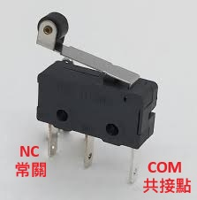
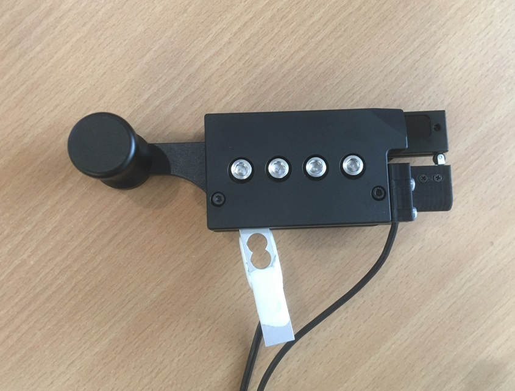
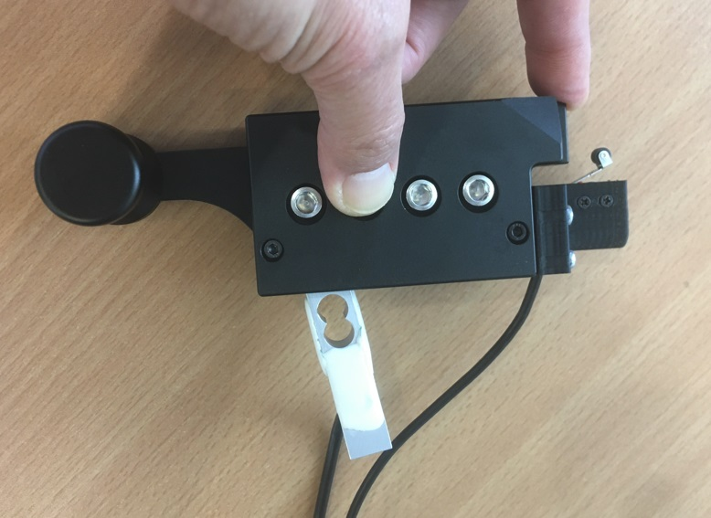
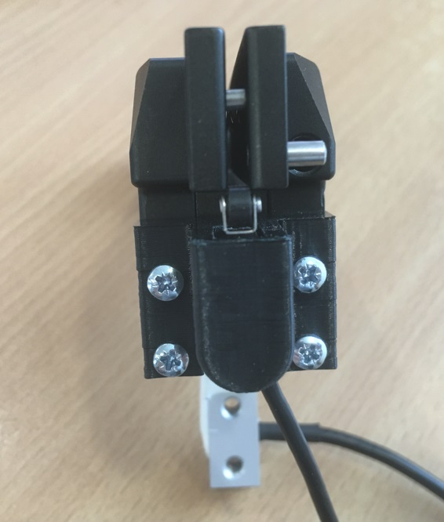
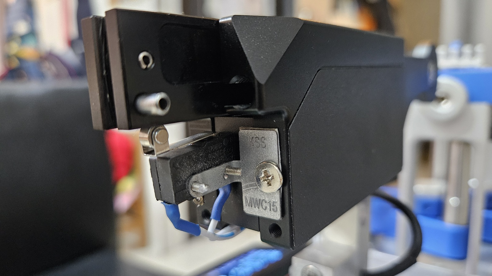

[](README.cht.md)
[](README.md)

# Improved Bead Clip Head Activation Button by jpliew

This improvement enhances the appearance of the bead clip head button while maintaining the same low cost.

> [!CAUTION]  
> This is a feature branch based on PicoBETH. For more details on the entire project, please refer to the main branch: (https://github.com/206cc/PicoBETH/)

# Demo Video

[](https://www.youtube.com/watch?v=U8-CrL-Yr1A)

# Hardware

Uses the same **roller-style micro switch** as the original project but changes the NO (normally open) contact to NC (normally closed).



## 3D Printed Bracket

Use the bracket file provided by jpliew for 3D printing:

[Download Bracket File](https://github.com/user-attachments/files/17158580/BadmintonTensionClampSwitch.zip)

Below are images of the assembled product:







## Manual Bracket

If you don’t have a 3D printer, you can also manually make a small L-shaped bracket, as shown below:



# Main Program Modification

In the `main.py` file, within the `def start_tensioning():` function, find the following code:

```python
if button_head_pressed or button_exit_pressed or rt_mode_pressed:
```

Add `not` before `button_head_pressed`, changing it to:

```python
if not button_head_pressed or button_exit_pressed or rt_mode_pressed:
```

This implements reverse button detection.

> [!CAUTION]  
> If this line is not modified, after tensioning is completed, it will immediately retract.

# Issues

After the modification, there is a minor issue: when pressing the bead clip head button, due to the non-blocking button detection, you need to hold the button down for up to 0.5 seconds to retract. You can see this in the 17th second of the video. It is recommended to press the EXIT button instead, which will retract faster and more immediately. Aside from this, no other issues have been found so far.

# Acknowledgment

Thanks to jpliew for the contribution: https://github.com/206cc/PicoBETH/issues/5
