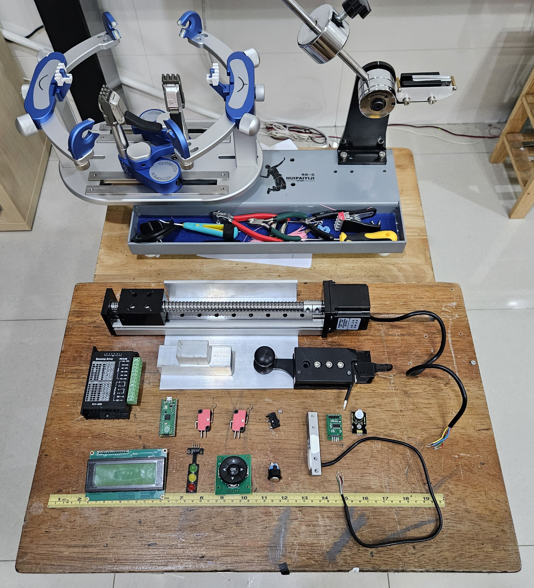
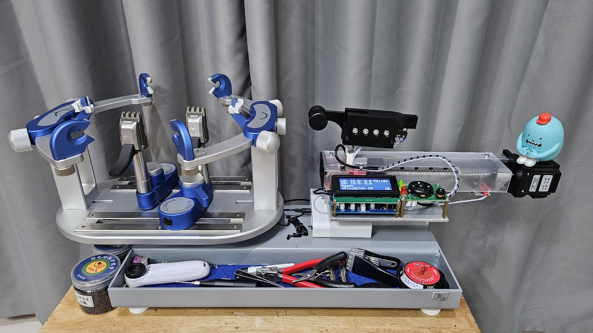
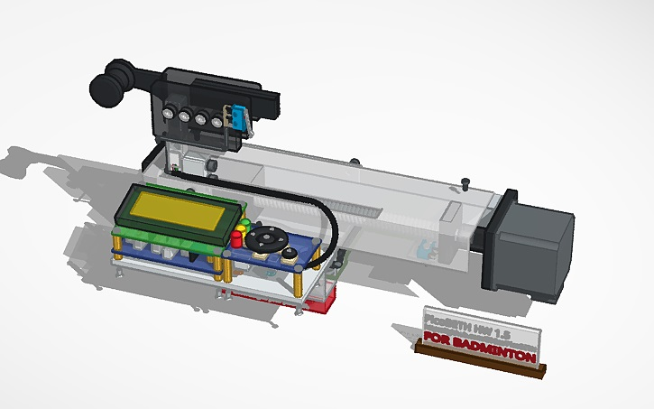

> [!TIP]
> Translated by ChatGPT 3.5  
> 中文說明請點選上方連結

# PicoBETH
PicoBETH (Raspberry Pico Badminton Electronic Tension Head) is an open-source project that allows hobbyist stringers who enjoy stringing but only have mechanical stringing machines (drop-weight, manual crank) to create their own electronic tensioning head. If you have basic programming skills, this project can be easily completed.

> Design philosophy: Economical, Intuitive, Accurate 

## Current Main Functions and Features

### Functions
- **LB/KG display and setting**
- **Pre-Stretch function**
- **Constant-Pull system**
- **Knot function**
- **Tension adjustment manually during tensioning**
- **Tension calibration**
- **Stringing timer**
- **Tension timer**
- **Tension counter and boot counter**
- **Detailed recording of tensioning logs**
- **Pull speed with 9-speed selection**

### Features
- **0.05LB High Precision**
  - Achieved with the Sparkfun HX711 at 94Hz and software version V2.2 and later.
  - [DEMO Vides](https://youtu.be/Hk7eMABAxT0)
- **Low Power Consumption**
  - Uses a DC19V4A power supply. *
- **Real-time UPS Redundancy (Uninterruptible Power Supply)**
  - Uses 5 x 18650 batteries to ensure at least one complete racquet stringing.
- **Compact and Space-Saving**
  - Dimensions are approximately 38(L) x 15(W) x 9(H) CM.(excluding clamp head)
- **Simple structure, low cost, and easy maintenance**
  - All components are easy to source and inexpensive
- **High durability**
  - Over 515,000 tensioning reliability tests completed (testing ongoing)

> [!CAUTION]
> In the **fast mode** after version 2.70, when the speed is set to **L7 or higher** and the **tension exceeds 30LB**, the original 12V3A power supply may be insufficient, potentially causing the motor to slip. Therefore, this version has been upgraded to a 19V4A power supply. If you also plan to switch to a 19V power supply, please ensure that your 5V power converter can handle a 19V input voltage. Additionally, if you are using an external UPS, it should also be upgraded to a version that can accept 19V input and output.

## Development Project Plan

| Project Item        | Progress   | Remarks                                      |
| ------------------- | ---------- | -------------------------------------------- |
| Reliability Testing           | Ongoing   | Tensioning cycles have reached 515,000+ with no failures (as of 2024/10/24) [Test Video](https://youtube.com/shorts/0TDaBDEwqnI) |
| Tennis Racquet Compatibility   | Testing | Performing 75-85LB cyclic tension reliability testing using the GX80 sliding table. Tensioning cycles have reached 175,000+ (as of 2024/10/24) |
| Update hardware layout | In progress | HW 2.0 will feature a simpler, more aesthetically pleasing, and cost-effective arrangement of hardware components [View 3D Model on Tinkercad](https://www.tinkercad.com/things/gW2eyW052h4-picobeth-hw20-for-badminton-stringing) |
| Pico 2 Compatibility | Completed | Due to the [RP2350-E9](https://hackaday.com/2024/09/20/raspberry-pi-rp2350-e9-erratum-redefined-as-input-mode-leakage-current/) bug, it has been confirmed that it cannot be used directly. |
| Create an adapter to match the mounting holes of the WISE 2086 | Not started |  |

## Background
A year ago, due to company club activities, I started playing badminton. Although my badminton skills weren't great, I became fascinated with stringing. I purchased a drop-weight stringing machine and initially planned to buy an electronic tensioning head. However, I later thought about using my knowledge to create this project on the Raspberry Pico, incorporating a load sensor, several microswitches, and buttons.

**Drop-weight stringing machine and modification parts**

**Modification completed (Under Development)**

**HW 1.5 machine** [How to make step by step](https://youtu.be/uJVE3YFJtJA)

[View 3D Model on Tinkercad](https://www.tinkercad.com/things/7evrJmn7L1r-picobeth-hw-15-for-badminton-stringing)

**Stringing demonstration video**

> [!NOTE]
> If you don't have a stringing machine, you can refer to this project to make one: [Pico-Badminton-Stringer](https://github.com/HsuKaoPang/Pico-Badminton-Stringer)

> [!NOTE]
> If you are choosing a manual badminton stringing machine. I recommend purchasing a drop-weight machine with a six-point fixed and base clamp. Drop-weight machines have a somewhat constant-pull effect, and the rackets strung with a drop-weight machine are not much different from those strung with an electronic machine. Before completing this project, you can use a drop-weight machine to become familiar with stringing. In the future, if the electronic stringing head malfunctions, you can quickly switch back to using the drop-weight machine head. 

# Warning
If the structure of your badminton stringing machine is not strong enough, I strongly advise against continuing with this project. A weak fixed platform can deform during tensioning, causing the racket frame to become round and the tension to decrease. Eventually, the machine will compensate for the tension, creating a vicious cycle that will ultimately lead to the racket breaking.

> [!CAUTION]
> Extremely important: If your stringing machine is of a simple type, please make sure to reinforce the structure.

# Additional Documentation

- [Operation and Settings Guide](docs/1.Operation_and_Settings_Guide.md)
- [Hardware Setup, Procurement, and Maintenance](docs/2.Hardware_Setup.md)
- [Maintenance and Logs Guide](docs/3.Maintenance_and_Logs_Guide.md)
- [FAQ (Frequently Asked Questions)](docs/4.FAQ.md)
- [Pico Stringing Pattern](docs/5.Pico_Stringing_Pattern.md)
- [Research Lab](docs/6.Research_Lab.md)

# Improvement Branches

| Branch Name                     | Description                      |
|----------------------------------|----------------------------------|
| [`imp/beadclip-btn@jpliew`](https://github.com/206cc/PicoBETH/tree/imp/beadclip-btn%40jpliew) | Improved Bead Clip Activation Button |
| `imp/tennis`                     | Tennis Racquet Compatibility (Testing in progress, production method will be released after 100,000 reliability test cycles) |

# Support
If you encounter any issues during the production process, feel free to leave a comment on the YouTube tutorial video. If you complete the project, you're also very welcome to share photos of your finished product in the GitHub discussions.

# Acknowledgements

- [HX711 Driver Module for Raspberry Pi Pico](https://github.com/endail/hx711-pico-mpy)
- [2004 I2C LCD Module for Raspberry Pi Pico](https://github.com/T-622/RPI-PICO-I2C-LCD)

# License

- **Source Code**: Licensed under the Apache License 2.0
- **Hardware Design**: Distributed under the CERN Open Hardware Licence v2 - Weakly Reciprocal
