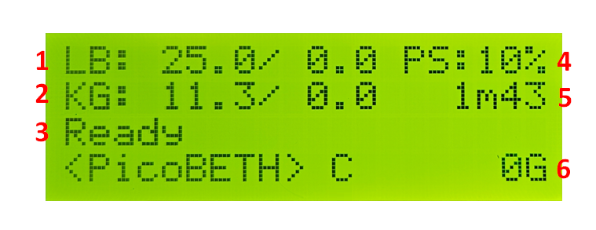
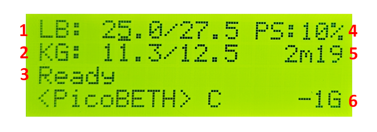
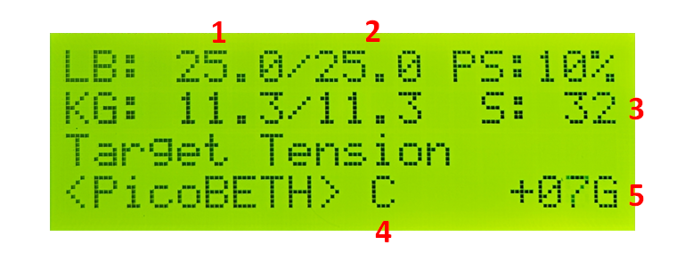
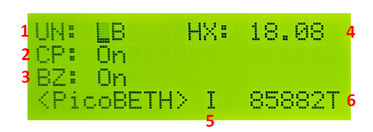
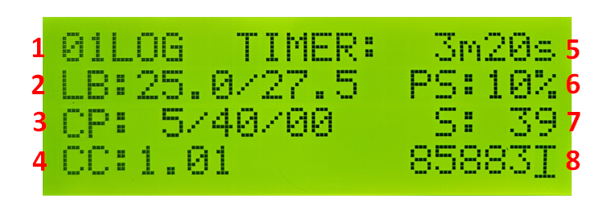
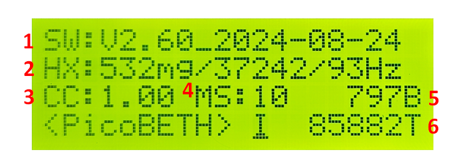
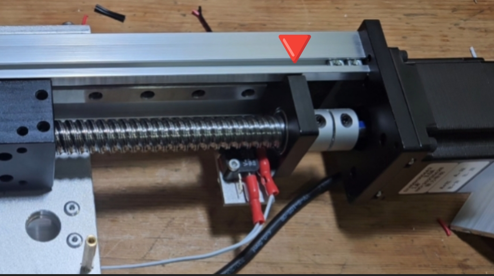
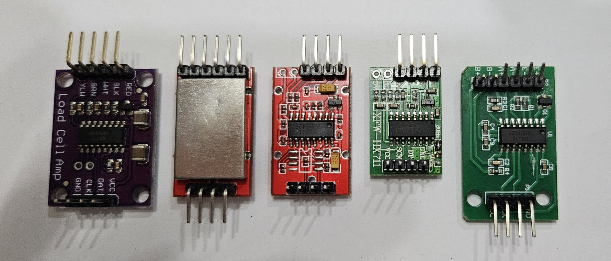

[](https://github.com/206cc/PicoBETH/blob/main/README.cht.md)
[](https://github.com/206cc/PicoBETH/blob/main/README.md)

> [!TIP]
> Translated by ChatGPT 3.5  
> 中文說明請點選上方連結

# PicoBETH
PicoBETH (Raspberry Pico Badminton Electronic Tension Head) is an open-source project that allows hobbyist stringers who enjoy stringing but only have mechanical stringing machines (drop-weight, manual crank) to create their own electronic tensioning head. If you have basic programming skills, this project can be easily completed.

> Design philosophy: Economical, Intuitive, Accurate 

## Current Main Functions and Features

[](https://www.youtube.com/watch?v=s5no9YdeNnc)

### Functions
- **LB/KG display and setting**
- **Pre-Stretch function**
- **Constant-Pull system**
- **Knot function**
- **Tension adjustment manually during tensioning**
- **Tension calibration**
- **Stringing timer**
- **Tension timer**
- **Tension counter and boot counter**
- **Detailed recording of tensioning logs**
- **Pull speed of the string(Switch on the TB6600 stepper motor driver)**

### Features
- **0.05LB High Precision**
  - Achieved with the Sparkfun HX711 at 94Hz and software version V2.2 and later in fast mode.
- **Low Power Consumption**
  - Uses a DC12V3A power supply.
- **Real-time UPS Redundancy (Uninterruptible Power Supply)**
  - Uses 3 x 18650 batteries to ensure at least one complete racquet stringing.
- **Compact and Space-Saving**
  - Dimensions are approximately 38(L) x 15(W) x 9(H) CM.(excluding clamp head)

## Development Project Plan

| Project Item        | Progress   | Remarks                                      |
| ------------------- | ---------- | -------------------------------------------- |
| Reliability Testing | In Progress| Current tension count: 95,000+ (2024/08/25)  |
| Tennis Racket Compatibility | Not Started | Parts procurement in progress          |
| Pico 2 Compatibility | Not Started |                                             |

## Background
A year ago, due to company club activities, I started playing badminton. Although my badminton skills weren't great, I became fascinated with stringing. I purchased a drop-weight stringing machine and initially planned to buy an electronic tensioning head. However, I later thought about using my knowledge to create this project on the Raspberry Pico, incorporating a load sensor, several microswitches, and buttons.

Drop-weight stringing machine and modification parts


Modification completed (Under Development)


Final machine [How to make step by step](https://youtu.be/uJVE3YFJtJA)


Stringing demonstration video

[](https://www.youtube.com/watch?v=ygbpYtNiPa4)

> [!NOTE]
> If you don't have a stringing machine, you can refer to this project to make one: [Pico-Badminton-Stringer](https://github.com/HsuKaoPang/Pico-Badminton-Stringer)

> [!NOTE]
> If you are choosing a manual badminton stringing machine. I recommend purchasing a drop-weight machine with a six-point fixed and base clamp. Drop-weight machines have a somewhat constant-pull effect, and the rackets strung with a drop-weight machine are not much different from those strung with an electronic machine. Before completing this project, you can use a drop-weight machine to become familiar with stringing. In the future, if the electronic stringing head malfunctions, you can quickly switch back to using the drop-weight machine head. 

## Warning
If your badminton stringing machine structure is not robust, I strongly advise against undertaking this project. A weak fixing platform can deform when under tension, causing the racket frame to become rounded and the tension to decrease. As a result, the machine compensates by reinforcing the tension, leading to a cycle that ultimately results in the badminton racket breaking.

> [!CAUTION]
> Extremely important: If your stringing machine is of a simple type, please make sure to reinforce the structure.

> [!CAUTION]
> Extremely important: If your stringing machine is of a simple type, please make sure to reinforce the structure.

> [!CAUTION]
> Extremely important, so I’ll remind you three times: If your stringing machine is of a simple type, please make sure to reinforce the structure.

## User Interface

The following demonstrates the user interface of version V2.60.

### Main Screen

- Use the Exit button to start the timer function. Press it again to stop the timer, and a third time to reset the timer.

1. Set LB
2. Set KG
3. Status Display
4. PS = Pre-stretch Function, KT = Knotting Function
5. Stringing Timer Time
6. Current Tension Value (Grams)



### Tension Setting Screen

- Press the five-way button to enter the tension setting mode. The first press only displays the maximum tension with pre-stretch included. The second press begins adjusting the tension and pre-stretch.
- The pre-stretch function (PS) and knotting function (KT) can be toggled using the up and down buttons. After using the knotting function, it will automatically switch back to the pre-stretch function.

1. LB Setting, minimum unit 0.1 / Maximum tension including pre-stretch
2. KG Setting, minimum unit 0.1 / Maximum tension including pre-stretch
3. Status Display
4. Pre-stretch/Knotting % Setting 0 ~ 30%, in increments of 5%
5. Stringing Timer Time
6. Current Tension Value (Grams)



### Tensioning Screen

- When the set tension is reached, the constant-pull mode is activated. Tension will increase if it's too low, or decrease if it's too high until the tensioning mode is ended by pressing the button on the clamp head or the Exit button.
- Pressing the middle button of the five-way button will disable the constant-pull system. Pressing the middle button again will re-enable the constant-pull system.
- Pressing the up or down buttons of the five-way button once will increase or decrease the tension by 0.5LB.

1. Set Tension
2. Current Tension
3. A countdown starts when the set tension is reached
4. Constant-pull Status C = Enabled, M = Disabled
5. Difference from Set Tension in Grams, displays +++ if over 99G, displays --- if below 99G



### Settings Screen

1. UN: Set LB or KG on the main screen.
2. CP: Constant-pull On/Off
3. BZ: Buzzer On/Off
4. HX: HX711 Tension Sensor Calibration (see final settings section for details)
5. I: System Information
6. T: Total Tension Count/Log Record



### Detailed Log of Tensioning

1. LOG Number
2. Tensioning Information for this Log, Set Value/Maximum Value
3. constant-pull counts of increasing/constant-pull counts of decreasing/adjustment parameters
4. Tension Coefficient
5. If the timing function is enabled, it shows the time for this tensioning
6. Pre-stretch % for this tensioning
7. Tensioning Seconds
8. Tensioning Count



> [!NOTE]
> By default, 1-50 log entries are displayed. To adjust this, modify the LOG_MAX parameter.

> [!WARNING]
> Do not set the LOG_MAX parameter too high, as it may cause memory shortages.

### System Information

1. Software Version and Date
2. HX711 Tension Amplifier Info - Drift Value/Tension Baseline Value/RATE Hz
3. The movement speed of the clamp head, the higher it is, the faster it goes.
4. Stepper motor speed, the lower it is, the faster it goes.
5. Tension Parameters
6. Boot Count
7. Total Tension Count



## Hardware

Main materials
1. Raspberry Pico H
2. CBX/SGX 1610 ballscrew 200MM sliding table
3. NEMA23 57x56 stepper motor (2-phase 4-wire 1.8° 1.2Nm)
4. TB6600 stepper motor driver
5. NJ5 20KG load sensor (YZC-133)
6. HX711 module (SparkFun)
7. 2004 i2c LCD
8. Wise 2086 bead clip easy head
9. Five-way key module
10. Button
11. Micro switch
12. Active buzzer (active high trigger)
13. Tri-color LEDs
14. 12V 18650 UPS Battery Box

Main [BOM List](https://docs.google.com/spreadsheets/d/1ML2syn-BDUk_CEcyjm62lMwHZluXPYK5swn7pdFXTbw) Price Reference


> [!WARNING]
> Please make sure to read the next section on Hardware Procurement Recommendations

> [!WARNING]
> Unless you have the ability to modify the code yourself, please purchase materials according to the specified models or specifications.

## Hardware Procurement Recommendations

### Sliding Table

There are many styles of sliding tables, and this project uses the CBX/SGX 1610 ballscrew 200MM sliding table. It is recommended to purchase the CBX version with a bearing fixing seat. Some sliding tables without bearing fixing seat may experience issues under high-speed and high-tension conditions.

Bearing Fixing Seat


### TB6600 Stepper Motor Driver

TB6600 is a small, economical stepper motor driver used for 42 and 57 type stepper motors. It is very cheap on online stores. It is recommended to buy TB6600 labeled as "upgraded version" or "enhanced version". Some very cheap TB6600s may have noticeable electrical noise, and I am not aware of any unknown issues.

### HX711 Load Cell Amplifier

HX711 is a simple and easy-to-use amplifier for weight sensors, commonly used in high-precision electronic scales. In this project, it is used to measure the tension of the strings. I have tested many HX711 circuit boards produced by various manufacturers and found a serious issue: many HX711 circuit boards from different manufacturers tend to drift. Of course, this drifting issue can be fixed. I will produce a dedicated episode on my [YouTube channel](https://www.youtube.com/@kuokuo702) on how to fix this issue. It is recommended to directly purchase the HX711 Load Cell Amplifier produced by SparkFun, as it has better quality. Before fabricating the stringing machine head, use the drift test program taught in [EP. 3](https://youtu.be/pZT4ccE3bZk) to test the stability of this board. If you encounter any issues, you can leave a comment on the video.

I tested the HX711 circuit board 


### NJ5 (YZC-133) Load Sensor

The load sensor doesn't necessarily have to be the NJ5 (YZC-133). I chose this model because it can be easily installed on the Wise 2086 bead clip head. If you are using other clamps, there are many different styles available, just make sure to select a 20KG model. Please refer to the SparkFun HX711 guide linked below for detailed instructions.

[https://learn.sparkfun.com/tutorials/load-cell-amplifier-hx711-breakout-hookup-guide/all](https://learn.sparkfun.com/tutorials/load-cell-amplifier-hx711-breakout-hookup-guide/all)

### Front and Rear Limit Switches on sliding table

If the limit micro switches on the sliding table are too small, the buffer zone might be insufficient, causing the platform to move slightly after the switch is triggered and before it stops. A limited buffer zone might lead to the platform colliding with the micro switch body. Therefore, it is recommended to use larger micro switches, long-arm micro switches (bent back), or arc-arm micro switches, as these types of switches offer a larger buffer zone and are more suitable.

## Hardware Design Suggestions

### Distance Between the Bead Clip Head and the table

In theory, the closer the distance between the bead clip head and the table, the better, as it can extend the lifespan of the slider. If you are not using the Wise 2086 bead clip head, you can choose a shorter sensor design to reduce the distance between the two.

### Using a PCB Circuit Board

You can start by assembling and testing the circuit on a breadboard. Once successful, transfer the circuit to a PCB or a hand-soldered board. It's not recommended to use a breadboard for long-term use as it may lead to some issues.

## Wiring Diagram


> [!WARNING]
> If the LED module is not specifically designed for use with the Raspberry Pi, you need to connect a 330-ohm resistor in series to protect the GPIO.

# How To Make

Video Series of the Production Process (Continuously Updating)

[](https://www.youtube.com/playlist?list=PLN3s8Sz8h_G_Dp-Vqi42OujVhEX1pyrGo)

## Software Installation
Use Thonny to save the following code files to the Raspberry Pico. The src folder contains relevant libraries for hx711 and 2004 LCD.

1. main.py
2. src\hx711.py
3. src\lcd_api.py
4. src\pico_i2c_lcd.py

> [!NOTE]
> Thanks to [https://github.com/endail/hx711-pico-mpy](https://github.com/endail/hx711-pico-mpy) for providing the hx711 library for Pico.

> [!NOTE]
> Thanks to [https://github.com/T-622/RPI-PICO-I2C-LCD](https://github.com/T-622/RPI-PICO-I2C-LCD) for providing the 2004 LCD library for Pico.

> [!NOTE]
> Related crafting videos [](https://www.youtube.com/watch?v=oMgVq6rkX_Q)

## TB6600 Stepper Motor Parameters


> [!NOTE]
> Related crafting videos [](https://www.youtube.com/watch?v=7eG5W6a95h0)

## HX711 Load Cell Amplifier

This project demands a higher standard for the HX711, and it is recommended to use the more stable quality provided by SparkFun.


### Enabling 80Hz

The default setting for SparkFun's HX711 is 10Hz. To enable 80Hz, you'll need to cut the connection wire at the green arrow as indicated below.


### Stability Testing

The quality of each HX711 unit varies. Before installing the equipment, it's advisable to test the stability using a breadboard. A normally stable board should not drift by more than 1G over the course of a whole day.


> [!NOTE]
> The testing script is named TEST_hx711.py.

> [!WARNING]
> Starting from version 1.96, during boot-up, the board will check the RATE. Failure to reach 80Hz or exceeding a drift of 1G will prevent the board from booting up.

> [!WARNING]
> The quality of each HX711 amplifier varies. If there are any issues, it is recommended to switch suppliers.

> [!NOTE]
> Related crafting videos [](https://www.youtube.com/watch?v=pZT4ccE3bZk)

## Structural Layout

Components can be freely arranged. The diagram below shows the positioning hole diagram for reference. Refer to the tutorial video for usage instructions.


> [!NOTE]
> Related crafting videos [](https://www.youtube.com/watch?v=gZF2_dbtVzA)

## PCB Circuit Board


Gerber PCB [DOWNLOAD](https://github.com/206cc/PicoBETH/tree/main/docs/Gerber_PicoBETH_PCB_2024-08-17.zip)

> [!WARNING]  
> Version 1.3a has removed the 10K resistors for buttons and micro switches, as the Raspberry Pi Pico already includes built-in pull-down resistors for buttons. Using both may cause issues.


Gerber PCB BTN [DOWNLOAD](https://github.com/206cc/PicoBETH/tree/main/docs/Gerber_PicoBETH_BTN_2024-06-09.zip)

> [!NOTE]
> Please download the Gerber files and email them to an online (PCBWay, AliExpress, eBay) PCB manufacturer. Note that it is a single-layer, double-sided 1.6mm PCB with double-sided pads. Place the order once the manufacturer provides a quote.

> [!NOTE]
> Related crafting videos [](https://www.youtube.com/watch?v=0bb_qs8acqc)

## Hardware Function Testing Mode

Upon completing assembly and powering on the machine for the first time, please conduct tests on all buttons, front and rear limits, and HX711 sensors as instructed on the screen.

> [!NOTE]
> Related crafting videos [](https://www.youtube.com/watch?v=MN-W57_CqYg)

## Final Settings

### Calibrate The HX Parameter

HX711 tension sensor calibration coefficient. It is necessary to recalibrate it the first time you use it or when replacing the tension sensor or HX711 circuit board.

After version V2.2, due to the improved fine-tuning accuracy, enabling the auto-calibration feature will result in more precise corrections.

Calibration Steps:
1. Go to the settings page and ensure the Constant-Pull feature is enabled.
2. Set the HX parameter to 20.00 on the settings page.
3. Return to the main menu and set the tension to 20.0 lb with a Pre-Stretch of 10%.
4. Attach one end of the external tension gauge to the stringing machine and the other end to the badminton string.
5. Start tensioning, and once it stabilizes, record the lowest reading from the external tension gauge.
6. Enter the recorded tension gauge value on the settings page and press the S button to save.

Reference video

[](https://www.youtube.com/watch?v=nrXwF6YsGyc)


Calibration steps for versions prior to V2.12:

Calibration method:
1. Temporarily disable the Constant-Pull function on the settings page.
2. Set the HX parameter to 20.00 on the settings page.
3. Return to the main menu and set the tension to 20.3 lb with a Pre-Stretch of 10%.
4. Attach one end of the external tension gauge to the stringing machine and the other end to the badminton string.
5. Start tensioning, and when the LCD displays below 20.0 lb(19.9), note down the reading on the external tension gauge.
6. Enter the recorded tension gauge reading on the settings page and re-enable the constant-pull function.

Reference video

[](https://www.youtube.com/watch?v=r7JQPvqK3No)

> [!IMPORTANT]
> Necessary! If you skip this calibration step, the tension displayed on the LCD will not match the actual tension.

## Tension Drift Test

After completing the tension calibration, check the degree of drift in the tension. The normal drift should be within approximately ±0.05LB, as shown in the video below. After passing the test, use the old racquet stringer to test a few times. If there are no issues, you can officially start using it.

Reference video

[](https://www.youtube.com/watch?v=wPfW1ht--Y0)

## Reliability Testing Mode

The Reliability Testing Mode, introduced in version V2.4, can automatically simulate stringing tensioning to check for any abnormalities in newly assembled or hardware-modified machines.

### Usage Instructions

When the version information appears at startup, press and hold the Up button until you hear a long beep, then release it. After securing the string, press the Set button to start the test.

### Testing Method
The system will automatically cycle through tensioning from 20LB to 30LB, with a fixed 10% pre-stretch. After holding the tension for 3 seconds, the tension will release. If any abnormalities are detected, the process will stop automatically, and an error message will be displayed. The test will continue indefinitely unless the Set button is pressed when prompted.

### Qualification Criteria
It is recommended to test at least 1000 tensioning cycles (approximately 4 hours) without any abnormal interruptions. A properly assembled machine should not experience any interruptions during this period.

> [!WARNING]
> Do not run this version directly in Thonny. Please write the program to the Raspberry Pi Pico and run it independently.

Reference video

[](https://www.youtube.com/watch?v=ypDOEKCdW9U)

## Maintenance

### Screw Maintenance

Observe for any abnormal vibrations or noises during each use. Visually inspect the screw's condition every month. Check for dust or other foreign substances on the screw and ensure sufficient lubrication. If yellowish-brown lubricating oil appears around the screw and the walking surface appears smooth, it indicates good lubrication. The recommended viscosity for the lubricating oil used in ball screw maintenance is 30~40 cSt.

### Parts Replacement

After replacing any components during maintenance, enter the hardware function testing mode at startup to retest all components for proper functionality.

**Usage:** When the version information appears at startup, press and hold the middle setting button until a long beep is heard, then release it.

> [!IMPORTANT]
> If you replace any hardware components, be sure to run **hardware function testing mode** to verify that all hardware functions are working properly.

### Factory Reset

You can restore the factory default settings without a computer by recreating the `config.cfg` file (the original configuration file will be renamed to `config.cfg.bak`). After restoring the default settings, be sure to set the FT parameters and recalibrate the HX tension parameters.

**Usage:** When the version information appears at startup, press and hold the exit button until a long beep is heard, then release it.

Reference video:

[](https://www.youtube.com/watch?v=iAgFXuEtak4)

### Firmware Update

Please follow the steps below to update the firmware:

- **Back up all files from the Raspberry Pi Pico to your computer.**
- **Upload the new version of `main.py` to the Raspberry Pi Pico.**
- [**Perform hardware testing**](https://github.com/206cc/PicoBETH/blob/main/README.md#hardware-function-testing-mode)
- [**Conduct reliability testing**](https://github.com/206cc/PicoBETH/blob/main/README.md#reliability-testing-mode)
- **Test stringing with an old racket at least once.**

> [!IMPORTANT]  
> All of the above steps are crucial.

## Logging System

Starting from version V2.5, a simple logging system has been introduced to help with troubleshooting, recording important events, and facilitating future review and analysis.

### System Log `sys_log.txt`

This log file is viewable on a computer. You can customize the log's storage location using the built-in `logs_save()` function. When the log file reaches 100KB, the system will automatically rename and overwrite it.

**Format:**
```
Triggered function: Total tension count / Custom information
```

**Example:**
```
init(HX711):55863T/21188/21465/401/90
forward():55863T/No String?
start_tensioning():55863T/ts_err#0
forward():55863T/No String?
start_tensioning():55863T/ts_err#0
init(HX711):55863T/21188/21493/487/90
```

### Stringing Log `logs.txt`

This log can be viewed directly on the LCD screen. The maximum log value is defined by the `LOG_MAX` parameter.

**Format:**
```
Total tension count, Timer time, Tension unit, Set tension (LB), Max tension (G), Pre-stretch (%), Tension time, Number of tension increases, Number of tension decreases, Tension parameter, Tension calibration parameter, FT parameter, Knotting function SW, Knot (%)
```

**Example:**
```
60384,72719,1,21,10477,10,3,0,0,1.03852,18.17,1,0,15
60385,72736,1,22,10976,10,3,0,37,1.048519,18.17,1,0,15
60386,72753,1,23,11475,10,3,4,23,1.03852,18.17,1,0,15
60387,72770,1,24,11974,10,3,5,41,1.02852,18.17,1,0,15
60388,72785,1,25,12473,10,3,7,43,1.03852,18.17,1,0,15
60389,72803,1,26,12972,10,3,6,49,1.048519,18.17,1,0,15
```

### Reliability Testing Log `rt_logs.txt`

This log file is viewable on a computer. It automatically renames and overwrites when the test count reaches 1000.

**Format:**
```
Reliability test count / Total tension count / Automatic tension parameter / Test tension parameter / Tension completion time (seconds)
```

**Example:**
```
4521/60384T/1.03/0.97/13
4522/60385T/1.04/0.97/12
4523/60386T/1.05/0.97/13
4524/60387T/1.04/0.97/13
4525/60388T/1.03/0.97/12
4526/60389T/1.04/0.97/13
```

# Frequently Asked Questions

## Q: I want to make this project, but I'm not sure if I can complete it.
A: It is recommended to first watch EP.1 ~ EP.3 of the [project compilation](https://www.youtube.com/playlist?list=PLN3s8Sz8h_G_Dp-Vqi42OujVhEX1pyrGo) on my YouTube channel. You will need to purchase materials such as Raspberry Pico, HX711 load cell amplifier, NJ5 load sensor (YZC-133), TB6600 stepper motor controller, and 57x56 stepper motor. These materials are easy to prepare and not expensive. If the example program runs smoothly, you can prepare the remaining materials. The subsequent production process leans towards mechanical machining. Additionally, you will need tools such as a bench drill, angle grinder, soldering iron, and some basic mechanical machining skills. Follow the tutorial videos step by step to complete the project.

## Q: Can I use other stepper motor drivers, such as the better DM542C?
A: In theory, you can switch to DM542C, but the driving method may need to be modified. For example, parameters such as MOTO_FORW_W, MOTO_BACK_W for controlling forward and reverse in the code, and MOTO_SPEED_V1, MOTO_SPEED_V2 for controlling speed may need to be adjusted. It is recommended to first modify the example program in [EP.2](https://youtu.be/7eG5W6a95h0) to ensure that this driver can drive the motor normally and that there is no abnormal noise from the slide during movement before transplanting it into the main program. Although I haven't tried it myself, there have been successful ports by other branch developers, which you can refer to in the [Pico-Badminton-Stringer](https://github.com/HsuKaoPang/Pico-Badminton-Stringer) project.

## Q: My HX711 RATE is only 10Hz, not 80Hz. Can I still use it?
A: No, you cannot. Initially, this project was also made with a sampling frequency of 10Hz, which can be used normally. However, after testing, it was found that a sampling frequency of 80Hz provides more precise, delicate, and faster response control of tension (the time difference between detecting the specified tension and instructing the Raspberry Pico to stop the motor rotation at 10Hz is about 1.3 times that of 80Hz). Therefore, in version 1.96, I added a check for the 80Hz action.

## Q: What is drift in HX711?
A: You can refer to the test program in [EP.3](https://youtu.be/pZT4ccE3bZk). After testing, the normal drift value of HX711 at 80Hz is about 0.5 ~ 1 gram. Therefore, in version 1.96, I added a drift value sampling during startup for 1 second. If it exceeds 1 gram, it cannot be used. If the check passes, generally speaking, the real-time tension displayed in the lower right corner of the LCD within -10 ~ 10 grams during standby is normal linear drift.

## Q: Do I have to use SparkFun's HX711 load cell amplifier?
A: Of course, you can use HX711 load cell amplifiers from other brands, but the premise is that they can pass the test program in [EP.3](https://youtu.be/pZT4ccE3bZk). In my experience, other brands' normal HX711s will be as stable as SparkFun's. Unfortunately, other brands may have many defective products that drift. If the drift exceeds 50 grams, it is an error value of 0.1 lb, which will cause repeated fine-tuning of the Constant-pull system.

## Q: About the ERR: HX711@Zero #3 error displayed during startup
A: Recently, some people reported passing the [EP.3](https://youtu.be/pZT4ccE3bZk) HX711 test, but still encountering this error during startup. This check is performed on a value obtained by the Wheatstone bridge on the load sensor (YZC-133) after being amplified by the HX711, serving as the initial reference for zero-point calibration. In the EP3 test program, this output is displayed using V0. During development, I found that the value of the HX711 I purchased that tends to drift was negative, and after repairing these drifting boards, the value became positive again. Therefore, I added this check condition. Perhaps my test sample size was not large enough, and positive or negative values do not affect usage. If subsequent confirmation shows that negative values are not a problem, I will remove this check. If you encounter this issue now, please comment out this check (lines 447 and 448 in version v2.12), and then report back to me if it works properly.

## Q: Can I make my own bead clip head?
A: This has also been something I've always wanted to do. The Wise 2086 bead clip easy head is the most expensive hardware in the entire project, but it's also because it can be easily installed on the NJ5 load sensor (YZC-133) and has excellent clamping functionality. So far, I haven't figured out how to replace it. If you have a good bead clip head design, you can install it yourself. Just make sure to pay attention to the precautions mentioned in [EP.9](https://youtu.be/Ax4agdsqyms).

## Q: How durable is this electronic tension head?
A: If all high-quality components are used, the durability should theoretically be quite high. Even if repairs are needed in the future, all the parts are relatively inexpensive and easy to replace.

## Q: Can this project be used for stringing tennis rackets?
A: In theory, it is possible, but some hardware needs to be upgraded, such as changing the load sensor (YZC-133) from 20KG to 50KG, larger stepper motors, larger power supplies, stronger platforms and slides, and modifying some code parameters. If interested, you can develop your own branch project.

## Q: Are there English subtitles for the project compilation on the YouTube channel?
A: I plan to add English subtitles in the future, but because my usual work is quite busy, I only have some time to work on projects each day. If possible, please give the video a thumbs up and subscribe, as this is a great encouragement for me.

## Q: 2004 LCD has no display
A: Please turn to the back and try adjusting the blue variable resistor to change the LCD contrast. Also, check if the jumper for the LCD backlight is inserted. If everything is functioning normally, you can try connecting only the 5V power, GND, and the 4 pins of the LCD to the Raspberry Pi Pico, if there are no issues, the boot screen should appear when powered on. If it still doesn't work, please check if the four necessary files—`main.py`, `src/hx711.py`, `src/lcd_api.py`, and `src/pico_i2c_lcd.py`—are present on the Raspberry Pi Pico.

## Q: The stringing function works fine, but the buzzer keeps sounding continuously.
A: Please check if you mistakenly purchased the Active Low Trigger version. The correct version should be the Active High Trigger.

# Conclusion
If you have any questions about making, please leave a comment in the YouTube video.

# Pico Sringing Pattern

I also have my own stringing pattern, temporarily named the Pico Stringing Pattern. I'm not sure if anyone else is using it, so if there is a similar stringing pattern, please let me know the stringing pattern name.

The stringing pattern demo.

[](https://www.youtube.com/watch?v=2QjT0JGiluk)

## Sringing Pattern


1. The short side is approximately 5 racket lengths, and the long side is approximately 8 racket lengths.
2. Follow the Yonex stringing pattern for main strings, pulling the two outermost main strings together for tension.
3. The cross strings are first the bottom of the short side, tying knots at the bottom, and then strings on the long side, tying knots at the top.
4. Increasing the tension of the cross strings will help the racquet maintain its original shape after stringing. Due to variations in stringing machine and individual techniques, you can experiment to find the tension increment that minimizes deformation.

## Tension Of Each String


1. The measured values were obtained after stringing with a 25lb tension, following a 10% pre-stretch, and allowing it to sit for 48 hours.
2. The measurements represent relative tension reference values for each string, NOT the actual tension.
3. Calibration method for the tension tester: [https://youtu.be/xYqu03XBzFU](https://youtu.be/xYqu03XBzFU)
