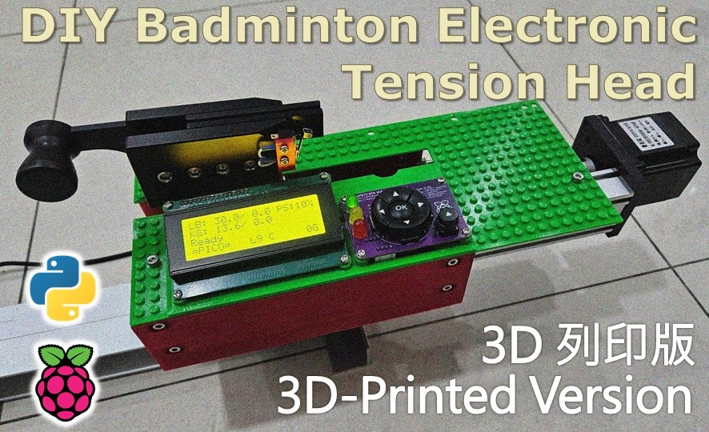
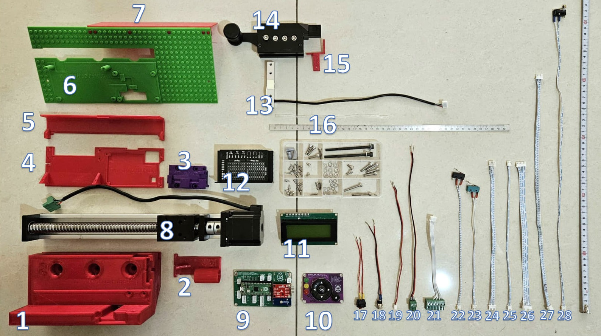
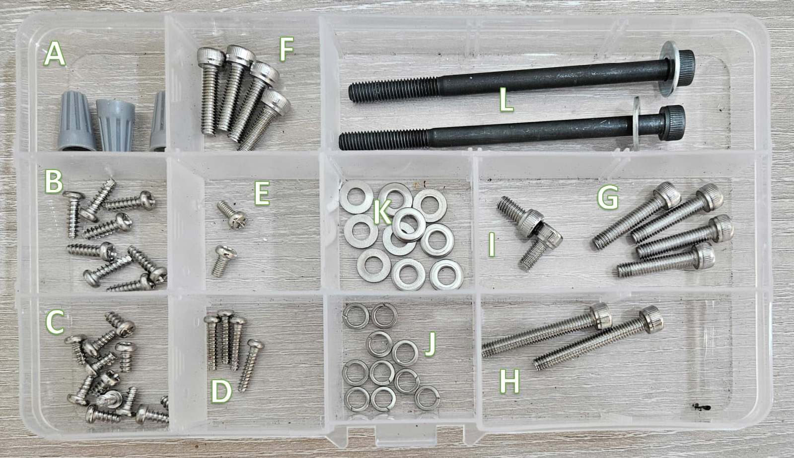
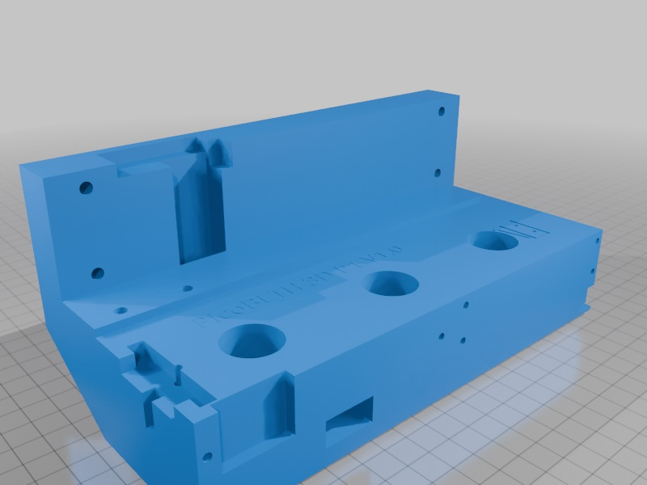
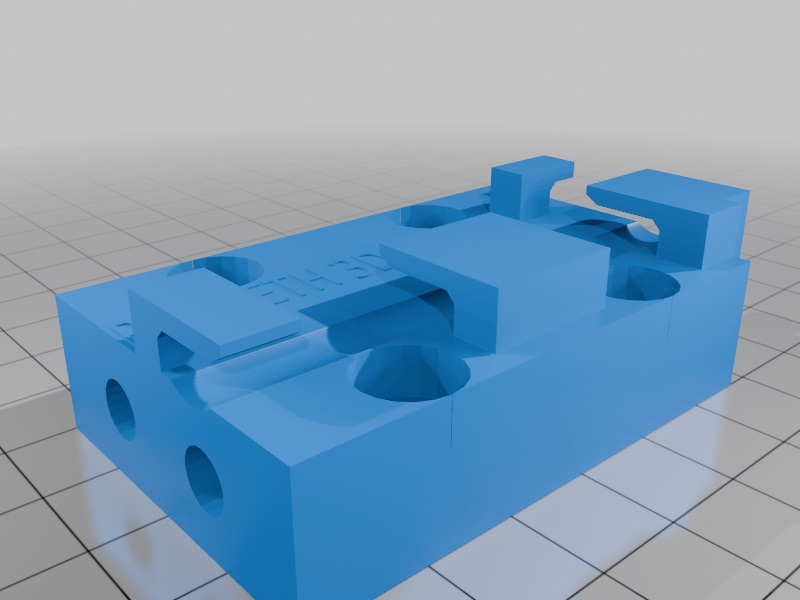

  

# PicoBETH HW 3D-Printed Version
> [!CAUTION]
> The documentation for this 3D-Printed project is still being revised. If you have any questions, feel free to ask and discuss in the community.

> [!CAUTION]
> This branch replaces the components in the main branch that require complex machining with 3D-printed parts, significantly simplifying the production process. Before starting this 3D-printed branch, please thoroughly read the [main branch](https://github.com/206cc/PicoBETH) documentation to understand the relevant information and precautions.

## 3D-Printed Parts Download
[PicoBETH HW 3D Printed Version](https://www.thingiverse.com/thing:6913170)

> [!CAUTION]
> Avoid using PLA for printing as its strength may degrade over time.

## 3D Viewing Model (Non-Printable)

[PicoBETH HW 3D Viewing Model](https://www.tinkercad.com/things/4lv9ptAmuc4-picobeth-hw-3d-viewing-model)

## Parts List

### Main Components

| No. | Name                                |
|-----|-------------------------------------|
| 1   | Part-1 Main Body                   |
| 2   | Part-2 Rear Limit Mount            |
| 3   | Part-3 Load Cell Bracket           |
| 4   | Part-4 PCB and TB6600 Mount        |
| 5   | Part-5 Power and Switch Cover      |
| 6   | Part-6 LCD and Button Mount        |
| 7   | Part-7 Rear Cover                  |
| 8   | SGX 1610 200mm Sliding Table       |
| 9   | PCB Mainboard, Raspberry Pico, SparkFun HX711, Buzzer |
| 10  | PCB Button Board                   |
| 11  | 2004 i2c LCD                       |
| 12  | TB6600 Stepper Motor Driver        |
| 13  | NJ5 20kg Load Cell (YZC-133)       |
| 14  | WISE 2086 Clip Head                |
| 15  | Activation Switch Mount            |
| 16  | Ø4 20cm Wire Wrap                  |
| 17  | Power Switch 12cm                  |
| 18  | DC Jack Cable 15cm                 |
| 19  | Mainboard Power Cable 20cm         |
| 20  | TB6600 Power Cable 28cm            |
| 21  | XH2.54mm 4P Stepper Motor Signal Cable 15cm |
| 22  | XH2.54mm 2P Front Limit Switch Cable 20cm |
| 23  | XH2.54mm 2P Rear Limit Switch Cable 20cm |
| 24  | XH2.54mm 4P LED Signal Cable (Same Direction) 25cm |
| 25  | XH2.54mm 2P Cancel Button Cable (Same Direction) 25cm |
| 26  | XH2.54mm 6P Five-Way Button Cable (Same Direction) 25cm |
| 27  | XH2.54mm 4P LCD Signal Cable 40cm |
| 28  | XH2.54mm 2P Clip Activation Switch Cable 50cm |

> [!WARNING]  
> **Note:** Power cables must not be thinner than **22 AWG**.

### Screw List

| No. | Name                           | Quantity |
|-----|--------------------------------|----------|
| A   | Gray Spring Wire Connectors    | 3        |
| B   | M3 × 10mm Self-Tapping Screws  | 8        |
| C   | M3 × 6mm Self-Tapping Screws   | 15       |
| D   | M2.6 × 10mm Self-Tapping Screws| 4        |
| E   | M3 × 6mm Round-Head Screws     | 2        |
| F   | M4 × 16mm Hex Screws           | 4        |
| G   | M4 × 20mm Hex Screws           | 4        |
| H   | M4 × 30mm Hex Screws           | 2        |
| I   | M4 × 8mm Hex Screws            | 2        |
| J   | M4 Spring Washers              | 10       |
| K   | M4 Flat Washers                | 10       |
| L   | M5 × 70mm Hex Screws + Washers | 2        |

## **Assembly Steps**

Follow the [YouTube Tutorial Video](https://youtube.com/shorts/kR_JLVGHwB8) for detailed assembly instructions.

### **Step 1: 3D-Printed Parts**

- **Main Body (PART-1)**  
The main body must withstand significant deformation forces. Recommended print settings:  
  - **Wall Thickness:** At least 5mm  
  - **Infill:** At least 30%  

- **Load Cell Bracket (PART-3)**  
This part serves as the mounting bracket for the Load Cell and the sliding table. Recommended print settings:  
  - **Infill:** 100%

### **Step 2: Assembling the Main Body (Part-1)**
1. Attach the bottom of the main body to the sliding table using **M4 x 30mm screws + spring washers + flat washers** x2 (keep them slightly loose for adjustment).
2. Attach the sides of the main body to the sliding table using **M4 x 20mm screws + spring washers + flat washers** x4 (keep them slightly loose for adjustment).
3. Align the main body with the sliding table.
4. Tighten the bottom **M4 x 30mm screws** x2 to a torque of **1.5 Nm**.
5. Tighten the side **M4 x 20mm screws** x4 to a torque of **1.5 Nm**.

> [!CAUTION]
> Ensure washers are installed, and tighten screws to the recommended torque to prevent damage to the 3D-printed parts.

### **Step 3: Assembling the PCB and TB6600 Mount (Part-4)**
1. Secure the TB6600 to the mount using **M3 x 10mm self-tapping screws** x4.
2. Secure the PCB using **M3 x 10mm self-tapping screws** x2 and **M3 x 6mm self-tapping screws** x2.
3. Connect the **TB6600 power cables**, **control signal cables**, and **motor signal cables**.
4. Secure the TB6600 mount to the frame using **M3 x 10mm self-tapping screws** x2.

### **Step 4: Wiring the Power Cables**
1. Install the **power switch** and **DC jack** onto the **Power Cover (Part-5)**.
2. Insert the **mainboard power cable** into the mainboard.
3. Use **gray spring wire connectors** to connect the **DC jack positive wire** to one side of the **power switch**.
4. Connect the remaining **three positive wires** into another gray connector.
5. Use another gray connector for all **negative wires**.

### **Step 5: Wiring Signal Cables**
1. Thread the **XH2.54mm 4P LCD Signal Cable** through the conduits and insert it into the mainboard. Mark the GND pin on both ends.
2. Thread and connect the **Five-Way Button (XH2.54mm 6P)**, **LED Signal Cable (XH2.54mm 4P)**, and **Cancel Button (XH2.54mm 2P)** to the mainboard.

### **Step 6: Installing the Clip Head and NJ5 20kg Load Cell (YZC-133)**
1. Drill a **6mm hole** 5mm above the Load Cell and attach it to the clip head.
2. Attach the **Load Cell** to the **Part-3 Load Cell Bracket** using **M5 x 70mm hex screws + flat washers** (leave a 5mm gap for adjustment, do not fully tighten yet).
3. Secure the activation switch mount to the clip head using **M3 x 6mm round-head screws**.
4. Attach the **XH2.54mm 2P Clip Activation Switch** using **M3 x 6mm self-tapping screws**.
5. After organizing the cables, tighten the **M5 x 70mm hex screws** to a torque of **2.0 Nm**.
6. Secure the **M4 x 16mm screws + spring washers + flat washers** x4 to a torque of **1.5 Nm**.
7. Connect the **XH2.54mm 2P Clip Activation Switch** to the mainboard.
8. Use **Ø4 wire wrap** to organize the cables for the Load Cell and Clip Activation Switch.

> [!CAUTION]
> Ensure washers are installed, and tighten screws to the recommended torque to prevent damage to the 3D-printed parts.

### **Step 7: Installing the Front and Rear Limit Switches (Part-2)**
1. Secure the **Rear Limit Switch (XH2.54mm 2P)** to the **Rear Limit Mount (Part-2)** using **M2.6 x 10mm self-tapping screws** x2.
2. Attach the **Rear Limit Mount (Part-2)** to the **Main Body (Part-1)** and secure it with **M3 x 6mm self-tapping screws**.
3. Secure the **Front Limit Switch (XH2.54mm 2P)** to the **Main Body (Part-1)** using **M2.6 x 10mm self-tapping screws** x2.
4. Connect the front and rear limit switch cables to the mainboard.

### **Step 8: Installing the Power and Switch Cover (Part-5)**
1. Attach the **Power and Switch Cover (Part-5)** to the **Main Body (Part-1)** using **M3 x 6mm self-tapping screws** x2.
2. Organize the power cables.

### **Step 9: Assembling the LCD and Button Mount (Part-6)**
1. Position the **LCD and Button Mount (Part-6)** on the **Main Body (Part-1)** (do not secure yet).
2. Connect the **XH2.54mm 4P LCD Signal Cable** to the **2004 i2c LCD** (ensure the GND pin is marked), and secure it using **M3 x 6mm self-tapping screws** x4.
3. Connect the **Five-Way Button (XH2.54mm 6P)**, **LED Signal Cable (XH2.54mm 4P)**, and **Cancel Button (XH2.54mm 2P)** to the **PCB Button Board**.
4. Secure the **PCB Button Board** to the **LCD and Button Mount (Part-6)** using **M3 x 6mm self-tapping screws** x4.
5. Secure the **LCD and Button Mount (Part-6)** to the **Main Body (Part-1)** using **M4 x 8mm hex screws**.

### **Step 10: Mounting the Stringing Head to the Platform**
1. Before installation, design a custom adapter base to fit your stringing machine platform. Refer to [EP.9 Positioning and Fixing](https://youtube.com/Ax4agdsqyms).
2. It is recommended to use M8 screws with flat washers and tighten them to a torque of **3.0 Nm**.

### **Step 11: Hardware Testing**
1. Enter HW Testing Mode by holding the **middle button** during startup.
2. Follow the prompts to complete all hardware tests.

### **Step 12: Tension Calibration and Testing**
1. Refer to [EP.10 Final Settings (Tension Calibration)](https://youtube.com/WMFJQU_TSFk) to complete the tension calibration process.
2. Test the accuracy of the tension at 20LB and 30LB settings.
3. After calibration, save the parameters by selecting **"S"** in the menu.

## Other Notes

### Load Cell Signal Wires

Due to design constraints, the Load Cell's installation direction is reversed compared to HW1 and HW2. Swap the green and white signal wires on the connector to ensure the correct force detection direction. Incorrect wiring may result in reversed tension readings.

### Load Cell Installation Direction

Pay attention to the installation direction of the Load Cell. The NJ5 YZC-133 shown in the video has a different orientation compared to most other YZC-133 models. If using other brands, the Load Cell may need to be rotated 180 degrees. For more details, refer to [EP.5 Supplement - Slope Adjustment and YZC-133 Load Cell](https://youtube.com/22Ev_kWTnxk).

# Support
If you have any questions or suggestions for improvement, feel free to leave a comment in the discussion forum or under the YouTube videos. Once you complete the project, we also encourage you to share photos of your results in the forum.
