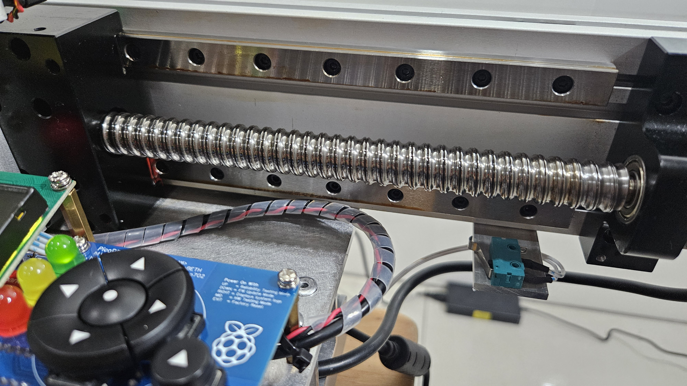
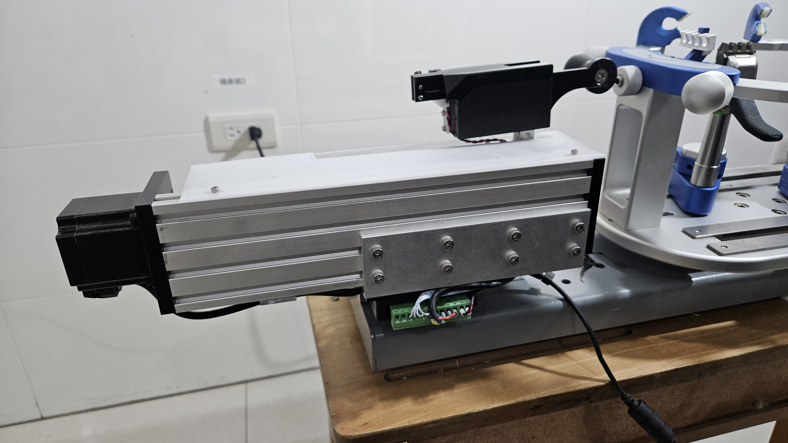
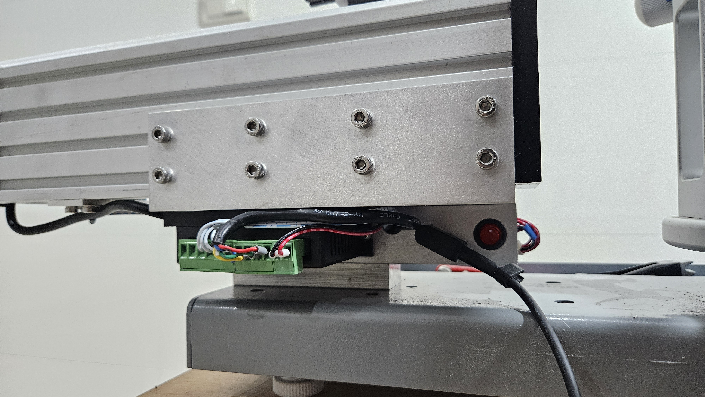

 

# PicoBETH Tennis Version

This version requires minimal hardware modifications based on the original badminton version to support the higher tension demands of tennis rackets. Before proceeding with this branch, be sure to thoroughly read the [main version](https://github.com/206cc/PicoBETH) documentation to understand the relevant knowledge and important considerations.

> **Extended Recommendation: ZeroBETH Project**
>
> You can refer to this extended version, ZeroBETH, which replaces the main controller from Raspberry Pi Pico with **Raspberry Pi Zero 2 W**.  
> The faster processing speed enables quicker constant pull adjustments, **making it especially suitable for high-tension tennis stringing**.
>
> [Watch the ZeroBETH Badminton/Tennis Stringing Head Comparison Demo](https://www.youtube.com/watch?v=osMxNlAMeeI)  
> [View the ZeroBETH Project Page](https://github.com/206cc/ZeroBETH/)

## Hardware Changes

1. **Sliding Table Lead Screw**: Upgraded to 1605 specification
2. **Load Cell**: Upgraded to 50kg specification

> [!WARNING]
> The software version must be updated to **V2.80A** or later for the tennis version.

> [!CAUTION]
> The documentation for this project is still being revised. If you have any questions, feel free to ask in the discussion forum.

### Hardware Configurations

Two configurations are provided for the tennis version: **Lightweight** and **Standard**. The table below shows the main differences between the badminton version and the two tennis versions:

|               | **Badminton Version** | **Tennis – Lightweight** | **Tennis – Standard** |
|---------------|----------------------|-------------------------|----------------------|
| **Sliding Table** | SGX 1610 | SGX 1610 | GX80 1605 |
| **Load Cell** | NJ5 YZC-133 20kg | NJ5 YZC-133 50kg | NJ5 YZC-133 50kg |
| **Maximum Tension** | 40 lb | 70 lb | 90 lb |
| **Speed** | Fast | Fast | Slow |

> [!WARNING]
> Do not use the GPP series sliding table. Reliability tests indicate that after approximately 70,000 tensioning cycles, the optical shaft will develop noticeable gaps.

> [!NOTE]
> Lead screw speed reference video
> 
> 

---

### Accuracy   
Reference video: [PicoBETH HW3D Lightweight Tennis – Tension Calibration & Accuracy](https://youtu.be/3H8zwHVQJGE)

---

## Lightweight Tennis Version

This version continues using the SGX series sliding table, replacing only the lead screw with 1605 for increased pulling force. Since SGX is equipped with only one MGN12H linear rail, it is recommended to keep the maximum tension below 70 lb to ensure the longevity of the sliding table.

### Assembly Instructions

- Refer to [PicoBETH HW 3D-Printed Version](https://youtu.be/gtyGDhp-Uqk) for assembly guidance.
- Only the Load Cell needs to be upgraded to 50kg.

---

## Standard Tennis Version

This version uses the GX80 series sliding table with a 1605 lead screw. The GX80 is configured with two MGN12H linear rails, allowing it to safely support up to 90 lb of tension. Reliability testing indicates that after 870,000 cycles, the Load Cell experienced metal fatigue and broke, but this lifespan is still quite long.

### Assembly Instructions

- Refer to [HW2 for GX80](docs/HW2.2_GX80.pdf) layout diagram.
- Main component specifications are as follows:

  | Component | Material | Dimensions | Length/Thickness |
  |------|------------|-----------------|---------------|
  | A    | L-shaped aluminum | 150 x 50 x 5 mm | Length: 175 mm  |
  | B    | Aluminum square tube | 32 x 32 x 3 mm  | Length: 175 mm  |
  | C    | Aluminum bar | 20 x 15 mm | Length: 80 mm   |
  | E    | Aluminum sheet | 55 x 25 mm | Thickness: 2 mm    |

### Related Photos

---

## Software Instructions

Ensure that you are using **V2.80A** or later, as this version includes calibration for the 50 kg Load Cell and optimizes the constant pull system for tensions above 40 lb.

### Parameter Settings

Please configure the following settings in the **Engineering Menu**  
(*applicable to firmware version v2.80E and later*):

1. Set the **Load Cell** to **50kg**  
2. Set the **Maximum Tension** as follows:  
   - **70LB** (for SGX 1610 sliding platform)  
   - **90LB** (for GX 80 1605 sliding platform)

---

## Tension Calibration

Since the tennis version uses a 50 kg Load Cell, the calibration process differs slightly from the 20 kg Load Cell used in the badminton version. Please refer to this **PicoBETH HW3D Lightweight Tennis – Tension Calibration & Accuracy** and follow the steps carefully to ensure accurate calibration.

---

## Future Updates

If you have any questions or suggestions, feel free to bring them up in the discussion forum.
