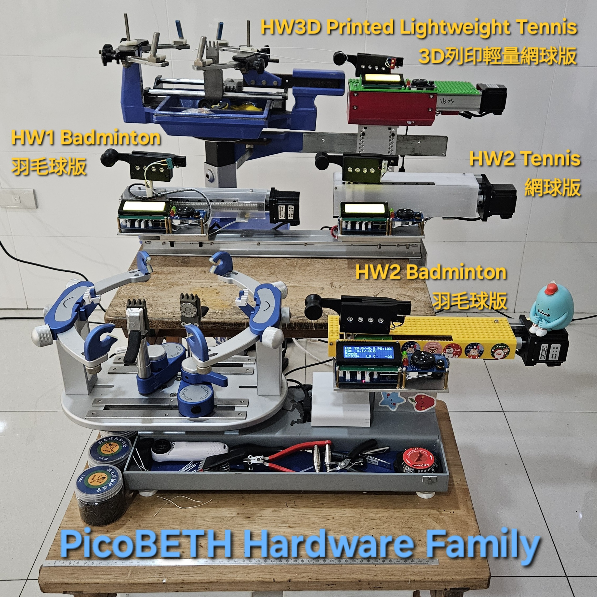

> [!TIP]
> Translated by ChatGPT 3.5  
> 中文說明請點選上方連結

# PicoBETH
PicoBETH (Raspberry Pico Badminton Electronic Tension Head) is an open-source project that allows hobbyist stringers who enjoy stringing but only have mechanical stringing machines (drop-weight, manual crank) to create their own electronic tensioning head. If you have basic programming skills, this project can be easily completed.

> Design philosophy: Economical, Intuitive, Accurate 

## Current Main Functions and Features

### Functions
- **LB/KG display and setting**
- **Pre-Stretch function**
- **Constant-Pull system**
- **Knot function**
- **Tension adjustment manually during tensioning**
- **Tension calibration**
- **Stringing timer**
- **Tension timer**
- **Tension counter and boot counter**
- **Detailed recording of tensioning logs**
- **Pull speed with 9-speed selection**
- **OTA (Over-the-Air) firmware updates** (Requires Pico W and firmware version v2.80E or later)

### Features
- **0.05LB High Precision**
  - Achieved with the Sparkfun HX711 at 94Hz and software version V2.2 and later.
  - [DEMO Vides](https://youtu.be/Hk7eMABAxT0)
- **Low Power Consumption**
  - Uses a DC19V4A power supply. *
- **Real-time UPS Redundancy (Uninterruptible Power Supply)**
  - Uses 5 x 18650 batteries to ensure at least one complete racquet stringing.
- **Compact and Space-Saving**
  - Dimensions: approximately 38(L) × 15(W) × 15(H) cm, Weight: 3.5 kg 
- **Simple structure, low cost, and easy maintenance**
  - All components are easy to source and inexpensive
- **High durability**
  - Over 1 million tension reliability test cycles have been completed with no hardware failures detected. [1 Million Cycles Video](https://youtube.com/shorts/kR_JLVGHwB8)

> [!CAUTION]
> Starting from version v2.90B, it is required to manually upload the updated LCD library `pico_i2c_lcd2.py` to the `src` folder; otherwise, the program will not run properly (OTA updates alone will not complete the upgrade—manual file upload is necessary).  
This version also incorporates optimization experience from the ZeroBETH project, significantly enhancing PicoBETH’s constant-pull algorithm and tensioning start-up response, bringing overall performance to the same level as ZeroBETH and greatly improving the user experience.

## Development Project Plan

| Project Item                         | Progress    | Remarks                                                                                                                                                                                                                                 |
| ------------------------------------ | ----------- | --------------------------------------------------------------------------------------------------------------------------------------------------------------------------------------------------------------------------------------- |
| DM542 Series Stepper Motor Driver Testing | Completed | This test replaced the TB6600 with DM542, DM542C, and DM542S to evaluate noise reduction and assess their suitability for the project. See: [Hardware Setup, Procurement, and Maintenance](docs/2.Hardware_Setup.md) |
| Porting to Raspberry Pi Zero              | Paused    | This task involved replacing the original Raspberry Pi Pico with a Raspberry Pi Zero and migrating the code accordingly. For details, see the project page: [https://github.com/206cc/ZeroBETH/](https://github.com/206cc/ZeroBETH/). Development has been paused due to significant performance improvements in PicoBETH. |
| 3D Printed Lightweight Tennis Version | Completed | Within the HW3D structure, a 50KG load cell and an SGX 1605 sliding platform will be used to perform a cyclic tension reliability test ranging from 55 to 65 LB. The test concluded after over 430,000 cycles due to a tension sensing error reported by the load cell.                |
| Pico 2 Compatibility                 | Completed   | Due to the impact of the **RP2350-E9 bug**, it has been confirmed that direct usage is not possible. Please refer to [`branch/pico2-issue`](https://github.com/206cc/PicoBETH/tree/branch/pico2-issue) for more details. |
| Reliability Testing                  | Completed   | The HW1 tension test reached 1 million cycles with no hardware failures, marking the completion of the test.                                                                                                                           |
| Tennis Racquet Compatibility         | Completed   | Within the HW2 structure, a 50KG load cell and a GX80 1605 sliding platform were used to conduct a cyclic tension reliability test at 75 to 85 LB. The test concluded after over 870,000 cycles when the load cell experienced metal fatigue fracture. |
| 3D-Printed Clip Head                 | Completed   | Due to the poor durability of the clamping piece, development has been discontinued.                                                                                                        |

## Background
A year ago, due to company club activities, I started playing badminton. Although my badminton skills weren't great, I became fascinated with stringing. I purchased a drop-weight stringing machine and initially planned to buy an electronic tensioning head. However, I later thought about using my knowledge to create this project on the Raspberry Pico, incorporating a load sensor, several microswitches, and buttons.

**PicoBETH Family**

**HW 1.5 machine** (Old version, no longer updated) [How to make step by step](https://youtu.be/uJVE3YFJtJA)

  
[View 3D Model on Tinkercad](https://www.tinkercad.com/things/5FHNO85KUK4-picobeth-hw-15-for-badminton-stringing?sharecode=hBukCj4giq4Q9J8Fq-s8H5lIKzbYCcOiwuyQ-TE8oRA)

**HW 2.0 machine** 

  
[View 3D Model on Tinkercad](https://www.tinkercad.com/things/gW2eyW052h4-picobeth-hw-20-for-badminton-stringing?sharecode=Maq9iaeRmlb3yHHCTIYZC1jmwOv0plqlq70pMMMWHQw)

**HW 3D Print machine** (Fully 3D-Printed)

  
PicoBETH HW 3D-Printed Version branch [`branch/3d-printed`](https://github.com/206cc/PicoBETH/tree/branch/3d-printed)

**Stringing demonstration video**

> [!NOTE]
> If you don't have a stringing machine, you can refer to this project to make one: [Pico-Badminton-Stringer](https://github.com/HsuKaoPang/Pico-Badminton-Stringer)

> [!NOTE]
> If you are choosing a manual badminton stringing machine. I recommend purchasing a drop-weight machine with a six-point fixed and base clamp. Drop-weight machines have a somewhat constant-pull effect, and the rackets strung with a drop-weight machine are not much different from those strung with an electronic machine. Before completing this project, you can use a drop-weight machine to become familiar with stringing. In the future, if the electronic stringing head malfunctions, you can quickly switch back to using the drop-weight machine head. 

# Warning
If the structure of your badminton stringing machine is not strong enough, I strongly advise against continuing with this project. A weak fixed platform can deform during tensioning, causing the racket frame to become round and the tension to decrease. Eventually, the machine will compensate for the tension, creating a vicious cycle that will ultimately lead to the racket breaking.

> [!CAUTION]
> Extremely important: If your stringing machine is of a simple type, please make sure to reinforce the structure.

# Additional Documentation

- [Operation and Settings Guide](docs/1.Operation_and_Settings_Guide.md)
- [Hardware Setup, Procurement, and Maintenance](docs/2.Hardware_Setup.md)
- [Maintenance and Logs Guide](docs/3.Maintenance_and_Logs_Guide.md)
- [FAQ (Frequently Asked Questions)](docs/4.FAQ.md)
- [Pico Stringing Pattern](docs/5.Pico_Stringing_Pattern.md)
- [Research Lab](docs/6.Research_Lab.md)

# Improvement Branches

| Branch Name                     | Description                      |
|----------------------------------|----------------------------------|
| [`imp/beadclip-btn@jpliew`](https://github.com/206cc/PicoBETH/tree/imp/beadclip-btn%40jpliew) | Improved Bead Clip Activation Button |
| [`branch/3d-printed`](https://github.com/206cc/PicoBETH/tree/branch/3d-printed) | HW 3D-Printed Version                |
| [`branch/tennis`](https://github.com/206cc/PicoBETH/tree/branch/tennis) | Compatible with Tennis Racquets  |
| [`branch/pico2-issue`](https://github.com/206cc/PicoBETH/tree/branch/pico2-issue) | Pico2 issue              |

# Support
If you encounter any issues during the production process, feel free to leave a comment on the YouTube tutorial video. If you complete the project, you're also very welcome to share photos of your finished product in the GitHub discussions.

# Acknowledgements

- [HX711 Driver Module for Raspberry Pi Pico](https://github.com/endail/hx711-pico-mpy)
- [2004 I2C LCD Module for Raspberry Pi Pico](https://github.com/T-622/RPI-PICO-I2C-LCD)

# License

- **Source Code**: Licensed under the Apache License 2.0
- **Hardware Design**: Distributed under the CERN Open Hardware Licence v2 - Weakly Reciprocal
