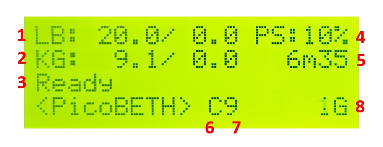
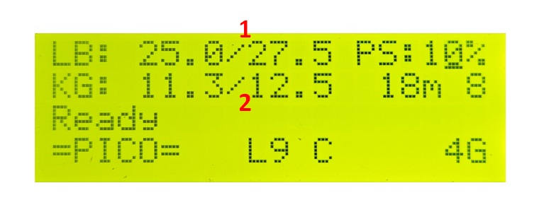
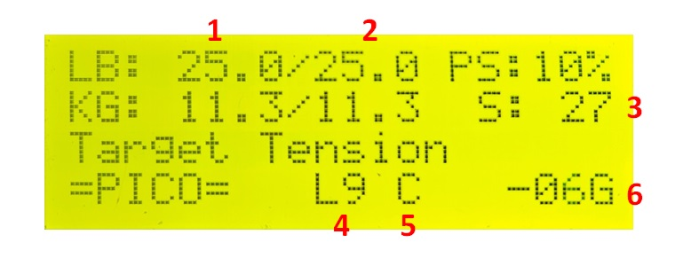
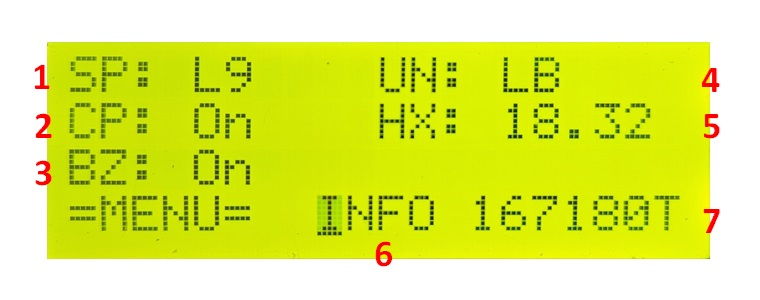
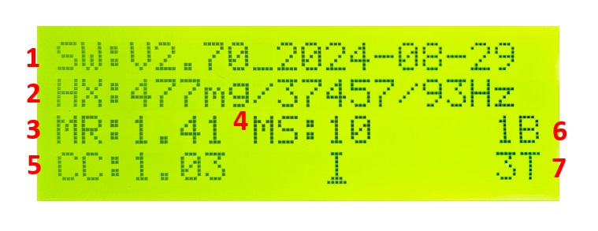

# 操作與設定指南

## 操作介面

以下展示 V2.80 版本的操作介面。

### 主畫面

- 按下離開鍵啟用計時，再次按下停止，第三次按下重置計時。

1. 設定磅數  
2. 設定公斤  
3. 狀態顯示  
4. PS=預拉，KT=打結功能  
5. 穿線計時器  
6. 珠夾頭速度 1=最慢，9=最快  
7. 恆拉狀態 C=啟用，M=停用  
8. 目前張力值（公克）  

### 張力設定畫面

- 按下五向鍵進入張力設定，第一次顯示最大張力，第二次開始調整張力與預拉。

1. 磅數設定（含預拉）  
2. 公斤設定（含預拉）  

### 張緊中畫面

- 張力達標時，進入恆拉模式。張力不足自動增加，張力過高自動減少，直至停止模式。按五向鍵的上下鍵可增減 0.5LB 張力。

1. 設定張力  
2. 目前張力  
3. 張力達標後開始計時  
4. 珠夾頭速度 1=最慢，9=最快  
5. 恆拉狀態 C=啟用，M=停用 
6. 與設定張力的差異  

### 設定畫面

1. SP：珠夾頭速度  
2. CP：恆拉開關  
3. BZ：蜂鳴器開關  
4. UN：使用磅或公斤  
5. HX：張力傳感器校正  
6. I：系統資訊  
7. T：總張緊計數/LOG 記錄  

### 系統資訊

1. 軟體版本與日期  
2. 張力放大器參數  
3. 珠夾頭速度與步數  
4. 步進馬達轉速  
5. 張力參數  
6. 開機次數  
7. 總張緊計數  

### 工程選單

自 v2.90 版本起，初次硬體參數設定已大幅簡化，無需透過電腦，即可透過「工程選單」進行設定。

> [!CAUTION]
> **首次開機請務必正確設定硬體參數，錯誤的設定可能導致球拍損壞。**

#### 進入工程選單方式

有以下兩種方式可進入工程選單：

1. **開機時**：當畫面顯示版本資訊與進度條時，按下 **方向鍵左鍵**。
2. **設定頁面中**：於 INFO 選單中，連續按下 **方向鍵下鍵** 5 次。

#### 9-1 荷重元（Load Cell）選擇

請選擇實際所使用的荷重元規格：

- **20kg**
- **50kg**

#### 9-2 最大張力設定

自 v2.90 起取消網球模式，改為依據荷重元與平台類型設定最大張力限制：

| 荷重元規格 | 平台類型   | 建議最大張力        |
|------------|------------|---------------------|
| 20kg       | SGX 1610   | 40lb                |
| 50kg       | SGX 1610   | 70lb                |
| 50kg       | GX80 1605  | 90lb+（極限 130lb） |

> [!WARNING]
> 請確保裝置結構具備足夠強度以承受設定的最大張力。

> [!WARNING]
> 張力超過荷重元額定值可能導致感測器損壞，並嚴重縮短使用壽命。

#### 9-3 珠夾張緊啟動模式

請選擇適用的珠夾啟動模式：

- **一般模式（Standard）**
- **改良模式（Enhanced）**  
  參考：[改良珠夾模式](https://github.com/206cc/PicoBETH/tree/imp/beadclip-btn%40jpliew)

## 預拉系統

PicoBETH 的預拉方式分為三個階段。以 20LB 預拉 10% 為例，流程如下：

- **階段一：** 當達到預拉張力（22LB）時，馬達停止運作，並發出 0.3 秒的長音提示。  
- **階段二：** 馬達以慢速退回至指定張力（20LB）。  
- **階段三：** 當張力穩定在指定值（20LB）後，系統會發出 0.1 秒的短音提示，隨後啟用恆拉系統。

為配合我的穿線手法，PicoBETH 的預拉方式與市售機器略有不同。階段二中，張力不會退至低於指定值。當我聽到階段一的 0.3 秒長音提示後，會立即鬆開前夾，使前一條線也能受到預拉張力的作用，理論上可以讓穿出的線更加整齊。如果您更偏好市售機器的預拉方式，也可以輕鬆修改程式碼來實現。
