# 硬體製作、採購與維護

## 硬體

### 主要材料
1. Raspberry Pi Pico H
2. CBX/SGX 1610 200MM 滑台
3. NEMA23 57 步進馬達（2 相 4 線 1.8° 1.2Nm）
4. TB6600 步進馬達驅動器
5. NJ5 20KG 張力傳感器 (YZC-133)
6. HX711 模塊（SparkFun）
7. 2004 i2c LCD 
8. WISE 2086 珠夾頭
9. 5 向按鍵模組
10. 按鈕
11. 微控開關
12. 有源蜂鳴器（高平電觸發）
13. 三色 LED
14. 5個 18650組成的不穩壓 USP 電池盒

**主要 [BOM清單](https://docs.google.com/spreadsheets/d/1ML2syn-BDUk_CEcyjm62lMwHZluXPYK5swn7pdFXTbw) 價格參考**

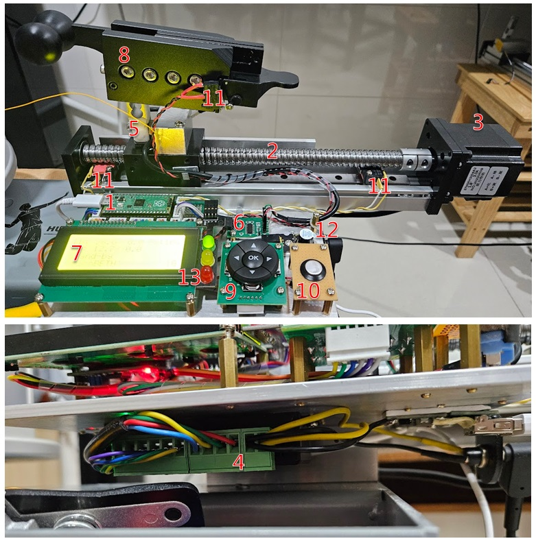

> [!WARNING]
> 請務必觀看下一章節的**硬體採購建議**

> [!WARNING]
> 除非您有自行修改程式的能力，否則請按照指定的型號或規格購買材料

## 硬體採購建議

### 滑台

滑台有非常多樣式，專案中使用的是螺杆式的 SGX/CBX 1610 200MM 滑台，建議購買馬達端帶有軸承固定座的版本，有些無固定座的滑台在高速及高張力下會有問題。

軸承固定座
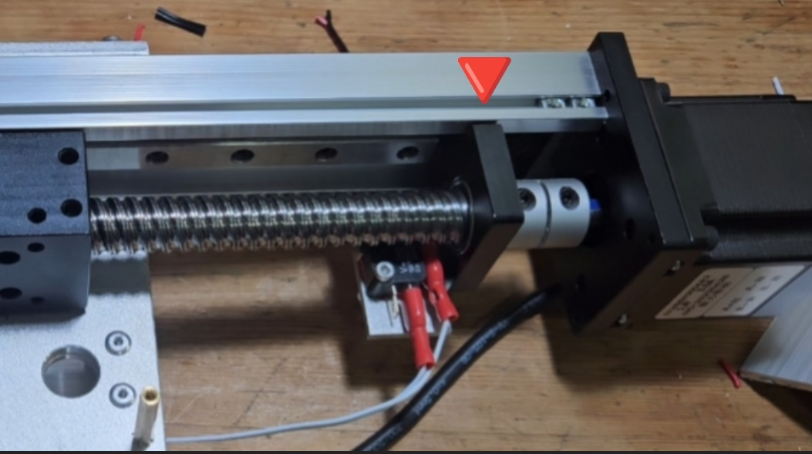

### TB6600 步進電機驅動器

TB6600 是一款小型且經濟實惠的步進電機驅動器，適用於 42 型和 57 型步進電機。建議選購標註有‘升級版’或‘加強版’的 TB6600，某些廉價版本可能在使用過程中產生明顯電流聲。建議優先選擇品質較佳的版本。

### HX711 張力感測放大器

HX711 是常用於高精度電子秤的簡單稱重傳感器放大器，此專案用於量測弦線張力。建議使用 SparkFun 生產的 HX711 Load Cell Amplifier，品質較為優良。製作前可以參照 [EP.3 影片](https://youtu.be/pZT4ccE3bZk) 中的飄移測試程式，檢測此板的穩定度。若遇到問題，可在影片中留言。

我測試過的 HX711 電路板：
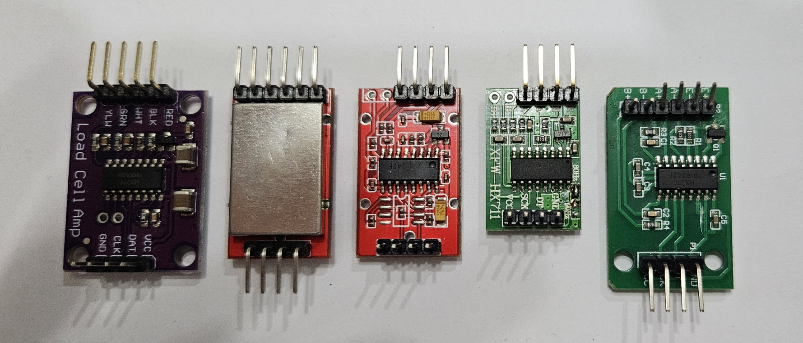

### NJ5 (YZC-133) 張力傳感器

此專案中使用 NJ5（YZC-133）主要是因為它能輕鬆安裝在 WISE 2086 珠夾頭上。若使用其他夾具，亦有許多不同型號可供選擇，確保承重能力為 20KG 即可。參考 [SparkFun HX711](https://learn.sparkfun.com/tutorials/load-cell-amplifier-hx711-breakout-hookup-guide/all) 的詳細說明。

## 硬體設計建議

### 滑台上的前後限位開關

若滑台上的前後限位微動開關尺寸過小，可能導致觸發開關後，平台在完全停止前仍有些微移動，可能造成平台撞擊開關本體。建議使用尺寸較大的微動開關或長臂微動開關，以確保有足夠的緩衝空間。

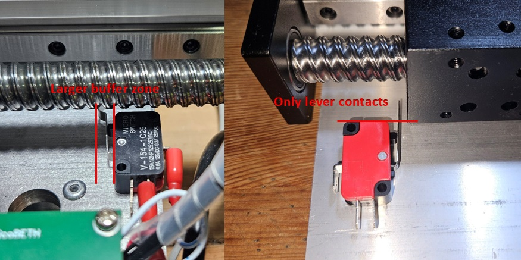

### 珠夾頭與平台間的距離

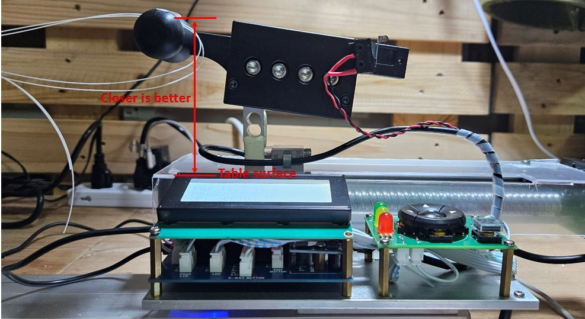

珠夾頭與平台之間的距離應盡量縮短，以延長滑台的使用壽命。如果不使用 WISE 2086 珠夾頭，可以選擇較短的傳感器來幫助降低兩者之間的距離。

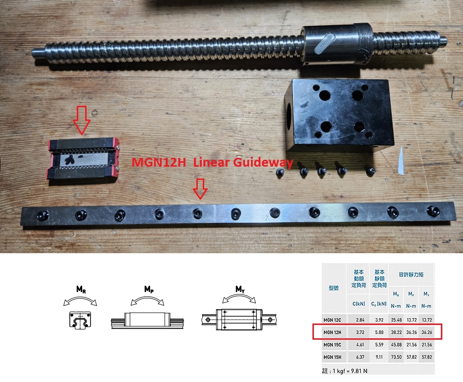

SGX 滑台由推進螺杆和底部的 MGN12H 線性滑台組成，主要受力在底部的 MGN12H 線性滑台上。由於我的滑台是90度側躺安裝，因此主要的受力方向為 My(橫向力矩)。假設在極端情況下，所有力都由 My 方向承受，且珠夾頭與滑軌之間的距離為11公分，則該 MGN12H 能夠承受 36.26Nm My 的力。由此可計算出滑軌在此結構中的最大承受力：

$$
\frac{36.26}{0.11 \times 9.8} \approx 33.6 \\text{公斤} (74 \\text{磅})
$$

由此公式可知，當珠夾頭與滑軌的距離越遠，滑軌能承受的力就越小。因此，在設計硬體佈局時，應盡量縮短珠夾頭與平台之間的距離，以延長滑台的壽命。

> [!WARNING]
> 此為簡化的極端情境算法，實際上，力的分布並非完全集中在 My 方向。部分力將會分散到 Mr（翻轉力矩）、Mp（俯仰力矩）以及推進螺杆上，實際承受的負載極限可能會高於此簡化計算結果，具體負載能力需根據硬體設計的綜合評估來確定。

### 使用 PCB 電路板

可以先在麵包板上組裝測試，確認成功後再將電路轉移到 PCB 電路板或手工焊接板上。長期使用麵包板可能會出現接觸不良的問題。

## 接線圖

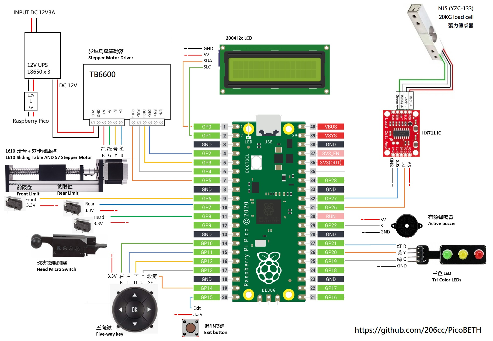

> [!WARNING]
> 若非為 Raspberry Pi 使用的 LED 模組，需串接 330 歐姆電阻以保護 GPIO。

## 製作教學

製作過程影集（持續更新中）

## 軟體安裝

使用 Thonny 將以下程式碼檔案儲存到 Raspberry Pico 中，其中 `src` 資料夾內包含 `hx711` 和 `2004 LCD` 的相關函式庫。

1. main.py
2. src/hx711.py
3. src/lcd_api.py
4. src/pico_i2c_lcd.py

> [!WARNING]
> `hx711.py`、`lcd_api.py`、`pico_i2c_lcd.py` 必須放在 `src` 資料夾下。

> [!NOTE]
> 相關製作影片：
> 

## TB6600 步進馬達參數

建議使用快速模式，除非滑台品質不佳導致馬達在快速模式下打滑，此時在切換至慢速模式。

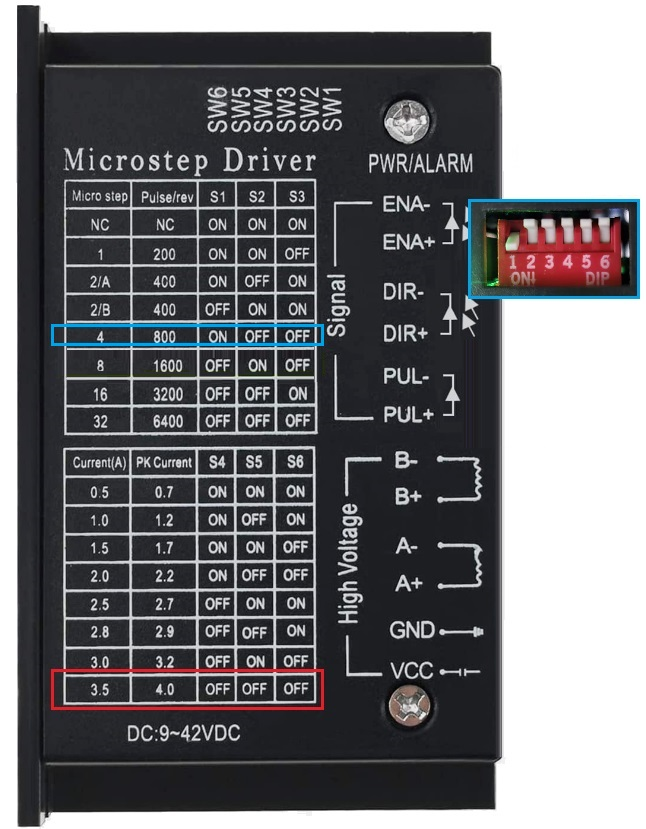

> [!NOTE]
> 相關製作影片：
> 

## HX711 張力感測放大器

此專案對於 HX711 的要求較高，建議使用 SparkFun 的 HX711 放大器，品質穩定。

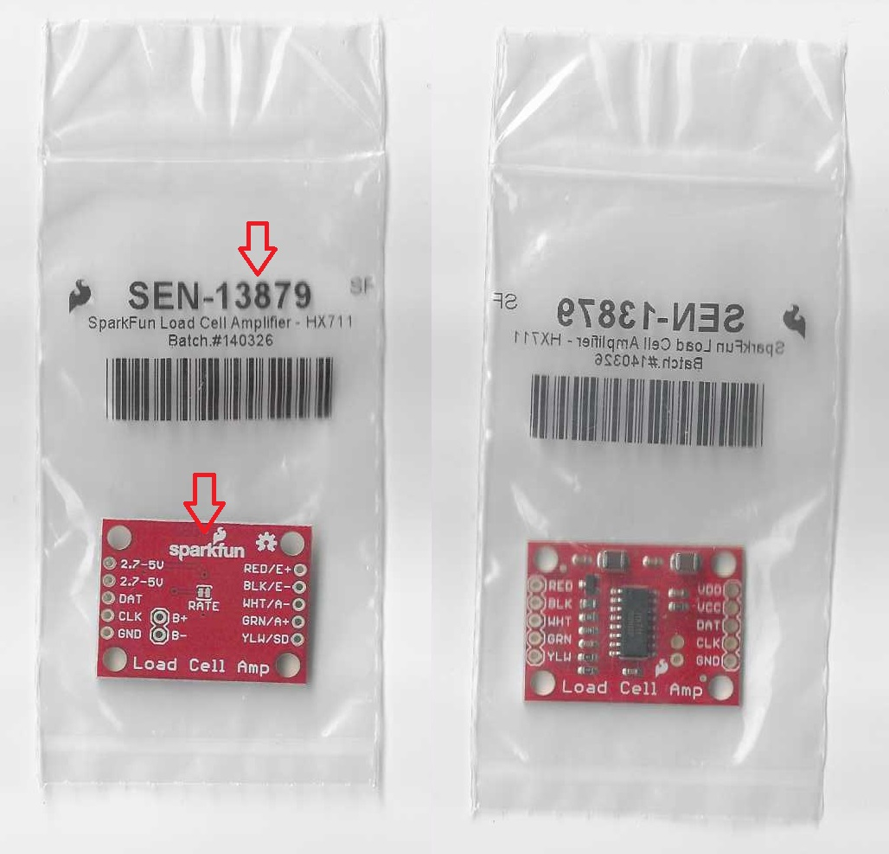

### 開啟 80Hz

SparkFun 的 HX711 預設為 10Hz，需用美工刀將下圖綠色箭頭所示處的連接線割斷，開啟 80Hz 模式。

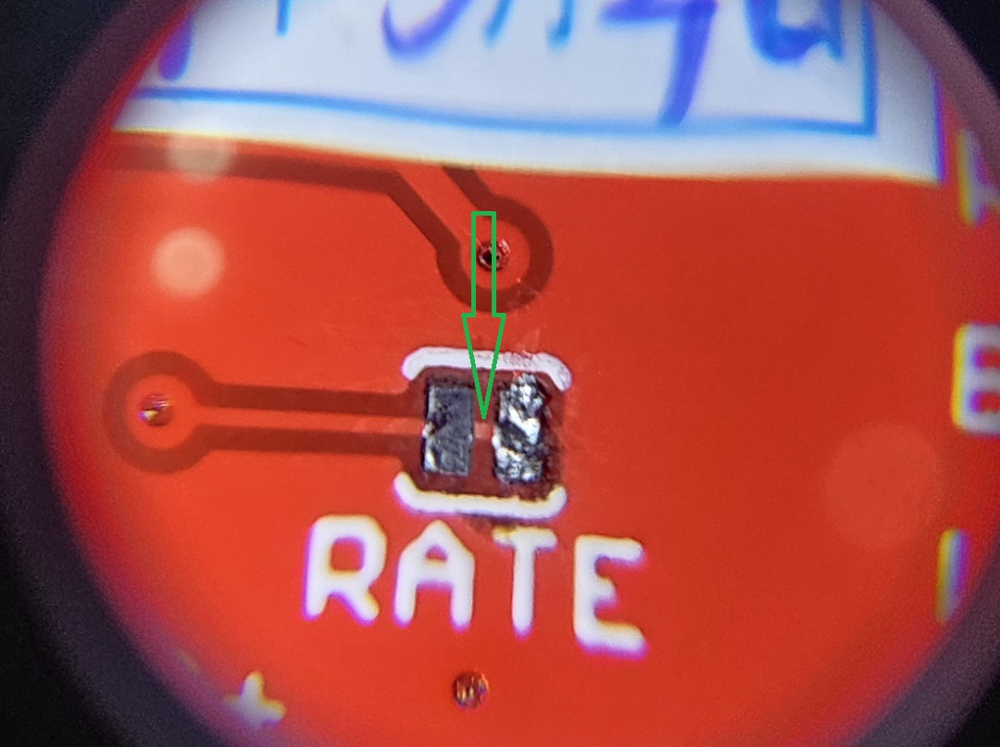

### 穩定度測試

每片 HX711 的品質不一，建議裝上機器前先測試其穩定度。正常情況下，穩定的機板一整天的飄移量不會超過 1g。

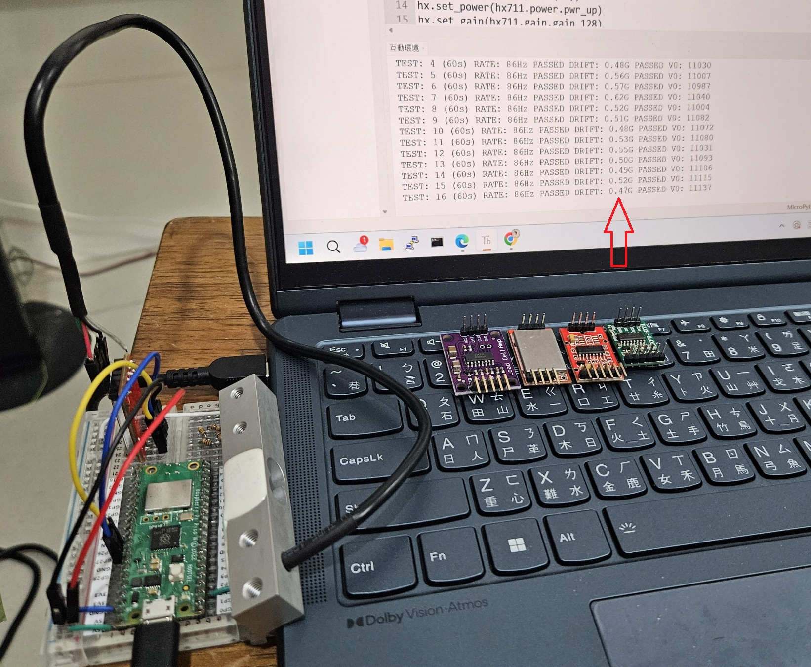

> [!NOTE]
> 測試程式為 TEST_hx711.py。

> [!WARNING]
> 在 V1.96 版本之後，開機時會檢查 RATE，若未達到 80Hz 或飄移量超過 1g，將無法正常啟動。

## 結構佈局

零件佈局可根據需求調整，下圖為參考定位孔圖。具體使用方法請參閱製作影片。

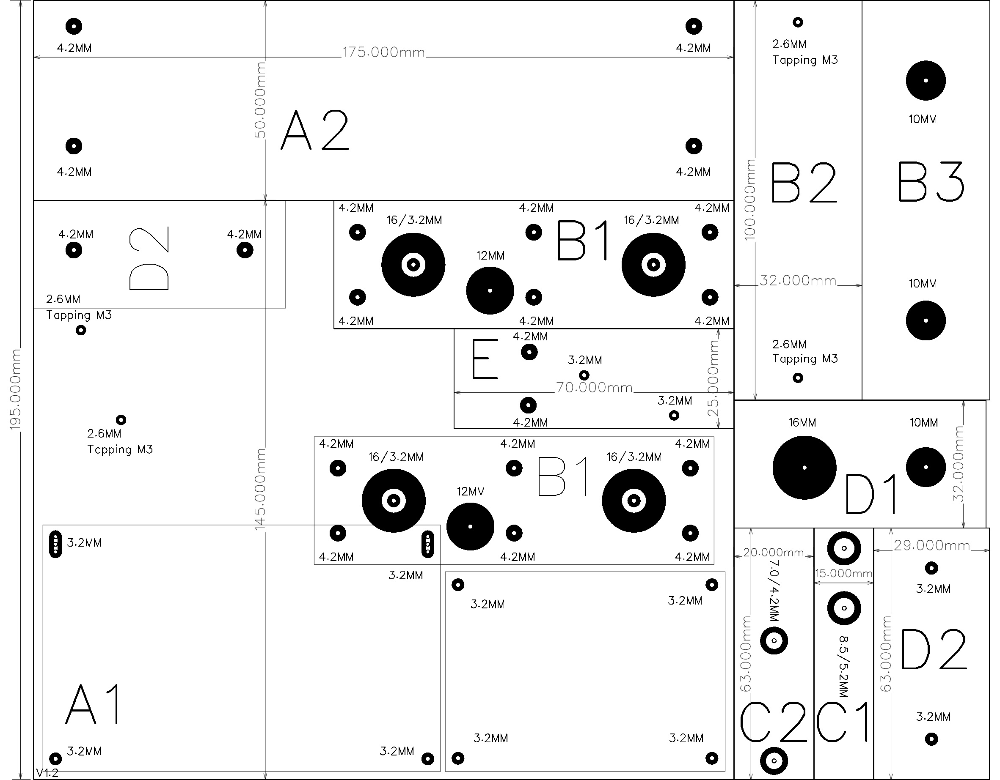

> [!NOTE]
> 相關製作影片：
> 

## PCB 電路板

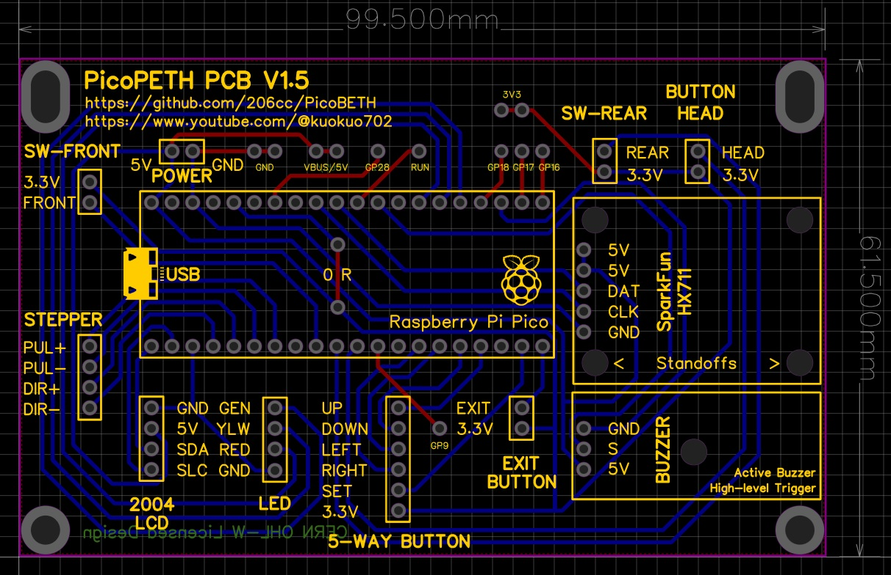

Gerber PCB [製板文件下載](Gerber_PicoBETH_PCB_2024-08-28.zip)

在 V1.5 版本中，已將未使用的 GPIO 引出，便於自定義功能的開發。

> [!WARNING]
> V1.3a 版本已移除按鍵與微動開關的 10K 電阻，因 Raspberry Pi Pico 已內建按鍵下拉電阻，兩者同時使用可能會產生問題。

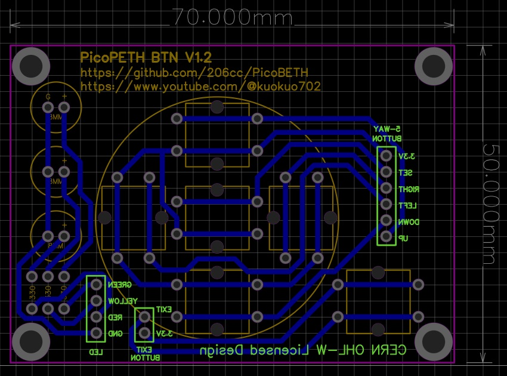

Gerber PCB BTN [製板文件下載](Gerber_PicoBETH_BTN_2024-08-28.zip)

> [!NOTE]
> 請將 Gerber 檔案下載後，透過 EMAIL 傳給 PCB 製造商（如露天、蝦皮），備註單層雙面 1.6mm、雙面焊盤，待廠商報價後即可下單。

## 硬體測試模式

組裝完成後首次開機時，請依照指示進行所有按鍵、限位開關、HX711 感測器的測試。

> [!NOTE]
> 相關製作影片：
> 

## 最後設定

### 校正 HX 參數

HX711 張力感應器校正系數，在第一次使用或更換張力傳感器、HX711 電路板時務必重新校正。

在 V2.2 版本後，自動恆拉功能提升了微調的準確性，可開啟該功能進行校正。

校正步驟：
1. 至設定頁面確認自動恆拉功能已開啟。
2. 將 HX 參數設為 20.00。
3. 跳回主選單設定拉力為 20.0 磅，預拉 10%。
4. 使用外接式張力計進行測量。
5. 將測量數值填入設定頁面，並儲存。

> [!IMPORTANT]
> 若不進行此校正，實際張力與 LCD 顯示張力將會產生誤差。

## 張緊飄移測試

完成校正後，測試張緊時的飄移程度，飄移量應控制在 ±0.05LB 以內。

> [!NOTE]
> 相關製作影片：
> 

## 可靠度測試

V2.4 版本後新增可靠度測試模式，自動模擬穿線張緊，用來測試機器有無異常。

### 測試方法

自動從 20LB 至 30LB 循環張緊，預拉固定 10%，平衡後 3 秒退回。測試無異常中斷，需在提示下按設定中鍵停止。

建議至少測試 1000 次，若期間無異常，表示組裝正常。

> [!WARNING]
> 請勿直接在 Thonny 上執行此測試，請將程式寫入 Raspberry Pi Pico 後再進行測試。

> [!NOTE]
> 相關製作影片：
> 
