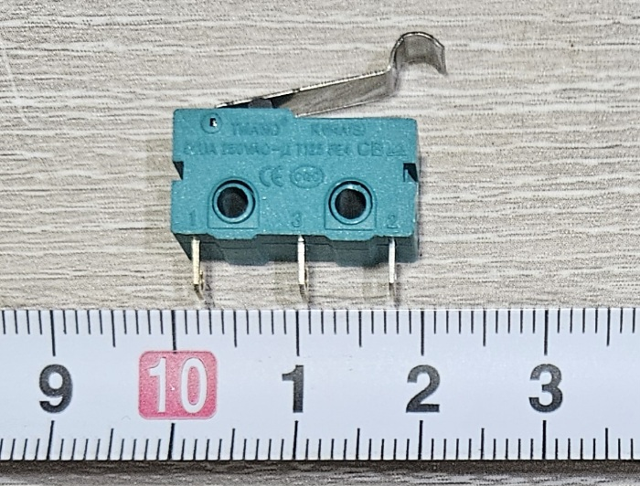
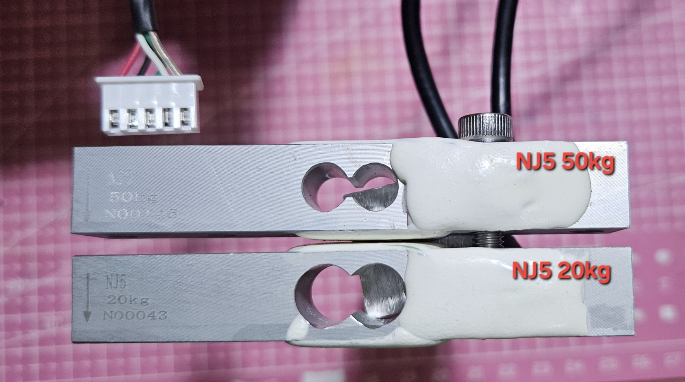
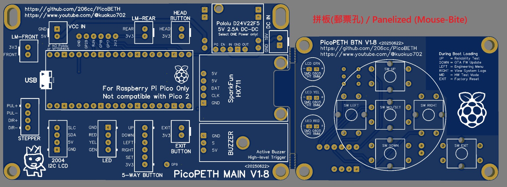
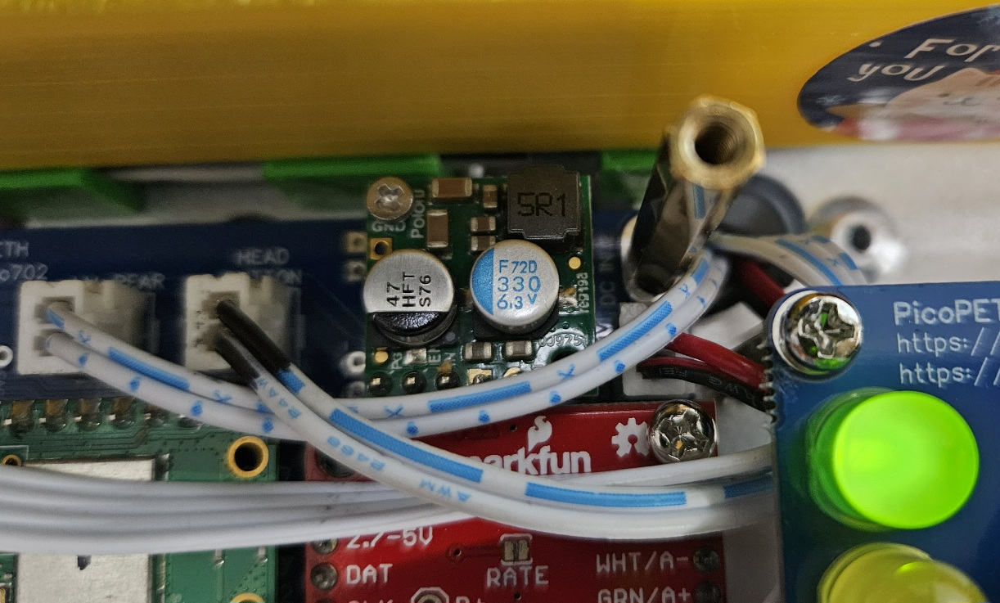
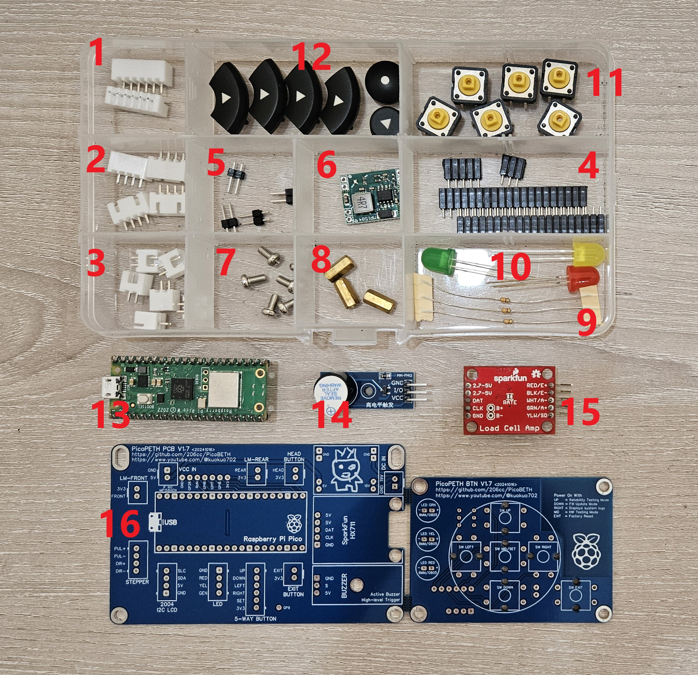
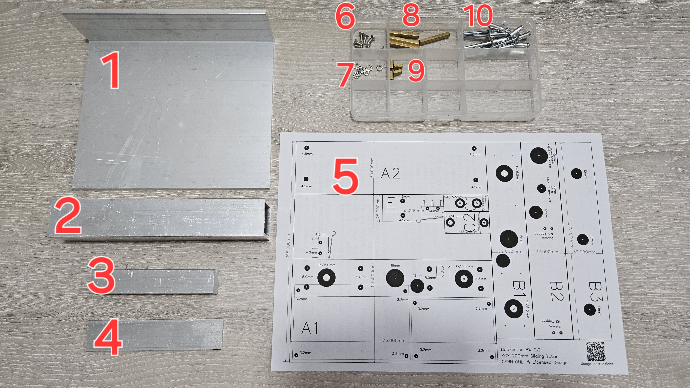
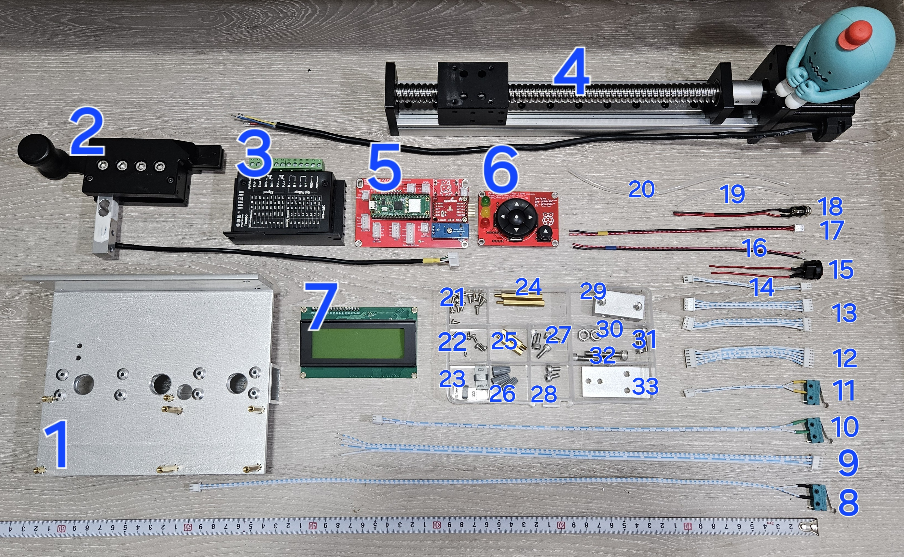
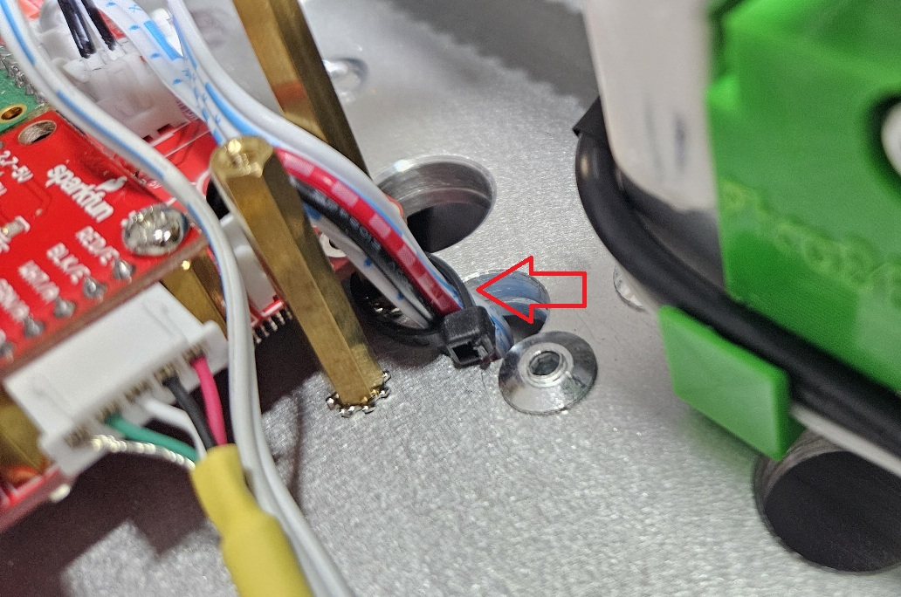
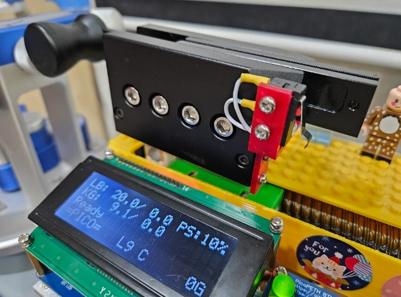

# 硬體製作、採購與維護

本穿線機頭經過精心設計，選用 **通用、常見、價格實惠且經過實測耐用的零件**，確保性能穩定，同時降低維修與更換的難度。  
整體結構設計已充分考量 **組裝便利性與維護需求**，所有零件皆可 **快速拆裝、更換，無需特殊工具**，使後續維修更加簡單直覺。  
此外，核心元件選擇 **市場上易於取得的規格**，即使長期使用後需要更換零件，價格也非常低廉，確保設備長期可用性與維修成本的控制。

---

## 在台灣的 BOM 採購清單

除了 SparkFun HX711，其餘零件皆可在淘寶購買，以下提供 **HW2 結構 + 部分 3D 列印零件** 的採購清單：

**採購清單**：[點此查看](https://docs.google.com/spreadsheets/d/17UTM2sgsdSgjqqpIIMIrwPZwl_h7HIvry-QYOZapw44/edit?usp=sharing)

> [!WARNING]
> 此清單 **不包含運費及關稅**，請自行估算總成本。

> [!WARNING]  
> **淘寶上充斥許多劣質產品**，購買時請 **謹慎挑選賣家**，避免購買到低品質零件。

> [!WARNING]
> 請務必觀看 **硬體採購建議**

> [!WARNING]
> 除非您有自行修改程式的能力，否則請按照指定的型號或規格購買材料

---

## 硬體採購建議

### 滑台

滑台有非常多樣式，專案中使用的是螺杆式的 SGX 1610 200MM 滑台，建議購買馬達端帶有軸承固定座的版本，有些無固定座的滑台在高速及高張力下會有問題。

軸承固定座

### TB6600 步進電機驅動器

TB6600 是一款小型且經濟實惠的步進電機驅動器，適用於 42 型和 57 型步進電機。建議選購標註有‘升級版’或‘加強版’的 TB6600，某些廉價版本可能在使用過程中產生明顯電流聲。建議優先選擇品質較佳的版本。

### HX711 張力感測放大器

HX711 是常用於高精度電子秤的簡單稱重傳感器放大器，此專案用於量測弦線張力。強烈建議使用 SparkFun 生產的 HX711 Load Cell Amplifier，品質較為優良。製作前可以參照 [EP.3 影片](https://youtu.be/pZT4ccE3bZk) 中的飄移測試程式，檢測此板的穩定度。若遇到問題，可在影片中留言。

我測試過的 HX711 電路板：

---

## 硬體設計建議

### 滑台上的前後限位開關

若滑台上的前後限位微動開關尺寸過小，可能導致觸發後，平台在完全停止前仍產生些微移動，進而碰撞開關本體。為確保足夠的緩衝空間，建議使用 **尺寸較大的微動開關** 或 **長臂微動開關**。  

在 **HW2** 與 **HW3D** 版本中，推薦使用下圖的微動開關。此款開關價格低廉且容易取得，並具備足夠的緩衝空間。  

### 珠夾頭與平台間的距離

珠夾頭與平台之間的距離應盡量縮短，以延長滑台的使用壽命。

SGX 滑台由推進螺杆和底部的 MGN12H 線性滑台組成，主要受力在底部的 MGN12H 線性滑台上。由於我的滑台是90度側躺安裝，因此主要的受力方向為 My(橫向力矩)。假設在極端情況下，所有力都由 My 方向承受，且珠夾頭與滑軌之間的距離為11公分，則該 MGN12H 能夠承受 36.26Nm My 的力。由此可計算出滑軌在此結構中的最大承受力：

$$
\frac{36.26}{0.11 \times 9.8} \approx 33.6 \\text{公斤} (74 \\text{磅})
$$

由此公式可知，當珠夾頭與滑軌的距離越遠，滑軌能承受的力就越小。因此，在設計硬體佈局時，應盡量縮短珠夾頭與平台之間的距離，以延長滑台的壽命。

> [!WARNING]
> 此為簡化的極端情境算法，實際上，力的分布並非完全集中在 My 方向。部分力將會分散到 Mr（翻轉力矩）、Mp（俯仰力矩）以及推進螺杆上，實際承受的負載極限可能會高於此簡化計算結果，具體負載能力需根據硬體設計的綜合評估來確定。

### 珠夾頭與 YZC-133 傳感器的固定

YZC-133 傳感器與珠夾頭的固定經後續測試，不需要使用 [EP5](https://youtu.be/PhSWcHrOhvc) 中提到的銅柱，只需將4個螺絲鎖緊，即可承受 120LB 的張力而不發生位移。

### YZC-133 張力傳感器

此專案中使用 NJ5（YZC-133）主要是因為它能輕鬆安裝在 WISE 2086 珠夾頭上。若使用其他夾具，亦有許多不同型號可供選擇，確保承重能力為 20KG 即可。參考 [SparkFun HX711](https://learn.sparkfun.com/tutorials/load-cell-amplifier-hx711-breakout-hookup-guide/all) 的詳細說明。

如果買不到南計出廠的 NJ5 YZC-133 傳感器，其他廠商出產的 YZC-133 四條訊號線可能是外露的，建議使用 Ø4 捲式結束帶進行包覆處理，包覆長度建議為25公分。將其固定在滑台上後，再次使用 Ø4 捲式結束帶將珠夾頭的線與傳感器線一起包覆。

> [!WARNING]
> 強烈不建議將 YZC-133 的線截斷後再接合，這樣的接點容易導致訊號飄移，並且開機時可能會出現警告，無法正常使用。

> [!WARNING]
> **強烈建議購買 NJ5 出廠的 YZC-133 傳感器**，一般的 YZC-133 未經可靠性測試，可能存在未知問題。

### 使用 PCB 電路板

可以先在麵包板上組裝測試，確認成功後再將電路轉移到 PCB 電路板或手工焊接板上。長期使用麵包板可能會出現接觸不良的問題。

---

## 硬體製作

如果您對製作過程感興趣，但不確定能否順利完成，建議依照以下順序 **逐步進行**，確保每個步驟都能順利完成。

### **建議製作順序**
1. **EP.1** PicoBETH 程式安裝  
2. **EP.2** Raspberry Pi Pico 的 TB6600 57 步進馬達控制  
3. **EP.3** Raspberry Pi Pico 的 HX711 飄移測試與 SparkFun RATE 啟用 80Hz  
4. **EP.6** 主板、按鍵板製作  
5. **EP.4(HW2)** 基礎結構組裝  
6. **EP.5(HW2)** 張力感測器與2086珠夾頭  
7. **EP.7(HW2)** 硬體與線路安裝  
8. **EP.8** 簡易防塵罩  
9. **EP.9** 定位與固定  
10. **EP.10** 最後設定  
11. **EP.11** 張緊飄移測試  
12. **EP.12** 可靠度測試  

### 接線圖

> [!WARNING]
> 若非為 Raspberry Pi 使用的 LED 模組，需串接 330 歐姆電阻以保護 GPIO。

---

## EP.1 PicoBETH 程式安裝

### 物料清單 (Bill of Materials, BOM)

| 項次 | 品名                           | 數量 | 備註 |
|----|------------------------------|----|----|
| 1  | Raspberry PI Pico H               | 1  |    |

> [!WARNING]
> **請勿購買 Pico 2(RP2350) 無法直接使用**。

使用 Thonny 將以下程式碼檔案儲存到 Raspberry Pico 中，其中 `src` 資料夾內包含 `hx711` 和 `2004 LCD` 的相關函式庫。

1. main.py
2. src/hx711.py
3. src/lcd_api.py
4. src/pico_i2c_lcd.py

> [!WARNING]
> `hx711.py`、`lcd_api.py`、`pico_i2c_lcd.py` 必須放在 `src` 資料夾下。

### 參考製作影片
點擊下方縮圖觀看完整製作過程：  

---

## EP.2 TB6600 57 步進馬達控制  

### 物料清單 (Bill of Materials, BOM)

| 項次 | 品名                           | 數量 | 備註 |
|----|------------------------------|----|----|
| 1  | Raspberry PI Pico H               | 1  |    |
| 2  | SGX 1610 200mm 滑動臺 與 56×57 1.2Nm 步進馬達 | 1  |                  |
| 3  | TB6600 步進馬達控制器                     | 1  |                  |

請將 **TB6600 的 DIP 開關** 設定為下圖所示，以確保驅動器參數正確。  

  

### 參考製作影片
點擊下方縮圖觀看完整製作過程：  

---

## EP.3 HX711 張力感測放大器

此專案對於 HX711 的要求較高，強烈建議使用 SparkFun 的 HX711 放大器，品質穩定。

### 物料清單 (Bill of Materials, BOM)

| 項次 | 品名                           | 數量 | 備註 |
|----|------------------------------|----|----|
| 1  | Raspberry PI Pico H               | 1  |    |
| 2  | NJ5 YZC-133 張力傳感器          | 1  |    |
| 4  | SparkFun HX711                                            | 1   |

### 開啟 80Hz

SparkFun 的 HX711 預設為 10Hz，需用美工刀將下圖綠色箭頭所示處的連接線割斷，開啟 80Hz 模式。

### 穩定度測試

每片 HX711 的品質不一，建議裝上機器前先測試其穩定度。正常情況下，穩定的機板一整天的飄移量不會超過 1g。

> [!NOTE]
> 測試程式為 TEST_hx711.py。

### 參考製作影片
點擊下方縮圖觀看完整製作過程：  

---

## EP.6 主板、按鍵板製作

Gerber PCB [製板文件下載](Gerber_PicoBETH_PCB_2024-10-31.zip)

在 V1.7 版本中，整合常的 MP1584EN 電源模組。

> [!NOTE]
> 請將 Gerber 檔案下載後，透過 EMAIL 傳給 PCB 製造商（如露天、蝦皮），備註單層雙面 1.6mm、雙面焊盤，待廠商報價後即可下單。

### 物料清單 (Bill of Materials, BOM)

| #  | 物料名稱                                                         | 數量 |
|----|------------------------------------------------------------------|------|
| 1  | JST XH 6P 公插頭，2.54mm                                    | 2   |
| 2  | JST XH 4P 公插頭，2.54mm                                    | 4   |
| 3  | JST XH 2P 公插頭，2.54mm                                    | 6   |
| 4  | 1×20 單排母座，2.54mm                                      | 2   |
|    | 1×5 單排母座，2.54mm                                       | 1   |
|    | 1×3 單排母座，2.54mm                                       | 1   |
| 5  | 1×2 單排公針，2.54mm                                       | 4   |
| 6  | MP1584EN DC-DC 5V 降壓模組                                    | 1   |
| 7  | M3 × 8mm 圓頭螺絲                                              | 6   |
| 8  | M3 × 10mm 雙母黃銅柱                                           | 3   |
| 9  | 330Ω 1/8W 電阻                                                 | 3   |
| 10 | 8mm LED，2.54mm，綠色、黃色、紅色                         | 3   |
| 11 | 12×12×7.3mm 輕觸開關（Tactile Switch），直插，方形按鈕         | 6   |
| 12 | 12×12mm 按鍵帽                                 | 6   |
| 13 | Raspberry Pi Pico H 單板微控制器                               | 1   |
| 14 | 主動蜂鳴器模組（高電平觸發）                                   | 1   |
| 15 | SparkFun HX711                                            | 1   |
| 16 | PicoBETH PCB 電路板                                            | 1   |

**PCB 焊接製作影片參考**  

  

### PCB 組裝與測試

PCB 板製作完成後，在安裝到機台前，可以先進行簡單測試，確保功能正常。
  

---

## 結構佈局

本專案目前提供 **3 種結構佈局**：**HW1、HW2、HW3D**。

- **HW1** 是本專案最初的結構設計，依照我的穿線機台規格開發。由於鎖點的關係，相容機台可能較少。然而，HW1 已通過 **100 萬次以上** 的可靠性測試，未出現任何問題。  
- **HW2** 針對結構佈局進行優化，提升了 **相容性與可靠性**，建議具備機械加工能力的使用者選用，因其結構更堅固且設計更緊湊。  
- **HW3D** 則適用於 **3D 列印** 製造的版本，所有組件皆可 3D 列印後安裝，降低製作門檻，使安裝更為簡便。  

**若具備機械加工能力，建議選擇 HW2，其結構更為堅固；若希望簡化製作流程，則可選擇 HW3D 版本。本說明將以 HW2 為基礎進行介紹。**

[前往 **HW3D 3D 列印分支**](https://github.com/206cc/PicoBETH/tree/branch/3d-printed)

### HW1 製作影集

點擊下方縮圖觀看 HW1 製作過程：  

---

## HW2 - EP.4 基礎結構組裝

### 物料清單 (Bill of Materials, BOM)

| 項次 | 品名                                     | 數量 | 備註 |
|----|--------------------------------------|----|----|
| 1  | L 型角鋁 150mm × 50mm × 175mm，厚 5mm  | 1  |    |
| 2  | 鋁方管 32mm × 32mm × 175mm，厚 3mm    | 1  |    |
| 3  | 鋁塊 20mm × 15mm × 40mm             | 1  |    |
| 4  | 鋁片 55mm × 25mm，厚 2mm            | 1  |    |
| 5  | 鑽孔定位圖紙                          | 1  |    |
| 6  | M3 × 8mm 皿頭螺絲                     | 8  |    |
| 7  | M3 防鬆墊片                           | 8  |    |
| 8  | M3 × 30mm 雙母銅柱                    | 4  |    |
| 9  | M3 × 8mm 雙母銅柱                     | 4  |    |
| 10 | M5 鋁拉釘                            | 10 |    |

### 鑽孔定位圖紙下載
[下載 HW2 鑽孔定位圖紙 (PDF)](pdf_HW22.pdf)  
請使用 **A4 紙張** 列印後裁剪使用。

### 參考製作影片
點擊下方縮圖觀看完整製作過程：  

---

## HW2 - EP.5 張力感測器與2086珠夾頭

### 物料清單 (Bill of Materials, BOM)

| 項次 | 品名                           | 數量 | 備註 |
|----|------------------------------|----|----|
| 1  | WISE 2086 Head               | 1  |    |
| 2  | NJ5 YZC-133 張力傳感器          | 1  |    |

### 參考製作影片
點擊下方縮圖觀看完整製作過程：  

---

## HW2 - EP.7 硬體與線路安裝

### 物料清單 (Bill of Materials, BOM)

| 項次 | 品名                                        | 數量 | 備註                |
|----|-------------------------------------------|----|------------------|
| 1  | 基座                                      | 1  |                  |
| 2  | Load Cell 與 2086 珠夾頭                 | 1  |                  |
| 3  | TB6600 步進馬達控制器                     | 1  |                  |
| 4  | SGX 1610 200mm 滑動臺 與 56×57 1.2Nm 步進馬達 | 1  |                  |
| 5  | 主板                                      | 1  |Raspberryy Pico、Spark HX711、蜂鳴器|
| 6  | 按鍵板                                    | 1  |LED、五向鍵、取消鍵|
| 7  | 2004 I2C LCD                              | 1  |                  |
| 8  | 微動開關 50cm XH2.54mm 2P                 | 1  | 珠夾啟動開關         |
| 9  | XH2.54mm 2P 接頭 38cm                     | 1  | TB6600 訊號線       |
| 10 | 微動開關 XH2.54mm 2P 35cm                             | 1  | 後限位              |
| 11 | 微動開關 XH2.54mm 2P 10cm                             | 1  | 前限位              |
| 12 | XH2.54mm 6P（同向）                               | 1  | 按鍵板五向鍵         |
| 13 | XH2.54mm 4P（同向）                               | 2  | 按鍵板 LED, 2004 LCD |
| 14 | XH2.54mm 2P（同向）                               | 1  | 按鍵板離開鍵         |
| 15 | 電源開關含線 22AWG 8cm                     | 1  |                  |
| 16 | 22AWG 22cm                                | 1  | TB6600 電源線       |
| 17 | XH2.54mm 2P 22AWG 20cm                    | 1  | 主板電源線          |
| 18 | 2.1 DC 母座 22AWG 10cm                     | 1  |                  |
| 19 | 4號捲繞管 10cm                            | 1  |                  |
| 20 | 4號捲繞管 20cm                            | 1  |                  |
| 21 | M3 × 8mm 圓頭螺絲                           | 10 |                  |
| 22 | M3 × 6mm 自攻螺絲                           | 4  |                  |
| 23 | 線材固定座                                | 2  |                  |
| 24 | M3 × 35mm 公母銅柱                          | 2  |                  |
| 25 | M3 × 20mm 公母銅柱                          | 2  |                  |
| 26 | 灰色彈簧式電線連接器                        | 3  |                  |
| 27 | M4 × 10mm 內六角螺絲                        | 4  |                  |
| 28 | M4 × 8mm 內六角螺絲                         | 2  |                  |
| 29 | Load Cell 固定座                          | 1  |                  |
| 30 | M6 螺母                                   | 2  |                  |
| 31 | M4 × 16mm 內六角螺絲                        | 2  |                  |
| 32 | M5 × 30mm 內六角螺絲                        | 2  |                  |
| 33 | 後限位固定座                              | 1  |                  |

### 補充說明

在 HW2 - EP.7 組裝影片中，遺漏了一個步驟。請使用束帶將線組固定在銅柱上（如下圖所示），以確保滑台座在移動過程中不會碰到線組。

### 硬體測試模式

組裝完成後首次開機時，請依照指示進行所有按鍵、限位開關、HX711 感測器的測試。

### 參考製作影片
點擊下方縮圖觀看完整製作過程：  

---

## EP.8 簡易防塵罩

### 物料清單 (Bill of Materials, BOM)

| 項次 | 品名                           | 數量 | 備註 |
|----|------------------------------|----|----|
| 1  | 1.2mm 壓克力板          | 1  |    |
| 2  | M4×8mm 內六角螺絲          | 2  |    |

### 參考製作影片
點擊下方縮圖觀看完整製作過程：  

---

## EP.9 定位與固定

### 轉接座

無論使用何種穿線機平台，都需要設計一個轉接座。通常，轉接座的主要作用是 **墊高** 穿線機頭，使旋轉球拍能夠剛好通過珠夾頭，可參考 [EP.9 影片](https://youtu.be/Ax4agdsqyms)。

### 參考影片
點擊下方縮圖觀看完整影片：  

### 手搖式穿線機轉接支架

我設計了一款**通用型手搖式穿線機簡易轉接支架**，請參考 [鑽孔標記圖紙](Pico%20Crank%20Bracket%20V1.0.pdf)，並搭配 **教學影片** 進行製作。

### 參考製作影片
點擊下方縮圖觀看完整製作過程：  

---

## EP.10 最後設定

### 校正 HX 參數

HX711 張力感應器校正系數，在第一次使用或更換張力傳感器、HX711 電路板時務必重新校正。

在 V2.2 版本後，自動恆拉功能提升了微調的準確性，可開啟該功能進行校正。

校正步驟：
1. 至設定頁面確認自動恆拉功能已開啟。
2. 將 HX 參數設為 20.00。
3. 跳回主選單設定拉力為 20.0 磅，預拉 10%。
4. 使用外接式張力計進行測量。
5. 將測量數值填入設定頁面，並儲存。

> [!IMPORTANT]
> 若不進行此校正，實際張力與 LCD 顯示張力將會產生誤差。

### 參考影片
點擊下方縮圖觀看完整影片：  

---

## EP.11 張緊飄移測試

完成校正後，測試張緊時的飄移程度，飄移量應控制在 ±0.05LB 以內。

### 參考影片
點擊下方縮圖觀看完整影片：  

---

## EP.12 可靠度測試

V2.4 版本後新增可靠度測試模式，自動模擬穿線張緊，用來測試機器有無異常。

### 測試方法

自動從 20LB 至 30LB 循環張緊，預拉固定 10%，平衡後 3 秒退回。測試無異常中斷，需在提示下按設定中鍵停止。

建議至少測試 1000 次，若期間無異常，表示組裝正常。

> [!WARNING]
> 請勿直接在 Thonny 上執行此測試，請將程式寫入 Raspberry Pi Pico 後再進行測試。

### 參考影片
點擊下方縮圖觀看完整影片：  

---

## 3D 列印組件

為了使 DIY 零件製造更容易，一些組件已轉換為 3D 列印。

### **HW2 硬體佈局組件 C**

強烈建議將 PART-C 組件更換為此 3D 列印版本，該版本設計了感應線的走線槽，優化佈線效果。

- **Note:** 此組件需高強度，請注意網頁說明。
- [Thingiverse Link](https://www.thingiverse.com/thing:6881477)

### **HW2 硬體佈局組件 E**

- [Thingiverse Link](https://www.thingiverse.com/thing:6880441)

### **HW2 硬體佈局的簡易防塵蓋**

- [Thingiverse Link](https://www.thingiverse.com/thing:6880452)

### **WISE 2086 珠夾啟動開關支架**

- [Thingiverse Link](https://www.thingiverse.com/thing:6884565)
