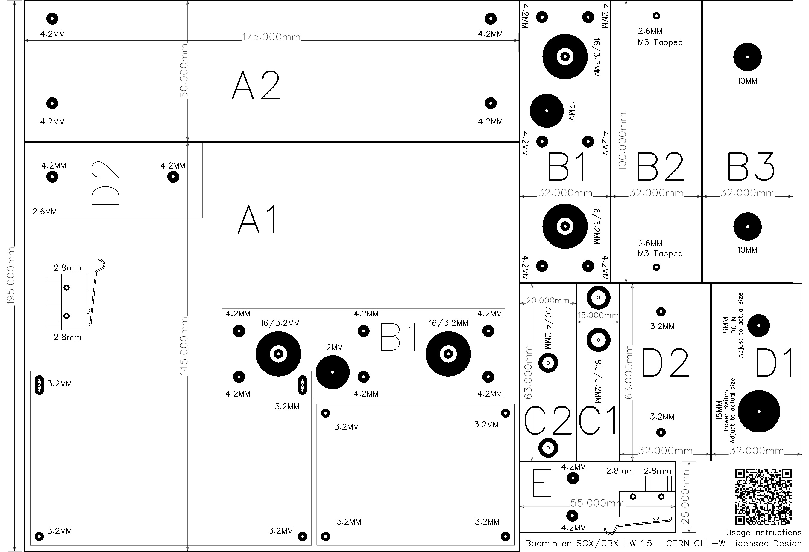
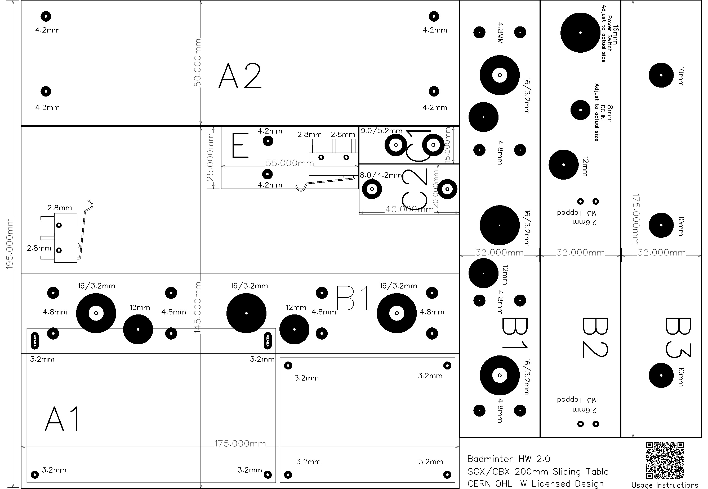

# Hardware Setup, Procurement, and Maintenance

## Hardware

Main materials
1. Raspberry Pico H
2. CBX/SGX 1610 ballscrew 200MM sliding table
3. NEMA23 57x56 stepper motor (2-phase 4-wire 1.8° 1.2Nm)
4. TB6600 stepper motor driver
5. NJ5 20KG load sensor (YZC-133)
6. HX711 module (SparkFun)
7. 2004 i2c LCD
8. Wise 2086 bead clip easy head
9. Five-way key module
10. Button
11. Micro switch
12. Active buzzer (active high trigger)
13. Tri-color LEDs
14. An unregulated UPS battery box made of 5 18650 batteries.

Main [BOM List](https://docs.google.com/spreadsheets/d/1ML2syn-BDUk_CEcyjm62lMwHZluXPYK5swn7pdFXTbw) Price Reference

> [!WARNING]
> Please make sure to read the next section on Hardware Procurement Recommendations

> [!WARNING]
> Unless you have the ability to modify the code yourself, please purchase materials according to the specified models or specifications.

## Hardware Procurement Recommendations

### Sliding Table

There are many styles of sliding tables, and this project uses the CBX/SGX 1610 ballscrew 200MM sliding table. It is recommended to purchase the CBX version with a bearing fixing seat. Some sliding tables without bearing fixing seat may experience issues under high-speed and high-tension conditions.

Bearing Fixing Seat

### TB6600 Stepper Motor Driver

TB6600 is a small, economical stepper motor driver used for 42 and 57 type stepper motors. It is very cheap on online stores. It is recommended to buy TB6600 labeled as "upgraded version" or "enhanced version". Some very cheap TB6600s may have noticeable electrical noise, and I am not aware of any unknown issues.

### HX711 Load Cell Amplifier

HX711 is a simple and easy-to-use amplifier for weight sensors, commonly used in high-precision electronic scales. In this project, it is used to measure the tension of the strings. I have tested many HX711 circuit boards produced by various manufacturers and found a serious issue: many HX711 circuit boards from different manufacturers tend to drift. Of course, this drifting issue can be fixed. I will produce a dedicated episode on my [YouTube channel](https://www.youtube.com/@kuokuo702) on how to fix this issue. It is recommended to directly purchase the HX711 Load Cell Amplifier produced by SparkFun, as it has better quality. Before fabricating the stringing machine head, use the drift test program taught in [EP. 3](https://youtu.be/pZT4ccE3bZk) to test the stability of this board. If you encounter any issues, you can leave a comment on the video.

I tested the HX711 circuit board 

## Hardware Design Suggestions

### Front and Rear Limit Switches on sliding table

If the limit micro switches on the sliding table are too small, the buffer zone might be insufficient, causing the platform to move slightly after the switch is triggered and before it stops. A limited buffer zone might lead to the platform colliding with the micro switch body. Therefore, it is recommended to use larger micro switches or arc-arm micro switches, as these types of switches offer a larger buffer zone and are more suitable, If space allows, long-lever micro switches can also be used, ensuring only the lever part makes contact, avoiding pressure on the main body.

### Distance Between the Bead Clip Head and the table

In theory, the closer the distance between the bead clip head and the table, the better, as it can extend the lifespan of the slider. If you are not using the Wise 2086 bead clip head, you can choose a shorter sensor design to reduce the distance between the two.

The SGX linear stage consists of a lead screw and an MGN12H linear guide at the base. The primary load is borne by the MGN12H linear guide. Since my sliding table is mounted at a 90-degree angle, the main load is in the My (yaw moment) direction. In an extreme scenario where all the load is concentrated in the My direction, and the distance between the bead clip head and the guide rail is 11 cm, the MGN12H can withstand a moment of 36.26 Nm in the My direction. From this, we can calculate the maximum load the guide rail can support in this configuration:

$$
\frac{36.26}{0.11 \times 9.8} \approx 33.6 \\text{kg} (74 \\text{lbs})
$$

From this formula, it's evident that the farther the distance between the ball chuck and the guide rail, the less force the guide rail can withstand. Therefore, when designing the hardware layout, it’s crucial to minimize the distance between the ball chuck and the platform to extend the lifespan of the linear stage.

> [!WARNING]
> This is a simplified extreme-case calculation. In reality, the load distribution is not entirely concentrated in the My direction. Some of the force will be distributed to Mr (roll moment), Mp (pitch moment), and the lead screw, meaning the actual load limit may be higher than this simplified result. The exact load capacity should be determined based on a comprehensive evaluation of the hardware design.

### Fixation of the Bead Clip Head and YZC-133 Sensor

After further testing, the fixation of the YZC-133 sensor and the bead clip head does not require the standoffs mentioned in [EP5](https://youtu.be/PhSWcHrOhvc). Simply tightening the 4 screws is sufficient to withstand 120LB of tension without any displacement.

### YZC-133 Load Sensor

The load sensor doesn't necessarily have to be the NJ5 (YZC-133). I chose this model because it can be easily installed on the Wise 2086 bead clip head. If you are using other clamps, there are many different styles available, just make sure to select a 20KG model. Please refer to the SparkFun HX711 guide linked below for detailed instructions. [SparkFun HX711](https://learn.sparkfun.com/tutorials/load-cell-amplifier-hx711-breakout-hookup-guide/all) 

If the NJ5 YZC-133 sensor is unavailable, the four signal wires of YZC-133 sensors from other manufacturers may be exposed. It is recommended to use Ø4 spiral wrap for protection, with a suggested wrapping length of 25 cm. After securing it to the slide platform, use the Ø4 spiral wrap again to bundle the wires of the bead clip head along with the sensor wires.

> [!IMPORTANT]
> It is strongly discouraged to cut and rejoin the wires of the YZC-133 sensor, as the connection points are prone to signal drift. Additionally, a drift warning may appear during startup, rendering the device unusable.

### Using a PCB Circuit Board

You can start by assembling and testing the circuit on a breadboard. Once successful, transfer the circuit to a PCB or a hand-soldered board. It's not recommended to use a breadboard for long-term use as it may lead to some issues.

## Wiring Diagram

> [!WARNING]
> If the LED module is not specifically designed for use with the Raspberry Pi, you need to connect a 330-ohm resistor in series to protect the GPIO.

## How To Make

Video Series of the Production Process (Continuously Updating)

## Software Installation
Use Thonny to save the following code files to the Raspberry Pico. The src folder contains relevant libraries for hx711 and 2004 LCD.

1. main.py
2. src\hx711.py
3. src\lcd_api.py
4. src\pico_i2c_lcd.py

> [!WARNING]  
> The three library files `hx711.py`, `lcd_api.py`, and `pico_i2c_lcd.py` must be placed in the `src` folder.

> [!NOTE]
> Related crafting videos 

## TB6600 Stepper Motor Parameters

It is recommended to use the fast mode unless the quality of the slide rail is poor, causing the motor to slip in fast mode. In that case, switch to the slow mode.

> [!NOTE]
> Related crafting videos 

## HX711 Load Cell Amplifier

This project demands a higher standard for the HX711, and it is recommended to use the more stable quality provided by SparkFun.

### Enabling 80Hz

The default setting for SparkFun's HX711 is 10Hz. To enable 80Hz, you'll need to cut the connection wire at the green arrow as indicated below.

### Stability Testing

The quality of each HX711 unit varies. Before installing the equipment, it's advisable to test the stability using a breadboard. A normally stable board should not drift by more than 1G over the course of a whole day.

> [!NOTE]
> The testing script is named TEST_hx711.py.

> [!WARNING]
> Starting from version 1.96, during boot-up, the board will check the RATE. Failure to reach 80Hz or exceeding a drift of 1G will prevent the board from booting up.

> [!WARNING]
> The quality of each HX711 amplifier varies. If there are any issues, it is recommended to switch suppliers.

> [!NOTE]
> Related crafting videos 

## Structural Layout

The component layout can be adjusted based on your needs. Two positioning hole diagrams are provided. Please refer to the instructional video for detailed instructions.

### V1.5 Layout

[View 3D Model on Tinkercad](https://www.tinkercad.com/things/5FHNO85KUK4-picobeth-hw-15-for-badminton-stringing?sharecode=hBukCj4giq4Q9J8Fq-s8H5lIKzbYCcOiwuyQ-TE8oRA)

| Component  | Material             | Dimensions                  | Length/Thickness         |
|------------|----------------------|-----------------------------|--------------------------|
| A          | L-shaped aluminum     | 150x50x5mm                  | Length: 175mm            |
| B          | Aluminum square tube  | 32x32x3mm                   | Length: 100mm            |
| C          | Aluminum strip        | 20x15mm                     | Length: 63mm             |
| D          | L-shaped aluminum     | 32x32x3mm                   | Length: 63mm             |
| E          | Aluminum plate        | 55x25mm                     | Thickness: 2mm           |

- The B component is shorter, designed according to my stringing machine base.

### HW 2.0 Layout

[View 3D Model on Tinkercad](https://www.tinkercad.com/things/gW2eyW052h4-picobeth-hw-20-for-badminton-stringing?sharecode=Maq9iaeRmlb3yHHCTIYZC1jmwOv0plqlq70pMMMWHQw)

| Component  | Material             | Dimensions                  | Length/Thickness         |
|------------|----------------------|-----------------------------|--------------------------|
| A          | L-shaped aluminum     | 150x50x5mm                  | Length: 175mm            |
| B          | Aluminum square tube  | 32x32x3mm                   | Length: 175mm            |
| C          | Aluminum strip        | 20x15mm                     | Length: 40mm             |
| E          | Aluminum plate        | 55x25mm                     | Thickness: 2mm           |

- The B component is longer and has more locking points on the bottom, making it compatible with a wider range of stringing machine bases.
- The C component is shortened to reduce the distance between the bead clip head and the sliding table, increasing the sliding table's lifespan.
- Removed component D; the power switch and power input have been relocated to position B2 for a cleaner wiring layout.

> [!IMPORTANT]
> Please do not directly print the components from the 3D model, as they lack sufficient strength.

> [!NOTE]  
> Please design an adapter part under the B component to install it onto your stringing machine base.

> [!NOTE]  
> If you have a better layout design, feel free to share your creation in the discussion forum.

> [!NOTE]
> Related crafting videos 

## PCB Circuit Board

Gerber PCB 1.5 [DOWNLOAD](Gerber_PicoBETH_PCB_2024-08-28.zip)

In version 1.5, the unused GPIOs are exposed to facilitate the development and use of custom functions in the future.

Gerber PCB BTN 1.2 [DOWNLOAD](Gerber_PicoBETH_BTN_2024-08-28.zip)

> [!NOTE]
> Please download the Gerber files and email them to an online (PCBWay, AliExpress, eBay) PCB manufacturer. Note that it is a single-layer, double-sided 1.6mm PCB with double-sided pads. Place the order once the manufacturer provides a quote.

> [!NOTE]
> Related crafting videos 

## Hardware Function Testing Mode

Upon completing assembly and powering on the machine for the first time, please conduct tests on all buttons, front and rear limits, and HX711 sensors as instructed on the screen.

> [!NOTE]
> Related crafting videos 

## Final Settings

### Calibrate The HX Parameter

HX711 tension sensor calibration coefficient. It is necessary to recalibrate it the first time you use it or when replacing the tension sensor or HX711 circuit board.

After version V2.2, due to the improved fine-tuning accuracy, enabling the auto-calibration feature will result in more precise corrections.

Calibration Steps:
1. Go to the settings page and ensure the Constant-Pull feature is enabled.
2. Set the HX parameter to 20.00 on the settings page.
3. Return to the main menu and set the tension to 20.0 lb with a Pre-Stretch of 10%.
4. Attach one end of the external tension gauge to the stringing machine and the other end to the badminton string.
5. Start tensioning, and once it stabilizes, record the lowest reading from the external tension gauge.
6. Enter the recorded tension gauge value on the settings page and press the S button to save.

Reference video

> [!IMPORTANT]
> Necessary! If you skip this calibration step, the tension displayed on the LCD will not match the actual tension.

## Tension Drift Test

After completing the tension calibration, check the drift during tensioning. The normal drift should be within ±0.05LB, as demonstrated in the video below. Once this test is passed, you can proceed with the final reliability test.

Reference video

## Reliability Testing Mode

The Reliability Testing Mode, introduced in version V2.4, can automatically simulate stringing tensioning to check for any abnormalities in newly assembled or hardware-modified machines.

### Usage Instructions

When the version information appears at startup, press and hold the Up button until you hear a long beep, then release it. After securing the string, press the Set button to start the test.

### Testing Method
The system will automatically cycle through tensioning from 20LB to 30LB, with a fixed 10% pre-stretch. After holding the tension for 3 seconds, the tension will release. If any abnormalities are detected, the process will stop automatically, and an error message will be displayed. The test will continue indefinitely unless the Set button is pressed when prompted.

### Qualification Criteria
It is recommended to test at least 1000 tensioning cycles (approximately 4 hours) without any abnormal interruptions. A properly assembled machine should not experience any interruptions during this period.

> [!WARNING]
> Do not run the reliability test directly in Thonny. Instead, write the program to the Raspberry Pi Pico and execute it independently.

Reference video

