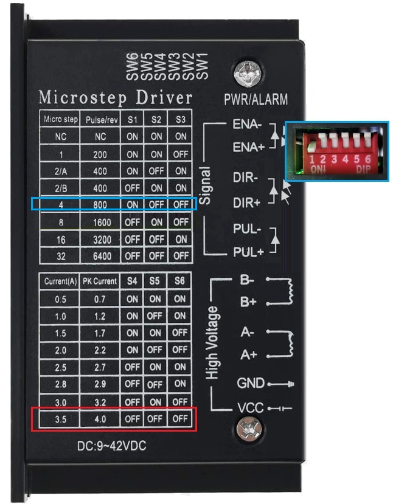

# Hardware Manufacturing, Procurement, and Maintenance

This stringing machine head has been carefully designed with the following key considerations:

1. **Selection of Reliable Components**  
   - Uses **universal, common, affordable, and tested durable components**.  
   - Ensures **stable performance** while minimizing maintenance and replacement difficulty.  

2. **Ease of Assembly and Maintenance**  
   - Designed with **assembly convenience and maintenance needs** in mind.  
   - All components can be **quickly disassembled and replaced without special tools**.  
   - Maintenance is **simple and intuitive**, reducing downtime.  

3. **Long-Term Usability and Cost Control**  
   - Core components follow **widely available market specifications**, making replacements easy to find.  
   - Even after long-term use, spare parts remain **low-cost**.  
   - Guarantees **long-term usability and controlled maintenance expenses**.

---

## Procurement Costs in Europe

The procurement costs in Taiwan may differ from those in other countries. **Nut56-M** from France has carefully compiled a **PicoBETH HW 3D-Printed Version** procurement list for reference.

**Procurement List**: [Click here to view](BudgetForKuo.xlsx)

If you are from another country and have procurement cost information for different regions, **feel free to share it with me** to benefit more people!  

> [!WARNING]  
> This list **requires you to own a 3D printer and print the parts yourself**. Please make sure to estimate the total cost accordingly.

> [!WARNING]  
> If you plan to purchase components from **Taobao**, please **carefully select sellers** to avoid low-quality products.

> [!WARNING]  
> Please make sure to watch **the hardware procurement recommendations**.

> [!WARNING]  
> Unless you have the ability to modify the program yourself, please follow the specified model and specifications when purchasing materials.

---

## Hardware Procurement Recommendations

### Linear Stage

There are many types of linear stages. This project uses a lead screw type SGX 1610 200MM linear stage. It is recommended to purchase the version with a bearing seat on the motor end. Some linear stages without a bearing seat may experience issues under high speed and high tension conditions.

**Bearing Seat**  


### Stepper Motor Drivers

This project uses the TB6600 stepper motor driver by default. Since version v2.91, it also supports the DM542C series drivers. Below is a comparison and recommendation for each model.

#### TB6600 Stepper Motor Driver

The TB6600 is a compact and budget-friendly stepper motor driver, suitable for NEMA 17 (42-type) and NEMA 23 (57-type) motors.  
It is recommended to purchase versions labeled "upgraded" or "enhanced." Some low-cost versions may produce noticeable electrical noise during use, which can affect the experience. It is advised to choose higher-quality versions.

#### DM542 Series Stepper Motor Drivers

Starting from v2.91, **DM542** series drivers are supported. Compared to the TB6600, the DM542 runs significantly quieter, especially when operating in Constant-Pull system mode, effectively reducing the "buzzing" sound.

> Note: Not all DM542 variants are compatible. Please refer to the tested results below:

| Driver Model            | Hardware Mount Compatibility   | Operational Compatibility | Operating Noise | Motor Temperature | Notes                                                             |
|-------------------------|----------------------------------|-----------------------------|------------------|--------------------|--------------------------------------------------------------------|
| **TB6600**              | --                               | --                          | High             | ~37°C              | Default driver for the project                                    |
| **DM542C (Type A)**     | Directly compatible with HW2/3D  | Normal                      | Low              | ~37°C              | Recommended, drop-in replacement without modification             |
| **DM542 (Common Market)** | Not directly compatible with HW2/3D | Motor rotation reversed     | Low              | ~60°C              | Requires custom mounting and reversed wiring; caution: high heat  |
| **DM542C (Type B)**     | Directly compatible with HW2/3D  | Normal                      | High             | --                 | Not recommended due to high noise                                 |
| **DM542S**              | Directly compatible with HW2/3D  | Normal                      | Same as TB6600   | --                 | Not recommended, no noise improvement                             |


#### Notes

- When using the **common market version of DM542**, motor wiring must be adjusted to correct the rotation direction:

  ```
  Original wiring: PUL+ PUL- DIR+ DIR- → A+ A- B+ B-  
  Corrected wiring:                   → B- B+ A- A+
  ```

  After adjustment, the motor rotation will be normal. Also, be aware that the motor surface may become hot—avoid direct contact to prevent burns.

- Switching to **DM542C** only improves "noise" performance. Its **precision and speed are the same as the TB6600**, and it does not affect the stringing performance.
- It is strongly recommended to use **DM542C (Type A)** and verify that its appearance and mounting holes match the photo above.

### HX711 Tension Sensor Amplifier

The HX711 is a simple load cell amplifier commonly used in high-precision electronic scales. In this project, it is used to measure string tension. It is strongly recommended to use the SparkFun HX711 Load Cell Amplifier, as it provides superior quality. Before assembling, refer to the drift test program in [EP.3 Video](https://youtu.be/pZT4ccE3bZk) to check the stability of the board. If you encounter any issues, feel free to leave a comment in the video.

**HX711 Circuit Boards I Have Tested:**  


The original SparkFun HX711 amplifier is shown in the image. There are many counterfeit versions available online. Genuine SparkFun products come with labeled packaging and have the SparkFun logo printed on the PCB. The price of authentic units does not vary significantly, around 12 USD. If the price is lower than this range, be cautious of potential counterfeits.


### NJ5 YZC-133 Load Cell

In this project, I have chosen the **NJ-manufactured NJ5 YZC-133**, which offers more stable quality compared to normal versions. Many commercially available YZC-133 load sensors vary in quality, with excessively thin wires and lack of external protection, potentially leading to long-term instability. Therefore, **it is strongly recommended to purchase the NJ5 YZC-133 Load Cell** to ensure reliability and durability.

If you cannot find the **NJ5 Load Cell**, try searching on **AliExpress** using the keywords:  
**"Load Cell 1KG 2KG 5KG 10KG 20KG 50KG HX711"**  
Searching directly for **YZC-133** or **NJ5** may not yield results.

Since version v2.80C, improvements in stepper motor control have allowed tension levels exceeding 70LB when using a 1610 leadscrew. It is recommended to use the 50kg version of the NJ5 YZC-133 load cell for optimal performance.

If you are using the 50kg version, make sure to set the Load Cell Rating to 50kg in the Engineering Menu and perform the tension calibration using the 50kg procedure. Failure to do so may result in damage to the racket.


> [!WARNING]  
> **It is strongly recommended to purchase the NJ5-manufactured YZC-133 sensor.**  
> Normal YZC-133 sensors have not undergone reliability testing and may exhibit abnormal issues.

---

## Hardware Design Recommendations

### Front and Rear Limit Switches on the Linear Stage

If the micro switches for the front and rear limits on the linear stage are too small, the platform may continue to move slightly after triggering the switch, potentially colliding with the switch body. To ensure sufficient buffer space, it is recommended to use **larger micro switches** or **long-arm micro switches**.


In the **HW2** and **HW3D** versions, the following micro switch is recommended. This switch is inexpensive, easy to obtain, and provides sufficient buffer space.


### Distance Between the Clamp Head and the Platform


The distance between the clamp head and the platform should be minimized to extend the lifespan of the linear stage.


The SGX linear stage consists of a lead screw drive and an MGN12H linear rail at the bottom. The primary load is borne by the MGN12H linear rail. Since my setup installs the linear stage at a 90-degree side-mounted position, the primary force direction is My (lateral moment). Assuming an extreme scenario where all force is borne in the My direction and the distance between the clamp head and the linear rail is 11 cm, the MGN12H can withstand 36.26 Nm of My force. The maximum load-bearing capacity of the rail in this structure can be calculated as:

$$
\frac{36.26}{0.11 \times 9.8} \approx 33.6 \\text{kg} (74 \\text{lbs})
$$

From this formula, it is evident that the farther the clamp head is from the linear rail, the less force the rail can withstand. Therefore, when designing the hardware layout, the distance between the clamp head and the platform should be minimized to extend the lifespan of the linear stage.

> [!WARNING]
> This is a simplified extreme-case calculation. In reality, the force distribution is not entirely concentrated in the My direction. Some force will be distributed to Mr (rolling moment), Mp (pitching moment), and the lead screw drive. The actual load limit may be higher than this simplified calculation, and the precise load capacity should be determined based on a comprehensive evaluation of the hardware design.

### Fixing the Clamp Head and NJ5 YZC-133 Sensor

After further testing, it has been confirmed that the **NJ5 YZC-133 load sensor** and **clamp head** can be securely fixed **without using** the copper standoff mentioned in [EP5](https://youtu.be/PhSWcHrOhvc). Simply **tightening the four screws** is sufficient to hold it firmly in place, allowing it to withstand **120LB tension** without shifting.

Additionally, **it is recommended to leave 30CM of the NJ5 YZC-133 sensor wire** to ensure convenient wiring.

> [!WARNING]  
> It is strongly discouraged to cut and reconnect the YZC-133 wires, as such connections can cause signal drift and may trigger warnings at startup, potentially preventing normal operation.

### Using a PCB Circuit Board

It is advisable to first assemble and test the circuit on a breadboard. Once confirmed to be functional, transfer the circuit to a PCB board or a manually soldered board. Long-term use of a breadboard may result in poor contact issues.

---

## Hardware Manufacturing

If you are interested in the production process but are unsure whether you can complete it successfully, you can start with EP.1 to EP.3. Once you confirm that you can proceed, purchase all the necessary materials and follow the steps gradually.

> [!WARNING]
> EP.3 is the most critical chapter of this project and the one most prone to issues. Stable and reliable tension values are essential for a perfect stringing machine. Therefore, please make sure to complete this chapter before proceeding with the subsequent steps.

### **Recommended Manufacturing Sequence**
1. **EP.1** PicoBETH Program Installation  
2. **EP.2** TB6600 57 Stepper Motor Control with Raspberry Pi Pico  
3. **EP.3** HX711 Drift Test with Raspberry Pi Pico and Enabling 80Hz SparkFun RATE  
4. **EP.6** Main Board and Button Board Assembly  
5. **EP.4(HW2)** Base Structure Assembly  
6. **EP.5(HW2)** Load Cell & WISE 2086 Head
7. **EP.7(HW2)** Hardware & Wiring Installation
8. **EP.8** Simple Dust Cover  
9. **EP.9** Positioning and Fixation  
10. **EP.10** Final Setup  
11. **EP.11** Tension Drift Test  
12. **EP.12** Reliability Test  

### Wiring Diagram


> [!WARNING]
> If using an LED module not designed for Raspberry Pi, a 330Ω resistor must be connected in series to protect the GPIO.

---

## EP.1 PicoBETH Program Installation

### Bill of Materials (BOM)

| #  | Item                            | Qty | Notes |
|----|--------------------------------|----|------|
| 1  | Raspberry PI Pico WH            | 1  |      |

> [!WARNING]
> **Do not purchase Pico 2 (RP2350), as it cannot be used directly.**

> [!NOTE]
> Starting from firmware version v2.80E, OTA updates over Wi-Fi are supported. It is recommended to use the Raspberry Pi Pico WH, which includes built-in Wi-Fi.

Use Thonny to save the following code files to the Raspberry Pi Pico. The `src` folder contains libraries for `hx711` and `2004 LCD`.

1. main.py
2. pico_ota.py
3. src/hx711.py
4. src/lcd_api.py
5. src/pico_i2c_lcd.py
6. src/pico_i2c_lcd2.py

> [!WARNING]
> `hx711.py`, `lcd_api.py`, `pico_i2c_lcd.py`, and `pico_i2c_lcd2.py` **must be placed inside the `src` folder**.

### Reference Video
Click the thumbnail below to watch the full tutorial:  
[](https://www.youtube.com/watch?v=oMgVq6rkX_Q)

---

## EP.2 TB6600 57 Stepper Motor Control  

### Bill of Materials (BOM)

| #  | Item                                   | Qty | Notes |
|----|---------------------------------------|----|------|
| 1  | Raspberry PI Pico WH                   | 1  |      |
| 2  | SGX 1610 200mm Linear Stage with 56×57 1.2Nm Stepper Motor | 1  | You can start by purchasing only the stepper motor. |
| 3  | TB6600 Stepper Motor Driver           | 1  |      |

Set the **DIP switches on the TB6600** as shown below to ensure correct driver parameters.

  

Starting from v2.91, this project supports the **DM542C stepper driver**. Please set the **DIP switches** as shown below to ensure correct driver parameters:


> [!WARNING]  
> There are many DM542C variants on the market. Please ensure the appearance matches the image above; otherwise, compatibility issues may occur.

### Reference Video
Click the thumbnail below to watch the full tutorial:  
[](https://www.youtube.com/watch?v=7eG5W6a95h0)

---

## EP.3 HX711 Tension Sensor Amplifier

This project has high requirements for the HX711. It is strongly recommended to use SparkFun's HX711 amplifier for its stable quality.

### Bill of Materials (BOM)

| #  | Item                            | Qty | Notes |
|----|--------------------------------|----|------|
| 1  | Raspberry PI Pico WH            | 1  |      |
| 2  | NJ5 YZC-133 Tension Sensor      | 1  |      |
| 3  | SparkFun HX711                  | 1  |      |

### Enabling 80Hz

The default frequency of the SparkFun HX711 is 10Hz. To enable 80Hz mode, use a utility knife to cut the trace indicated by the green arrow in the image below.


### Stability Testing

The quality of each HX711 varies. It is recommended to test its stability before installing it on the machine. Under normal conditions, a stable board should have a drift of no more than 1g over an entire day.


> [!NOTE]
> The test program is `TEST_hx711.py`.

### Reference Video
Click the thumbnail below to watch the full tutorial:  
[](https://www.youtube.com/watch?v=pZT4ccE3bZk)

---

## EP.6 Main Board and Button Board Assembly

  
  

### Gerber File Downloads (V1.8)

- [Gerber PCB V1.8 - Main & Button Panelized](Gerber_PicoBETH_1.8_main_btn_panel_2025-06-22.zip)
- [Gerber PCB V1.8 - Main Board Only](Gerber_PicoBETH_1.8_main_2025-06-22.zip)
- [Gerber PCB V1.8 - Button Board Only](Gerber_PicoBETH_1.8_btn_2025-06-22.zip)

> [!WARNING]  
> You can either download the panelized version (main board + button board) for fabrication,  
> or download the individual boards separately and fabricate them individually.  
> **Note:** Some PCB manufacturers may charge extra for processing panelized boards.

> [!NOTE]  
> After downloading the Gerber files, send them via email to a PCB manufacturer  
> (e.g., PCBWay, JLCPCB, etc.).  
> Recommended manufacturing specs: **double-sided PCB, 1.6mm thickness, plated through-holes**.  
> Once you receive a quote, you can proceed with the order.

### DC-DC 5V Power Supply Recommendation

Some off-the-shelf **MP1584EN modules** have unstable quality and may introduce noticeable  
**ripple noise**, which can cause the **HX711 load sensor to drift** during standby.

To address this, **PCB V1.8** includes a dedicated footprint for the high-quality  
**Pololu D24V22F5 DC-DC converter** to provide a more stable power supply option.

  
**Pololu D24V22F5** DC-DC Converter

#### If you notice significant drift in HX711 readings (e.g., more than ±5g), try:

- Replacing the MP1584EN module with one from a different supplier, or  
- Switching to the **Pololu D24V22F5 converter** for better stability

#### Alternative power supply options:

- Power directly via USB  
- Use the **VCC IN** header on the PCB with another 5V DC-DC converter

> [!WARNING]  
> Use **either** the MP1584EN **or** the Pololu D24V22F5 module.  
> **Do not install or power both at the same time.**

> [!NOTE]  
> Tension drift can also be caused by poor component quality in the  
> **HX711 amplifier module, load cell sensor**, or **contact resistance**.  
> It's recommended to use well-made, original components for best stability.

> [!WARNING]  
> Genuine **Pololu D24V22F5 modules** usually come with original packaging  
> and official labeling, and are priced around **$10 USD**.  
> If the price seems unusually low, it may be a counterfeit.

### Bill of Materials (BOM)


| #  | Item                                  | Qty |
|----|--------------------------------------|------|
| 1  | JST XH 6P Male Connector, 2.54mm    | 2   |
| 2  | JST XH 4P Male Connector, 2.54mm    | 4   |
| 3  | JST XH 2P Male Connector, 2.54mm    | 6   |
| 4  | 1×20 Single Row Female Header, 2.54mm | 2   |
|    | 1×5 Single Row Female Header, 2.54mm  | 1   |
|    | 1×3 Single Row Female Header, 2.54mm  | 1   |
| 5  | 1×2 Single Row Male Pin Header, 2.54mm | 4   |
| 6  | MP1584EN DC-DC 5V Step-down Module  | 1   |
| 7  | M3 × 8mm Round Head Screws         | 6   |
| 8  | M3 × 10mm Double Female Brass Standoff | 3   |
| 9  | 330Ω 1/8W Resistor                 | 3   |
| 10 | 8mm LED (Green, Yellow, Red)       | 3   |
| 11 | 12×12×7.3mm Tactile Switch         | 6   |
| 12 | 12×12mm Button Cap                 | 6   |
| 13 | Raspberry Pi Pico WH Microcontroller | 1   |
| 14 | Active Buzzer Module (High-Level Trigger) | 1   |
| 15 | SparkFun HX711                      | 1   |
| 16 | PicoBETH PCB Board                  | 1   |

**PCB Soldering Guide Video**  

[](https://youtu.be/uN1JvO9Rgfg)  

### PCB Assembly and Testing

After fabricating the PCB, perform a simple test before installing it on the machine to ensure functionality.
[](https://youtu.be/Pghks2Jm8Q8)

---

## Structural Layout

This project currently provides **three structural layouts**: **HW1, HW2, HW3D**.

- **HW1** is the original structural design developed based on my stringing machine specifications. Due to mounting hole constraints, compatibility with other machines may be limited. However, HW1 has passed **over 1 million reliability tests** without any issues.  
- **HW2** optimizes the structural layout, improving **compatibility and reliability**. It is recommended for users with machining capabilities, as it features a more robust and compact design.  
- **HW3D** is the **3D-printed** version, where all components can be manufactured using a 3D printer. This reduces production complexity and makes installation easier.  

**If you have machining capabilities, HW2 is recommended for its enhanced structural strength. If you prefer a simplified assembly process, HW3D is a suitable choice. This guide will be based on HW2.**

[Go to **HW3D 3D-Printed Branch**](https://github.com/206cc/PicoBETH/tree/branch/3d-printed)

### HW1 Manufacturing Video Series

Click the thumbnail below to watch the HW1 manufacturing process:  

[](https://www.youtube.com/playlist?list=PLN3s8Sz8h_G_Dp-Vqi42OujVhEX1pyrGo)

---

## HW2 - EP.4 Basic Structure Assembly

### Bill of Materials (BOM)


| #  | Item                                      | Qty | Notes |
|----|------------------------------------------|----|------|
| 1  | L-Shaped Aluminum 150mm × 50mm × 175mm, 5mm Thick | 1  |      |
| 2  | Aluminum Square Tube 32mm × 32mm × 175mm, 3mm Thick | 1  |      |
| 3  | Aluminum Block 20mm × 15mm × 40mm        | 1  |      |
| 4  | Aluminum Plate 55mm × 25mm, 2mm Thick   | 1  |      |
| 5  | Drilling Positioning Template            | 1  |      |
| 6  | M3 × 8mm Countersunk Screws              | 8  |      |
| 7  | M3 Lock Washers                          | 8  |      |
| 8  | M3 × 30mm Double Female Brass Standoff  | 4  |      |
| 9  | M3 × 8mm Double Female Brass Standoff   | 4  |      |
| 10 | M5 Aluminum Rivets                       | 10 |      |

### Drilling Positioning Template Download
[Download HW2 Drilling Positioning Template (PDF)](pdf_HW22.pdf)  
Please print on **A4 paper** and cut for use.

### Reference Video
Click the thumbnail below to watch the full assembly process:  
[](https://www.youtube.com/watch?v=nRAz0oo81Cg)

---

## HW2 - EP.5 Tension Sensor and 2086 Clamp Head

### Bill of Materials (BOM)

| #  | Item                          | Qty | Notes |
|----|------------------------------|----|------|
| 1  | WISE 2086 Head               | 1  |      |
| 2  | NJ5 YZC-133 Tension Sensor   | 1  |      |

### Reference Video
Click the thumbnail below to watch the full assembly process:  
[](https://www.youtube.com/watch?v=LZdVev2RvTQ)

---

## HW2 - EP.7 Hardware and Wiring Installation

### Bill of Materials (BOM)


| #  | Item                                      | Qty | Notes |
|----|------------------------------------------|----|------|
| 1  | Base Structure                           | 1  |      |
| 2  | Load Cell & 2086 Clamp Head              | 1  |      |
| 3  | TB6600 Stepper Motor Driver              | 1  |      |
| 4  | SGX 1610 200mm Linear Stage with 56×57 1.2Nm Stepper Motor | 1  |      |
| 5  | Main Board                               | 1  | Raspberry Pico, Spark HX711, Buzzer |
| 6  | Button Board                             | 1  | LED, Five-Way Button, Exit Button |
| 7  | 2004 I2C LCD Module                      | 1  |      |
| 8  | Micro Switch 50cm XH2.54mm 2P            | 1  | Clamp Activation Switch |
| 9  | XH2.54mm 2P Connector 38cm               | 1  | TB6600 Signal Wire |
| 10 | Micro Switch XH2.54mm 2P 35cm            | 1  | Rear Limit Switch |
| 11 | Micro Switch XH2.54mm 2P 10cm            | 1  | Front Limit Switch |
| 12 | XH2.54mm 6P 15cm (Same Direction)        | 1  | Five-Way Button for Button Board |
| 13-1 | XH2.54mm 4P 10cm                       | 1  | 2004 LCD |
| 13-2 | XH2.54mm 4P 15cm (Same Direction)      | 1  | LED for Button Board |
| 14 | XH2.54mm 2P 15cm (Same Direction)        | 1  | Exit Button for Button Board |
| 15 | Power Switch with Wire 22AWG 8cm         | 1  |      |
| 16 | 22AWG 22cm                               | 1  | TB6600 Power Cable |
| 17 | XH2.54mm 2P 22AWG 20cm                   | 1  | Main Board Power Cable |
| 18 | 2.1 DC Female Connector 22AWG 10cm       | 1  |      |
| 19 | Ø4 Spiral Wrap 10cm                      | 1  |      |
| 20 | Ø4 Spiral Wrap 20cm                      | 1  |      |
| 21 | M3 × 8mm Round Head Screws               | 10 |      |
| 22 | M3 × 6mm Self-Tapping Screws             | 4  |      |
| 23 | Cable Tie Mounts                         | 2  |      |
| 24 | M3 × 35mm Male-Female Brass Standoff     | 2  |      |
| 25 | M3 × 20mm Male-Female Brass Standoff     | 2  |      |
| 26 | Gray Spring-Type Wire Connectors         | 3  |      |
| 27 | M4 × 10mm Hex Socket Screws              | 4  |      |
| 28 | M4 × 8mm Hex Socket Screws               | 2  |      |
| 29 | Load Cell Mounting Bracket               | 1  |      |
| 30 | M6 Nuts                                  | 2  |      |
| 31 | M4 × 16mm Hex Socket Screws              | 2  |      |
| 32 | M5 × 30mm Hex Socket Screws              | 2  |      |
| 33 | Rear Limit Switch Mounting Bracket       | 1  |      |

### Additional Instructions

In the HW2 - EP.7 Hardware & Wiring Installation, a step was omitted. Please use a zip tie to secure the wiring to the brass post (as shown in the image below) to ensure that the sliding platform does not come into contact with the wiring during movement.


### Hardware Testing Mode

When powering on for the first time after assembly, follow the instructions to test all buttons, limit switches, and the HX711 sensor.

### Reference Video
Click the thumbnail below to watch the full assembly process:  
[](https://www.youtube.com/watch?v=AXmFsu2JrRA)

---

## EP.8 Simple Dust Cover

### Bill of Materials (BOM)

| No. | Item                          | Quantity | Remarks |
|----|------------------------------|----|----|
| 1  | 1.2mm Acrylic Sheet          | 1  |    |
| 2  | M4×8mm Hex Socket Screw      | 2  |    |

### Reference Video
Click the thumbnail below to watch the full assembly process:  
[](https://www.youtube.com/watch?v=FxlZjgAZZtA)

---

## EP.9 Positioning and Fixation

### Adapter Bracket

Regardless of the stringing machine platform used, an adapter bracket needs to be designed. The primary purpose of the adapter bracket is to **raise** the stringing machine head so that the rotating racket can pass just under the clamp head. Refer to [EP.9 Video](https://youtu.be/Ax4agdsqyms) for more details.

### Reference Video
Click the thumbnail below to watch the full tutorial:  
[](https://www.youtube.com/watch?v=Ax4agdsqyms)

### CB10 Adapter Interface

Special thanks to Mario from France for providing a detailed installation manual for the **CB10 Adapter Interface**. The CB10 is compatible with older-generation Gamma machines, which share the same frame design. If you need installation details, please download the manual.

If you would like to share your own adapter interface installation guide, feel free to contact me!

[**Click to Download**](PICOBETH_CB10_Interface.pdf)

### Manual Stringing Machine Adapter Bracket

I have designed a **universal manual stringing machine adapter bracket**. Please refer to the [Drilling Marking Template](Pico%20Crank%20Bracket%20V1.0.pdf) and follow the **tutorial video** for assembly.


### Reference Assembly Video
Click the thumbnail below to watch the full tutorial:  
[](https://www.youtube.com/watch?v=3aoykcxvBiY)

---

## EP.10 Final Settings

### Hardware Parameter Configuration

Starting from version v2.90, initial hardware parameter setup has been greatly simplified. You can now configure all parameters directly via the **Engineering Menu**, without needing a computer.

> [!CAUTION]
> **Please make sure to correctly configure hardware parameters on first boot. Incorrect settings may cause serious damage to the racket.**

#### How to Enter the Engineering Menu

You can enter the engineering menu using either of the following methods:

1. **During startup**: When the version info and progress bar are displayed, press the **left directional key**.
2. **From the Settings Page**: In the INFO menu, press the **down directional key** 5 times consecutively.

#### 9-1 Load Cell Selection

Please select the appropriate load cell rating based on your hardware:

- **20kg**
- **50kg**

#### 9-2 Maximum Tension Setting

Starting from v2.90, the tennis mode has been removed. The system now sets the maximum tension based on the load cell type and platform used:

| Load Cell Rating | Platform Type | Recommended Max Tension  |
|------------------|----------------|---------------------------|
| 20kg             | SGX 1610       | 40lb                      |
| 50kg             | SGX 1610       | 70lb                      |
| 50kg             | GX80 1605      | 90lb+ (Limit: 130lb)      |

> [!WARNING]
> Please ensure the machine’s structure can withstand the configured maximum tension.

> [!WARNING]
> Applying tension beyond the rated load cell limit may damage the sensor and drastically shorten its lifespan.

#### 9-3 Bead Clip Tensioning Mode

Select the appropriate bead clip tensioning mode:

- **Standard Mode**
- **Enhanced Mode**  
  Reference: [Enhanced Bead Clip Mode](https://github.com/206cc/PicoBETH/tree/imp/beadclip-btn%40jpliew)

### Calibrating HX Parameters

The HX711 tension sensor calibration coefficient must be recalibrated the first time it is used or whenever replacing the tension sensor or HX711 circuit board.

From version V2.2 onwards, the automatic constant-pull function has been improved for finer adjustments. It is recommended to enable this function before calibration.

#### Calibration Steps:
For 20kg Load Cell:
1. Enter the Engineering Mode and ensure the Load Cell is set to 20kg (requires firmware v2.80E or later).
2. Go to the settings page and ensure the automatic constant-pull function is enabled.
3. Set the HX parameter to **20.00**.
4. Return to the main menu and set the tension to **20.0 lbs** with **10% pre-stretch**.
5. Use an external tension gauge to measure the actual tension.
6. Enter the measured value into the settings page and save.

For 50kg Load Cell:
1. Enter the Engineering Mode and ensure the Load Cell is set to 50kg (requires firmware v2.80E or later).
2. Go to the settings page and ensure the automatic constant-pull function is enabled.
3. Set the HX parameter to **50.00**.
4. Return to the main menu and set the tension to **50.0 lbs** with **10% pre-stretch**.
5. Use an external tension gauge to measure the actual tension.
6. Enter the measured value into the settings page and save.

> [!IMPORTANT]
> Failure to perform proper tension calibration may result in a mismatch between the displayed and actual tension, potentially causing damage to your racket.

### Reference Video
Click the thumbnail below to watch the full tutorial:  
[](https://www.youtube.com/watch?v=WMFJQU_TSFk)

---

## EP.11 Tension Drift Test

After calibration, test the tension drift during operation. The drift should be controlled within ±0.05LB.

### Reference Video
Click the thumbnail below to watch the full tutorial:  
[](https://www.youtube.com/watch?v=wPfW1ht--Y0)

---

## EP.12 Reliability Test

Starting from version V2.4, a reliability test mode has been added. This mode automatically simulates string tensioning to check for machine abnormalities.

### Testing Method

The system will automatically cycle tensioning between **20LB and 30LB**, with a fixed **10% pre-stretch**. After reaching equilibrium, it will release after **3 seconds**. The test will continue unless an abnormal interruption occurs. To stop the test, press the center button when prompted.

It is recommended to perform at least **1000 cycles**. If no anomalies occur during the test, the assembly is considered stable.

> [!WARNING]
> Do **not** run this test directly in Thonny. Write the program to the Raspberry Pi Pico and execute the test from there.

### Reference Video
Click the thumbnail below to watch the full tutorial:  
[](https://www.youtube.com/watch?v=ypDOEKCdW9U)

---

## 3D Printed Components

To simplify DIY part manufacturing, some components have been converted to 3D-printable versions.

### **HW2 Hardware Layout Component C**

It is highly recommended to replace the PART-C component with this 3D-printed version, which features a dedicated routing channel for the sensor wire, improving cable management.


- **Note:** This component requires high strength. Please refer to the webpage instructions.  
- [Thingiverse Link](https://www.thingiverse.com/thing:6881477)

### **HW2 Hardware Layout Component E**


- [Thingiverse Link](https://www.thingiverse.com/thing:6880441)

### **HW2 Hardware Layout Simple Dust Cover**


- [Thingiverse Link](https://www.thingiverse.com/thing:6880452)

### **WISE 2086 Clamp Activation Switch Bracket**


- [Thingiverse Link](https://www.thingiverse.com/thing:6884565)
