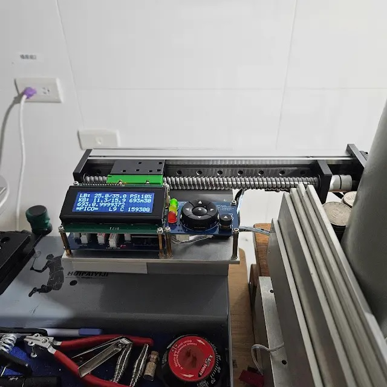
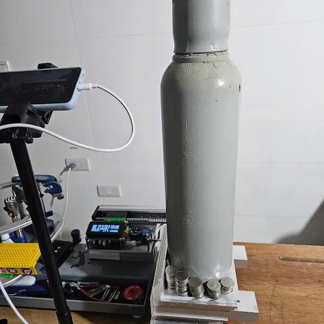
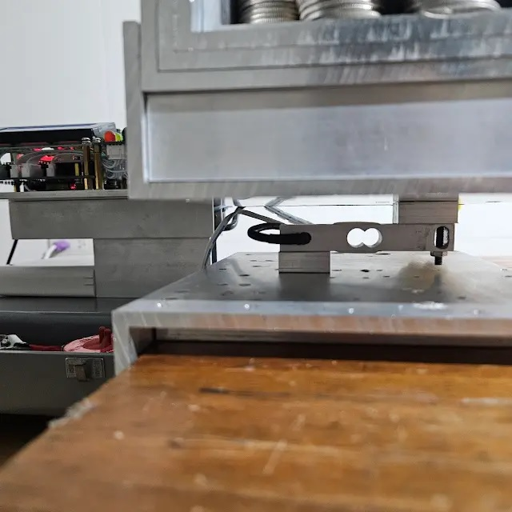
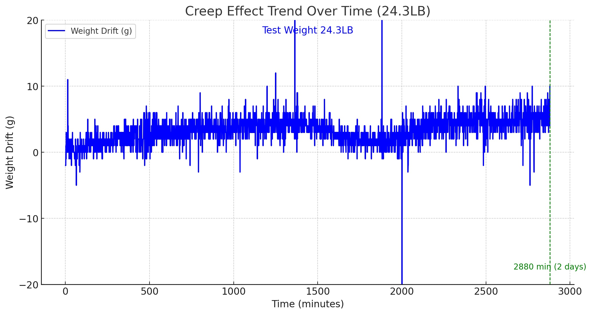

# Research Lab

This section will showcase research data from the development process, for users interested in further development. The data will be continuously updated.

## Tension Limit Testing

**Test Environment**  
- NEMA23 57 Stepper Motor (2-phase, 4-wire, 1.8°, 1.2Nm)  
- DC 19V 4A Power Supply  
- TB6600 Driver, Current Setting: 3.5A  
- Software Version: V2.80E, Speed Setting: L9

| Slide/Lead Screw | TB6600 STEP/REV | Maximum Tension |  
|------------------|-----------------|-----------------|
| SGX 1610         | 4/800(Fast)     | 80LB            |
| GX80 1610        | 4/800(Fast)     | 80LB            |
| GX80 1605        | 4/800(Fast)     | 120LB           |

> [!NOTE]  
> The test standard involves performing 10 consecutive tension tests without the motor experiencing any step loss (slipping).

> [!NOTE]  
> Due to variations in the quality of slides from different suppliers, the above data is for reference only.

## Creep Effect

Since future plans include conducting long-term tension loss tests on different strings, it is necessary to first verify whether the YZC-133 Load Cell used in the machine exhibits any creep effect.

> **Note:** The test results may vary depending on the brand and manufacturing quality of the Load Cell. These results are only applicable to the YZC-133 Load Cell used on my machine.

### Test Environment

The Load Cell was removed and modified into a scale format. A heavy load was applied, and the program was adjusted to record weight changes over time, observing whether the values gradually drifted.

The test was conducted using two loads: 24.3 LB and a higher load of 35.0 LB, over a 48-hour period to observe potential creep effects.

### Test Results

**24.3 LB test duration: 2880 minutes (48 hours)**  

**35.0 LB test duration: 3600 minutes (60 hours)**

After 48 hours of testing and removing outliers, the drift values for both load conditions remained within ±10 grams (0.02 LB). The results indicate a stable drift trend with minimal deviation, which can be considered negligible.

### Improvements

Some outliers may have been caused by using a steel cylinder as the load instead of standard weights. Due to the large volume of the steel cylinder, slight air pressure fluctuations could cause value deviations. If you would also like to perform this test, for more accurate results, it is recommended to use standard weights and record the median value within a 60-second sampling period to obtain a smoother curve.
